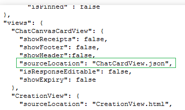

# <a name="customizing-chatcanvascardview"></a>Personnalisation de ChatCanvasCardView

Contrairement à la création, réponse et affichages de synthèse sont html, conversation affichages sont native. Pour personnaliser l’affichage de carte de conversation, vous devrez fournir un json de la disposition de la carte, ainsi que les valeurs dans la vue. En l’absence d’une conversation personnalisée un canevas affichage carte, la valeur par défaut est affichage de carte de conversation avec le texte de titre de l’application. 

## <a name="views-and-their-supported-properties"></a>Vues et leurs propriétés prises en charge
Vous trouverez ci-dessous les différents types de sub-views/widgets ainsi que leurs propriétés personnalisables. Certaines propriétés sont marquées avec <sup>iOS</sup> indiquant qu’ils sont applicables uniquement sur iOS _(et n’a aucun effet sur android)_.

### <a name="container--view"></a>Conteneur / afficher

<ol>
<li>ID (facultatif, mais doit être unique)</li>
<li>visible<sup>iOS</sup></li>
<li>Tapez _(tous les types de vue secondaire que nous avons mentionné ici)_</li>
<li>marge / marginTop / marginRight / marginBottom / marginLeft</li>
<li>remplissage / paddingTop / paddingRight / paddingBottom / paddingLeft</li>
<li>width</li>
<li>height</li>
<li>poids _(% taux de parent largeur/hauteur de la vue en cas de mises en page horizontaux/verticaux respectivement)_</li>
<li>backgroundColor _(uniquement code hexadécimal autorisé ici)_</li>
<li>cornerRadius</li>
<li>borderWidthiOS / borderColoriOS</li>
<li>Children _(tableau de vues sous-sites)_</li>
<li>mise en page _(quand verticale / horizontale n’est pas spécifié, par défaut verticale)_</li>
<li>verticalAlignment _(haut / bas / centre / stretchiOS - comment enfants seront alignés verticalement)_</li>
<li>horizontalAlignment _ (gauche/droite/centre/spaceBetween<sup></sup> iOS/spaceAround<sup>iOS</sup>) - comment enfants seront alignés horizontalement. _</li>
<li>initialHeight<sup>iOS</sup> _une seule propriété iOS utilisée dans le conteneur de plus haut est utilisé pour afficher la carte avant la dimension précise est établie. Il est fortement recommandé d’utiliser cette propriété pour une meilleure expérience !_</li>
</ol>

### <a name="text"></a>Texte

<ol>
<li>ID (facultatif, mais doit être unique)</li>
<li>visible<sup>iOS</sup></li>
<li>Tapez _(tous les types de vue secondaire que nous avons mentionné ici)_</li>
<li>marge / marginTop / marginRight / marginBottom / marginLeft</li>
<li>remplissage / paddingTop / paddingRight / paddingBottom / paddingLeft</li>
<li>width</li>
<li>height</li>
<li>poids _(% taux de parent largeur/hauteur de la vue en cas de mises en page horizontaux/verticaux respectivement)_</li>
<li>backgroundColor _(uniquement code hexadécimal autorisé ici)_</li>
<li>cornerRadius</li>
<li>borderWidthiOS / borderColoriOS</li>
<li>chaîne</li>
<li>fontSize _(famille de polices est toujours du système par défaut, pour éviter les problèmes de rendu)_</li>
<li>textColor _(uniquement code hexadécimal autorisé ici)_</li>
<li>ellipsizeMode _(head / intermédiaire / Queue)_</li>
<li>maxNumberOfLines _(0 pour aucune limite autre texte sera tronqué selon ellipsizeMode)_</li>
</ol>


### <a name="image"></a>Image

<ol>
<li>ID (facultatif, mais doit être unique)</li>
<li>visible<sup>iOS</sup></li>
<li>Tapez _(tous les types de vue secondaire que nous avons mentionné ici)_</li>
<li>marge / marginTop / marginRight / marginBottom / marginLeft</li>
<li>remplissage / paddingTop / paddingRight / paddingBottom / paddingLeft</li>
<li>width</li>
<li>height</li>
<li>poids _(% taux de parent largeur/hauteur de la vue en cas de mises en page horizontaux/verticaux respectivement)_</li>
<li>backgroundColor _(uniquement code hexadécimal autorisé ici)_</li>
<li>cornerRadius</li>
<li>borderWidthiOS / borderColoriOS</li>
<li>source</li>
<li>contentMode _ (aspectFit/aspectFill/étirer/répétez<sup>iOS</sup>) _</li>
</ol>


## <a name="binding-data-with-views"></a>Liaison de données avec des vues
* __Formulaire__
  * $\{Form.Title}
  * $\{Form.Expiry} - _sortie est une chaîne de date-heure_
  * $\{Form.questions}
  * $\{Form.questions.Length}
  * $\{Form.questions[questionId].Title}
  * $\{Form.questions[questionId].Options}
  * $\{Form.questions[questionId].Options.Length}
  * $\{Form.questions[questionId].Options[optionId].Text}
  * $\{Form.questions[questionId].Options[optionId].pictureUrl}
  * $\{Form.Properties}
  * $\{Form.Properties.Length}
  * $\{Form.Properties[PropertyName]}
  * $\{Form.Properties[PropertyName].Value}
  * $\{Form.Properties[PropertyName].Length} - _pour tableau/définir la propriété type_
* __MyLatestResponse__
  * $\{MyLatestResponse.sendTime} - _sortie est une chaîne de date-heure_
  * $\{MyLatestResponse.questionToAnswerMap[questionId]}
* __Résumé__
  * $\{Summary.totalResponseCount}
  * $\{Summary.totalParticipantsCount}
  * $\{Summary.targetResponderCount}

Un peut également utiliser ces variables comme espaces réservés, tels que :  
_« Je vous remercie de votre rapport news : ${Form.properties[newsDescription].value} »_

## <a name="operations"></a>Opérations

Dans certains scénarios, il peut se produire un besoin où différents utilisateurs devront peut-être afficher la carte de conversation différent, qui peut-être être basée sur certains attributs. Afin d’activer des scénarios, Kaizala fournit des [opérateurs](Operator.md), qui permet aux créateurs de Action personnaliser les affichages de carte de conversation pour la même instance d’Action différentes pour différents scénarios/utilisateurs.

Par exemple, vous pouvez choisir d’afficher une vue carte différentes pour les utilisateurs qui n’ont pas terminé le travail et un affichage autre carte pour les utilisateurs qui ont terminé le travail. Cela peut être étendu à n’importe quel type de scénarios qui peuvent survenir.

## <a name="how-to-provide-the-json-schema"></a>Comment fournir le schéma json
Dans le fichier manifeste _(package.json)_ d’un package de placer le nom de fichier JSON sous **sourceLocation** clé **ChatCanvasCardView** ci-dessous est un instantané de package.json :



## <a name="example-chatcanvascardview-source-file"></a>Exemple de fichier de code source ChatCanvasCardView
```json
{
    "schemaVersion": 1,
    "schema": {
        "type": "container",
        "initialHeight": 300,
        "layout": "vertical",
        "children": [
            {
                "type": "text",
                "paddingLeft": 10,
                "paddingRight": 10,
                "string": "${Form.properties[Property1].value}",
                "fontSize": 18,
                "fontStyle": "bold",
                "textColor": "#CE222E",
                "textAlignment": "left",
                "maxNumberOfLines": 2,
                "marginBottom": 10
            },
            {
                "type": "image",
                "height": 160,
                "source": "${Form.properties[CoverImageProperty].value}",
                "contentMode": "aspectFit",
                "backgroundColor": "#263749",
                "marginBottom": 10
            },
            {
                "type": "text",
                "paddingLeft": 10,
                "paddingRight": 10,
                "string": "${Form.properties[Property2].value}",
                "fontSize": 18,
                "fontStyle": "bold",
                "textColor": "#32495f",
                "textAlignment": "left",
                "maxNumberOfLines": 4,
                "marginBottom": 0
            }
        ]
    }
}
