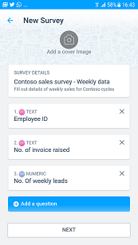

# Actions KaizalaKaizala Actions

## Vue d'ensembleOverview
Actions Kaizala sont base « unités de travail » qui permettent aux utilisateurs d’obtenir leur travail dans un contexte à l’intérieur de Kaizala conversationnel.Kaizala Actions are basic 'units of work' that help users to get their work done within a conversational context inside Kaizala. Certaines de ces Actions comme tâche, enquête, sondage, etc. sont expédié out-de-the-box.Some of these Actions like Job, Survey, Poll, etc. are shipped out-of-the-box. Ces Actions peuvent être découverts au sein de l’application Kaizala et peuvent être appelées dans une conversation à partir de la Palette de l’Action.These Actions can be discovered within the Kaizala app and can be invoked in a chat from the Action Palette. [En savoir plus](https://support.office.com/en-us/article/Kaizala-Actions-1EACC59A-DD14-43E9-B6B0-3C78773D5496).[Read More](https://support.office.com/en-us/article/Kaizala-Actions-1EACC59A-DD14-43E9-B6B0-3C78773D5496).

Bien que les besoins de chaque organisation varient et ils nécessiterait fonctionnalités seraient très différentes de besoins de toute autre organisation.We understand that the needs of every organization vary and they would require functionalities that would be very different from the needs of any other organization. Par conséquent, Kaizala permet le développement d’Actions personnalisées Kaizala qui peuvent être effectuées par des développeurs tiers 3e.Hence Kaizala enables development of custom Kaizala Actions that can be done by 3rd Party developers. Ces Actions personnalisées peuvent être déployées sur un groupe, mappé au sein d’un contexte d’organisation.These custom Actions can be deployed to a group, mapped within an organization context. 

Toutes les Actions qui sont publiées sur un ensemble d’utilisateurs peuvent être appelées par leur Action avait été ajoutée à tous les groupes.All Actions that are published to a set of users can be invoked by them on any groups that Action had been added to. 

> **Remarque :** Actions personnalisées peuvent uniquement être ajoutées aux groupes de l’organisation.**Note:** Custom Actions can only be added to organization groups.

> **Remarque :** [Portail de gestion Kaizala](https://manage.kaiza.la) est la passerelle pour tout développement, test et publication de nouvelles Actions Kaizala.**Note :** [Kaizala Management Portal](https://manage.kaiza.la) is the gateway for all development, testing and publishing of new Kaizala Actions.

## Présentation Kaizala ActionUnderstanding Kaizala Action

Une Action Kaizala contient actuellement quatre différentes vues qui peuvent être définis comme indiqué ci-dessous :A Kaizala Action currently contains four different views that can be defined as below:

* **Mode Création** lorsqu’une Action est appelée à partir de la paletteA **creation view** when an Action is invoked from the palette
* Une **vue de carte** qui apparaît sur la zone de conversation lorsqu’une instance de l’Action est envoyéA **card view** that appears on the chat canvas when an instance of the Action is sent
* Une **vue répondeur** pour répondre à l’Action KaizalaA **responder view** for users to respond to the Kaizala Action
* Un **affichage de synthèse** pour afficher les réponses agrégéesA **summary view** to view aggregated responses

Par exemple, dans Out-of-Box(OOB) Kaizala enquête Action :For instance, in Out-of-Box(OOB) Kaizala Survey Action:

| VueView | Exemple de vue dans Action d’enquête prêtes à l’emploiSample view in OOB Survey Action |
|------|----------------------------------|
| Mode CréationCreation view| |
| Affichage de carteCard view | |
| Vue répondeurResponder view | |
| Affichage de synthèseSummary view | |

Dans Actions personnalisées, vous pouvez créer des affichages personnalisés qui correspondent aux au-dessus de vues.In custom Actions, you can create custom views that correspond to above views.

## Créer une nouvelle Action KaizalaCreate a new Kaizala Action
Vous pouvez créer de nouvelles Actions Kaizala qui tirent parti de réseau de personnes de Kaizala et les fonctionnalités mobiles pour créer des expériences de la manière suivante :You can create new Kaizala Actions that leverage Kaizala’s people network and mobile capabilities to create compelling experiences in the following ways:

* **Concevoir** une nouvelle Action Kaizala via le portail de gestion Kaizala - vous pouvez créer une Action personnalisée de Kaizala par le biais de l’interface du Concepteur d’Action en s’appuyant sur les modèles d’Action existantes.**Design** a new Kaizala Action through the Kaizala Management Portal - You can design a custom Kaizala Action through the Action Designer interface by building on the existing Action templates. [En savoir plusRead More](https://support.office.com/en-us/article/Kaizala-Actions-1eacc59a-dd14-43e9-b6b0-3c78773d5496?ui=en-US&rs=en-US&ad=US)
* **Développer** une nouvelle Action Kaizala - vous pouvez créer des Actions Kaizala nouveau complexes qui fournissent des fonctionnalités personnalisées à l’aide de technologies web tels que HTML, CSS et JavaScript.**Develop** a new Kaizala Action - You can create complex new Kaizala Actions that provide custom functionality using web technologies like HTML, CSS and JavaScript. Suivez les liens ci-dessous pour en savoir plus sur les différentes étapes du développement d’une Action Kaizala.Follow the links below to learn about various stages of developement of a Kaizala Action.
    *   [Anatomie d’un package de l’Action KaizalaAnatomy of a Kaizala Action package](anatomy.md)
    *   [Mise en routeGet Started](get_started.md)
    *   [DévelopperDevelop](develop.md)
    *   [PublierPublish](publish.md)

Toutes les Actions Kaizala doivent respecter les [instructions](validation.md) pour pouvoir être publiés sur les clients Kaizala.All Kaizala Actions need to adhere to the [guidelines](validation.md) to be eligible to be published to Kaizala clients.

## Créer votre première Action KaizalaBuild your first Kaizala Action

Vous pouvez essayer de création de votre première Action Kaizala en suivant notre simple [didacticiel](tutorial.md)You can try out building your first Kaizala Action by following our simple [tutorial](tutorial.md)

## Téléchargez des exemples de Packages de ActionDownload Sample Action Packages

*  [Exemples d’ActionsSample Actions](https://manage.kaiza.la/MiniApps/DownloadSDK)
