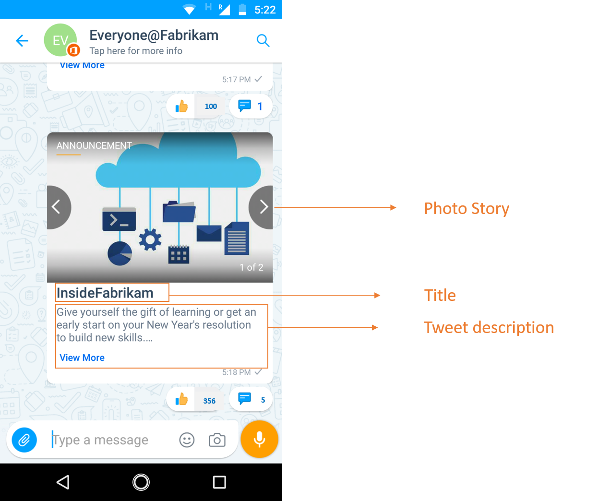
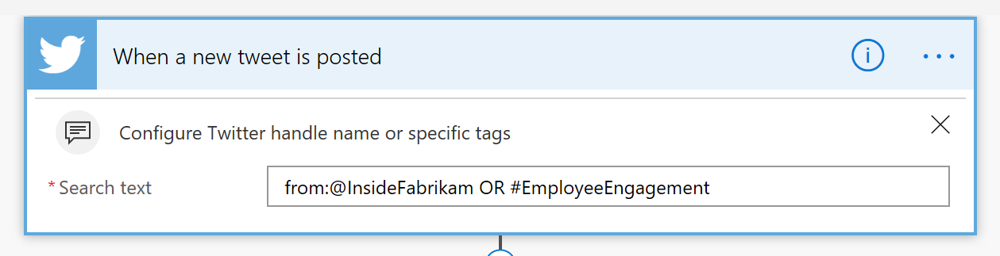

# Publication automatique des mises à jour Twitter sur Kaizala

La publication des pages d'employés Twitter fait partie de l'activité quotidienne, mais il est assez difficile de publier les mêmes informations plusieurs fois. Encourager les employés à partager les mises à jour des réseaux sociaux, lorsqu'ils sont effectués correctement, peuvent considérablement élargir les points suivants. 

Cet exemple de solution vous permet de gagner du temps en publiant automatiquement des tweets à partir de votre compte Twitter officiel vers les groupes Kaizala. Une carte d'annonce est envoyée au groupe lorsqu'un ou tous les déclencheurs suivants se produisent

1. Un nouveau Tweet est publié sur une poignée Twitter spécifique, par exemple, «@InsideFabrikam»

2. Un billet est ré-tweeté dans ce handle Twitter 
    
3. Un billet a un mot-dièse spécifique, par exemple «#EmployeeEngagement»

Cette carte comporte trois champs, le titre de la carte, les pièces jointes (images, vidéos ou GIF) et le corps (Description). Le corps de l'annonce est doté de l'URL Twitter et en appuyant sur cette URL, les utilisateurs sont dirigés vers la page d'État sur Twitter.

> Remarque: en cas de vidéo ou GIF, la miniature apparaît en mode carte de conversation.

Affichage de la carte de conversation:

Vue immersive:

Dans ce scénario, le flux est utilisé pour envoyer la carte à un groupe sélectionné dans Kaizala.

Kaizala" width="500" />

## Étapes d'implémentation:

1. Télécharger le [AutoPostTwitterUpdatesToKaizala-SolutionPackage. zip](https://aka.ms/AutoPostTwitterUpdatesToKaizala-SolutionPackage.zip) (*contient un package de flux*)

2. [Importer](https://flow.microsoft.com/en-us/blog/import-export-bap-packages/) le fichier «AutoPostTwitterUpdatesToKaizala-SolutionPackage. zip» sur votre compte Microsoft Flow

     > Remarque: Si vous n'avez jamais utilisé de connexions Twitter ou Kaizala, ajoutez d'abord les [connexions](https://docs.microsoft.com/en-us/flow/add-manage-connections)

3. Modifier le flux (*comme ci-dessous*)

    1.  Dans le premier bloc du flux
    
        Entrer le descripteur Twitter ou entrer le mot-dièse, ou les deux
        
        Kaizala" width="400" />
    
    2.  Dans le dernier bloc du flux
      
        1. Sélectionnez le nom du groupe. 
    
        2. Entrez le titre. Le titre sera visible par les utilisateurs en mode carte de conversation. Par exemple, «InsideFabrikam»
     
        Kaizala" width="400" />
     
4. Enregistrer le flux

L'annonce est envoyée au groupe Kaizala sélectionné, chaque flux de temps étant déclenché.

> Remarque: en cas de tweets avec sondages/emplacement, seul le texte de question/tweet de sondage s'affichera dans la carte, pas les options de sondage ou l'emplacement tweet.

> Remarque: consultez votre administrateur informatique en cas de [stratégie DLP](https://docs.microsoft.com/en-us/flow/prevent-data-loss) définie par votre organisation pour Twitter
