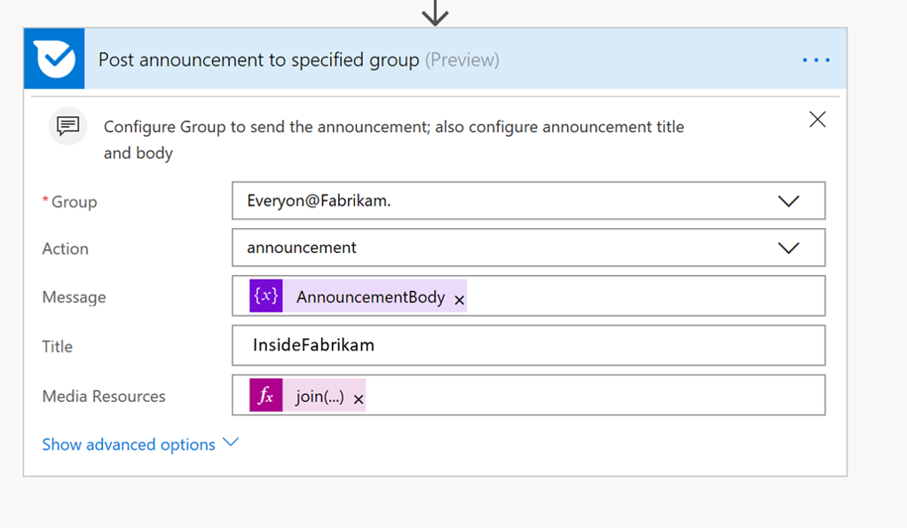

# Mises à jour Kaizala auto-Post Twitter

Validation pour Twitter pages employé fait partie des activités quotidiennes, mais que vous ayez à valider les mêmes informations plusieurs fois est très difficile. Encourager les employés peuvent partager des mises à jour des médias sociaux, lorsque vous avez terminé correctement peut étendre considérablement suivant de la société. 

Cet exemple de solution gagne du temps en auto-validation tweet à partir de votre compte Twitter officiel aux groupes Kaizala. Une carte de l’annonce est envoyée au groupe lorsqu’un ou tous les sous déclencheurs se produisent

1. Un nouveau tweet est publié sur un Twitter spécifique gérer E.g.,"@InsideFabrikam »

2. Une publication est nouveau tweetée dans ce handle Twitter 
    
3. Une publication est simplement un hashtag spécifique E.g.,"#EmployeeEngagement »

Cette carte possède trois champs carte titre, corps (description) et des pièces jointes (images, des vidéos ou GIF). Le corps de l’annonce est l’URL Twitter et sur appuyant sur cette URL, les utilisateurs seraient redirigés vers la page d’état sur Twitter.

> Remarque : En cas de vidéo ou GIF, vignette s’affiche dans la vue de carte de conversation

Afficher la carte conversation :

Mode immersif :

Dans ce scénario, le flux est utilisé pour envoyer la carte à un groupe sélectionné dans Kaizala.

Kaizala" width="500" />

## Étapes d’implémentation :

1. Téléchargez le [AutoPostTwitterUpdatesToKaizala-SolutionPackage.zip](https://github.com/MicrosoftDocs/kaizala-docs/blob/master/Articles/BusinessSolutions/CorporateCommunications/AutoPostTwitterUpdatesToKaizala/AutoPostTwitterUpdatesToKaizala-SolutionPackage.zip) (*il contient le Package de flux*)

2. [Importation](https://flow.microsoft.com/en-us/blog/import-export-bap-packages/) « AutoPostTwitterUpdatesToKaizala-SolutionPackage.zip » à votre compte Microsoft Flow

     > Remarque : Si vous n’avez jamais utilisé connexions Twitter ou Kaizala, première [Ajouter des connexions](https://docs.microsoft.com/en-us/flow/add-manage-connections)

3. Modifier le flux (*comme indiqué ci-dessous*)

    1.  Dans le premier bloc du flux
    
        Entrez la poignée Twitter ou le hashtag, ou les deux
        
        Kaizala" width="400" />
    
    2.  Dans le dernier bloc du flux
      
        1. Sélectionnez le nom du groupe 
    
        2. Entrez le titre. Le titre sera visible pour les utilisateurs dans l’affichage de carte de conversation. Par exemple, « InsideFabrikam »
     
        Kaizala" width="400" />
     
4. Enregistrer le flux

Annonce est envoyé au groupe Kaizala sélectionné, chaque fois que flux est déclenché.

> Remarque : en cas de tweet sondages/emplacement uniquement le texte de la question/tweet sondage s’affichera dans la fiche, pas les options de sondage ou l’emplacement tweet

> Remarque : Vérifiez avec votre administrateur informatique en cas de toute [stratégie DLP](https://docs.microsoft.com/en-us/flow/prevent-data-loss) défini par votre organisation pour Twitter
