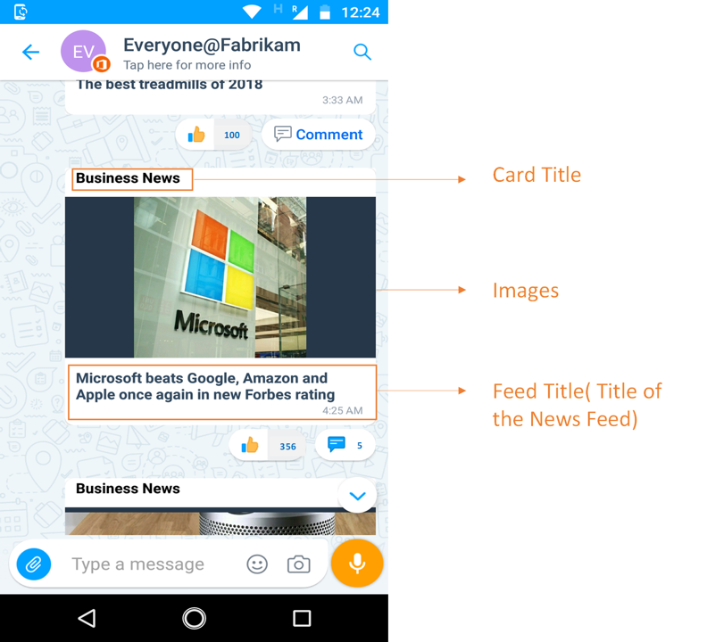
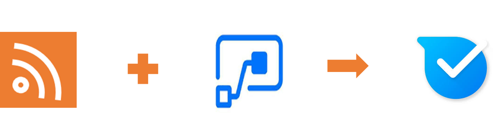
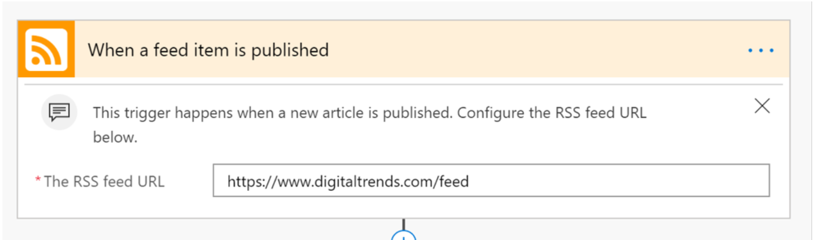
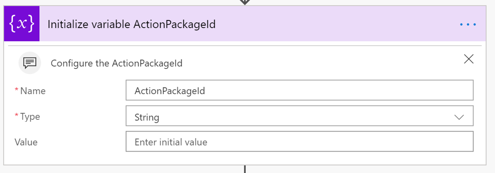
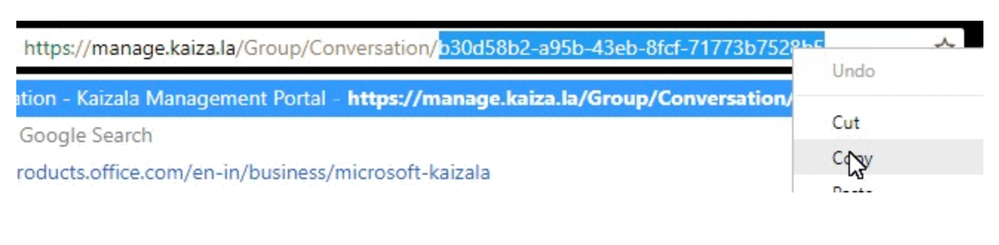
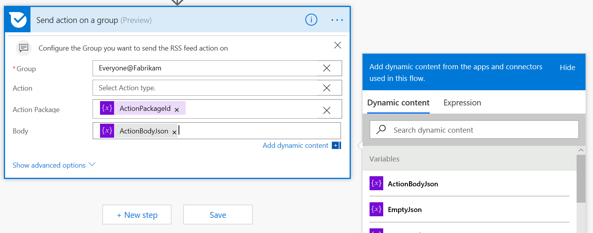

# <a name="display-rss-feeds-in-kaizala-groups"></a><span data-ttu-id="997df-101">Afficher les flux RSS dans les groupes Kaizala</span><span class="sxs-lookup"><span data-stu-id="997df-101">Display RSS feeds in Kaizala groups</span></span>

<span data-ttu-id="997df-102">Les organisations utilisent des flux RSS pour compléter leurs systèmes de messagerie et améliorer la manière dont ils fournissent des informations aux employés.</span><span class="sxs-lookup"><span data-stu-id="997df-102">Organizations use RSS feeds to complement their e-mail systems and improve the way they provide information to employees.</span></span> <span data-ttu-id="997df-103">Les organisations peuvent désormais utiliser ces flux avec la première ligne et les employés mobiles en les envoyant en tant qu'annonces aux groupes Kaizala.</span><span class="sxs-lookup"><span data-stu-id="997df-103">Organizations can now leverage these feeds with the first line and mobile workers by sending them as announcements to Kaizala groups.</span></span>

<span data-ttu-id="997df-104">Quelques cas d'utilisation de flux RSS:</span><span class="sxs-lookup"><span data-stu-id="997df-104">Few use cases of RSS feeds:</span></span>

1. <span data-ttu-id="997df-105">Informations industrielles sur les sites externes</span><span class="sxs-lookup"><span data-stu-id="997df-105">Industry News from external sites</span></span>
2. <span data-ttu-id="997df-106">Actualité de l'entreprise à partir de sites internes</span><span class="sxs-lookup"><span data-stu-id="997df-106">Company news from internal sites</span></span>
3. <span data-ttu-id="997df-107">Concurrence des informations provenant de sites externes</span><span class="sxs-lookup"><span data-stu-id="997df-107">Compete Information from external sites</span></span>
4. <span data-ttu-id="997df-108">Mises à jour de produits</span><span class="sxs-lookup"><span data-stu-id="997df-108">Product Updates</span></span>
5. <span data-ttu-id="997df-109">ReGroupez les flux spécifiques, par exemple finance, design et Tech.</span><span class="sxs-lookup"><span data-stu-id="997df-109">Group specific feeds, E.g., Finance, Design and Tech</span></span> 
6. <span data-ttu-id="997df-110">Trucs et astuces, par exemple, outil 299657, sports et photographie</span><span class="sxs-lookup"><span data-stu-id="997df-110">Tips and Tricks, E.g, DIY, Sports and Photography</span></span>

<span data-ttu-id="997df-111">Cet exemple permet à un utilisateur de l'administrateur d'ajouter des flux RSS à des groupes Kaizala.</span><span class="sxs-lookup"><span data-stu-id="997df-111">This sample will help, an admin user to add RSS feeds to Kaizala groups.</span></span> <span data-ttu-id="997df-112">Cette carte comporte 3 champs en mode carte de conversation-titre de la carte (par exemple, Actualités professionnelles), titre de l'image et du flux.</span><span class="sxs-lookup"><span data-stu-id="997df-112">This card has 3 fields in chat card view- Card title(E.g., Business News), Image and Feed title.</span></span> <span data-ttu-id="997df-113">En appuyant sur la carte, l'utilisateur est en mode Web dans Kaizala.</span><span class="sxs-lookup"><span data-stu-id="997df-113">Tapping on the card would take the user to web view within Kaizala.</span></span> 
 
 ><span data-ttu-id="997df-114">Remarque: seule l'URL du flux RSS de la liste est ouverte dans Kaizala, si ce n'est pas le cas, le contenu est dirigé vers un navigateur.</span><span class="sxs-lookup"><span data-stu-id="997df-114">Note: Only whitelisted RSS feed URL's open within Kaizala, if not, the content would be directed to a browser.</span></span>



<span data-ttu-id="997df-115">Il s'agit d'une annonce sous la forme d'une carte et d'un flux utilisé pour envoyer cette carte d'action personnalisée au groupe Kaizala.</span><span class="sxs-lookup"><span data-stu-id="997df-115">This is an announcement in the form of a card and Flow is used to send this custom action card to Kaizala group.</span></span>



## <a name="implementation-steps"></a><span data-ttu-id="997df-116">Étapes d’implémentation</span><span class="sxs-lookup"><span data-stu-id="997df-116">Implementation steps</span></span>

1. <span data-ttu-id="997df-117">Téléchargez le fichier [«GetRSSFeedsOnKaizala-SolutionPackage. zip»](https://aka.ms/GetRssFeedsonKaizala-SolutionPackage.zip) (*ce package contient «RSS-Feed-ActionPackage. zip» et «RSS-Feed-FlowPackage. zip»*)</span><span class="sxs-lookup"><span data-stu-id="997df-117">Download the ["GetRSSFeedsOnKaizala-SolutionPackage.zip"](https://aka.ms/GetRssFeedsonKaizala-SolutionPackage.zip) (*This package contain "RSS-feed-ActionPackage.zip" and "RSS-feed-FlowPackage.zip"*)</span></span>
2. <span data-ttu-id="997df-118">Téléchargez la dernière version de Kaizala [«ActionSDK. zip»](https://manage.kaiza.la/MiniApps/DownloadSDK)(*elle contient le fichier KASClient. js*)</span><span class="sxs-lookup"><span data-stu-id="997df-118">Download the latest version of Kaizala ["ActionSDK.Zip"](https://manage.kaiza.la/MiniApps/DownloadSDK)(*This contains KASClient.js file*)</span></span>
3. <span data-ttu-id="997df-119">Modifier le fichier «RSS-feed-ActionPackage. zip» (*comme ci-dessous*)</span><span class="sxs-lookup"><span data-stu-id="997df-119">Edit the "RSS-feed-ActionPackage.zip" (*as below*)</span></span>
   1. <span data-ttu-id="997df-120">DéCompresser le package d'action «RSS-feed-ActionPackage. zip» dans un dossier</span><span class="sxs-lookup"><span data-stu-id="997df-120">Unzip action package "RSS-feed-ActionPackage.zip" to a folder</span></span>
   2. <span data-ttu-id="997df-121">Modifier les actions «ID» et «nom du fournisseur» dans package. JSON</span><span class="sxs-lookup"><span data-stu-id="997df-121">Change the action "id" and "provider name" in package.json</span></span>
   3. <span data-ttu-id="997df-122">Ajouter le fichier KASClient. js à ce dossier</span><span class="sxs-lookup"><span data-stu-id="997df-122">Add KASClient.js file to this folder</span></span> 
   4. <span data-ttu-id="997df-123">Ajoutez l'URL du flux RSS dans package. JSON (comme ci-dessous) pour autoriser cette URL.</span><span class="sxs-lookup"><span data-stu-id="997df-123">Add RSS feed URL in package.json(as below) to whitelist that URL.</span></span> <span data-ttu-id="997df-124">Dans cet exemple, l'URL des tendances numériques est la liste d'autorisation.</span><span class="sxs-lookup"><span data-stu-id="997df-124">In this example, digital trends URL is whitelisted.</span></span>    
         ```
      "externalUrls": [
      { "url": "https://www.digitaltrends.com" }
      ]  
      ```
   5. <span data-ttu-id="997df-125">Zip tout le contenu de ce dossier (*ce dossier est votre package d'action modifié qui doit être importé dans le portail de gestion kaizala*)</span><span class="sxs-lookup"><span data-stu-id="997df-125">Zip all the contents in this folder (*This folder is your modified Action package which should be imported to kaizala management portal*)</span></span>
   
 > <span data-ttu-id="997df-126">Remarque: sélectionnez tous les fichiers dans votre répertoire de travail et créez un fichier zip pour votre package.</span><span class="sxs-lookup"><span data-stu-id="997df-126">Note: Select all the files in your working directory and create a new zip file for your package.</span></span> <span data-ttu-id="997df-127">Assurez-vous que tous les fichiers sont présents dans le répertoire racine du package.</span><span class="sxs-lookup"><span data-stu-id="997df-127">Ensure that all files are present in the root directory of the package.</span></span> <span data-ttu-id="997df-128">Cela doit inclure KASClient. js, package. JSON avec le nouvel «ID», le «nom du fournisseur» et l'URL de la liste d'autorisation</span><span class="sxs-lookup"><span data-stu-id="997df-128">This should include KASClient.js, package.json with new "id", "provider name" and whitelisted URL</span></span>
 
4. <span data-ttu-id="997df-129">[Importer](https://docs.microsoft.com/en-us/kaizala/actions/publish#import-kaizala-action) le package d'action modifié vers le portail de gestion Kaizala (*cette carte est envoyée par l'API appelante, il n'est donc pas nécessaire d'ajouter la carte à un groupe*).</span><span class="sxs-lookup"><span data-stu-id="997df-129">[Import](https://docs.microsoft.com/en-us/kaizala/actions/publish#import-kaizala-action) the edited action package to kaizala management portal (*This card is sent by calling API, so there is no need to add the card to a group*)</span></span>
5. <span data-ttu-id="997df-130">[Importer](https://flow.microsoft.com/en-us/blog/import-export-bap-packages/) le fichier «RSS-Feed-Flowpackage. zip» sur votre compte Microsoft Flow</span><span class="sxs-lookup"><span data-stu-id="997df-130">[Import](https://flow.microsoft.com/en-us/blog/import-export-bap-packages/) the "RSS-feed-Flowpackage.zip" to your Microsoft Flow account</span></span>

    > <span data-ttu-id="997df-131">Remarque: Si vous n'avez jamais utilisé de connexions RSS ou Kaizala, vous devez d'abord [Ajouter des connexions](https://docs.microsoft.com/en-us/flow/add-manage-connections)</span><span class="sxs-lookup"><span data-stu-id="997df-131">Note: If you have never used RSS or Kaizala connections, first [add connections](https://docs.microsoft.com/en-us/flow/add-manage-connections)</span></span>    

6. <span data-ttu-id="997df-132">Modifier les détails dans le flux importé (*voir les étapes ci-dessous*)</span><span class="sxs-lookup"><span data-stu-id="997df-132">Edit details in Imported Flow (*See steps below*)</span></span> 
   1. <span data-ttu-id="997df-133">Dans le premier bloc, entrez l'URL du flux RSS. </span><span class="sxs-lookup"><span data-stu-id="997df-133">In the first block , enter the RSS feed URL  </span></span>
   2. <span data-ttu-id="997df-134">Dans le deuxième bloc, entrez le titre de la carte dans le champ «valeur».</span><span class="sxs-lookup"><span data-stu-id="997df-134">In the second block, enter the card title in "value" field.</span></span> <span data-ttu-id="997df-135">Le titre de la carte sera visible par les utilisateurs en mode carte de conversation.</span><span class="sxs-lookup"><span data-stu-id="997df-135">The card title will be visible to users in chat card view.</span></span> <span data-ttu-id="997df-136">Par exemple, «informations professionnelles»</span><span class="sxs-lookup"><span data-stu-id="997df-136">E.g., "Business News"</span></span>
   
      
   3. <span data-ttu-id="997df-137">Dans le troisième bloc, entrez le nom de l'action «ID» dans le champ «Value», que vous avez indiqué dans package. JSON.</span><span class="sxs-lookup"><span data-stu-id="997df-137">In the third block, enter the Action "id" in "value" field, that you have given in package.json</span></span>
      
   4. <span data-ttu-id="997df-138">Dans le dernier bloc du flux</span><span class="sxs-lookup"><span data-stu-id="997df-138">In the last block of the Flow</span></span>
        1. <span data-ttu-id="997df-139">Sélectionnez le nom du groupe ou entrez l'ID de groupe auquel vous souhaitez envoyer la carte.</span><span class="sxs-lookup"><span data-stu-id="997df-139">Select the group name or enter the group id where you want to send the card</span></span>
        2. <span data-ttu-id="997df-140">Pour obtenir l'ID de groupe, accédez à votre groupe https://manage.kaiza.la sur et sélectionnez l'identificateur à la fin de l'URL.</span><span class="sxs-lookup"><span data-stu-id="997df-140">To get the group id, go to your group on https://manage.kaiza.la and select the identifier at the end of the URL.</span></span>
        
            
            
        3. <span data-ttu-id="997df-141">Cliquez sur action pour sélectionner type d'action comme «valeur personnalisée» dans la liste déroulante.</span><span class="sxs-lookup"><span data-stu-id="997df-141">Click on action, to select action type as "custom value" from the dropdown</span></span>
        4. <span data-ttu-id="997df-142">Mapper le corps sur «ActionBodyJson»</span><span class="sxs-lookup"><span data-stu-id="997df-142">Map body to "ActionBodyJson"</span></span>
       
       
7.  <span data-ttu-id="997df-143">Enregistrer le flux</span><span class="sxs-lookup"><span data-stu-id="997df-143">Save the Flow</span></span>

 <span data-ttu-id="997df-144">Les flux RSS sont envoyés au groupe Kaizala sélectionné, chaque fois que le flux de temps est déclenché.</span><span class="sxs-lookup"><span data-stu-id="997df-144">RSS feeds will be sent to the selected Kaizala group, each time flow is triggered.</span></span> 

> <span data-ttu-id="997df-145">Remarque: vous ne pouvez définir qu'une URL de flux RSS dans le flux.</span><span class="sxs-lookup"><span data-stu-id="997df-145">Note: You can only set one RSS feed URL in the Flow.</span></span> <span data-ttu-id="997df-146">Pour diriger plusieurs flux vers le même groupe, des flux différents doivent être créés pour chaque flux</span><span class="sxs-lookup"><span data-stu-id="997df-146">To direct multiple feeds to same group, different Flows have to be created for each feed</span></span>

> <span data-ttu-id="997df-147">Problème connu: sur iOS, les publicités emportent l'utilisateur de la WebView, car elles ne sont pas dans la liste d'autorisation.</span><span class="sxs-lookup"><span data-stu-id="997df-147">Known issue: On iOS, the ads take the user out of the webview since they are not whitelisted</span></span>

### <a name="useful-links"></a><span data-ttu-id="997df-148">Liens utiles</span><span class="sxs-lookup"><span data-stu-id="997df-148">Useful links</span></span>
1. [<span data-ttu-id="997df-149">Comment créer des groupes Kaizala</span><span class="sxs-lookup"><span data-stu-id="997df-149">How to create Kaizala Groups</span></span>](https://docs.microsoft.com/en-us/office365/kaizala/groups)
2. [<span data-ttu-id="997df-150">Configurer le flux RSS sur un site SharePoint</span><span class="sxs-lookup"><span data-stu-id="997df-150">Configure RSS Feed to SharePoint site</span></span>](https://support.office.com/en-us/article/create-or-subscribe-to-an-rss-feed-fb35047d-8dbd-412a-a5f3-f1712af14dcb)
