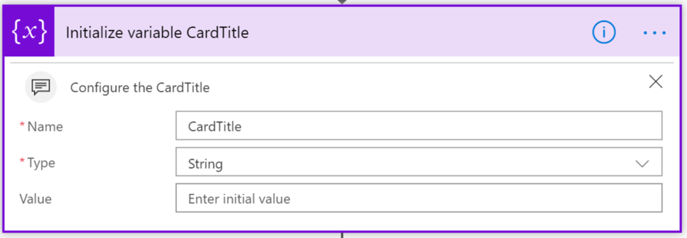

# <a name="display-rss-feeds-in-kaizala-groups"></a>Afficher les flux RSS dans les groupes Kaizala

Les organisations utilisent des flux RSS pour compléter leurs systèmes de messagerie et améliorer la manière dont ils fournissent des informations aux employés. Les organisations peuvent désormais utiliser ces flux avec la première ligne et les employés mobiles en les envoyant en tant qu'annonces aux groupes Kaizala.

Quelques cas d'utilisation de flux RSS:

1. Informations industrielles sur les sites externes
2. Actualité de l'entreprise à partir de sites internes
3. Concurrence des informations provenant de sites externes
4. Mises à jour de produits
5. ReGroupez les flux spécifiques, par exemple finance, design et Tech. 
6. Trucs et astuces, par exemple, outil 299657, sports et photographie

Cet exemple permet à un utilisateur de l'administrateur d'ajouter des flux RSS à des groupes Kaizala. Cette carte comporte 3 champs en mode carte de conversation-titre de la carte (par exemple, Actualités professionnelles), titre de l'image et du flux. En appuyant sur la carte, l'utilisateur est en mode Web dans Kaizala. 
 
 >Remarque: seule l'URL du flux RSS de la liste est ouverte dans Kaizala, si ce n'est pas le cas, le contenu est dirigé vers un navigateur.


Il s'agit d'une annonce sous la forme d'une carte et d'un flux utilisé pour envoyer cette carte d'action personnalisée au groupe Kaizala.


## <a name="implementation-steps"></a>Étapes d’implémentation

1. Téléchargez le fichier [«GetRSSFeedsOnKaizala-SolutionPackage. zip»](https://aka.ms/GetRssFeedsonKaizala-SolutionPackage.zip) (*ce package contient «RSS-Feed-ActionPackage. zip» et «RSS-Feed-FlowPackage. zip»*)
2. Téléchargez la dernière version de Kaizala [«ActionSDK. zip»](https://manage.kaiza.la/MiniApps/DownloadSDK)(*elle contient le fichier KASClient. js*)
3. Modifier le fichier «RSS-feed-ActionPackage. zip» (*comme ci-dessous*)
   1. DéCompresser le package d'action «RSS-feed-ActionPackage. zip» dans un dossier
   2. Modifier les actions «ID» et «nom du fournisseur» dans package. JSON
   3. Ajouter le fichier KASClient. js à ce dossier 
   4. Ajoutez l'URL du flux RSS dans package. JSON (comme ci-dessous) pour autoriser cette URL. Dans cet exemple, l'URL des tendances numériques est la liste d'autorisation.    
         ```
      "externalUrls": [
      { "url": "https://www.digitaltrends.com" }
      ]  
      ```
   5. Zip tout le contenu de ce dossier (*ce dossier est votre package d'action modifié qui doit être importé dans le portail de gestion kaizala*)
   
 > Remarque: sélectionnez tous les fichiers dans votre répertoire de travail et créez un fichier zip pour votre package. Assurez-vous que tous les fichiers sont présents dans le répertoire racine du package. Cela doit inclure KASClient. js, package. JSON avec le nouvel «ID», le «nom du fournisseur» et l'URL de la liste d'autorisation
 
4. [Importer](https://docs.microsoft.com/en-us/kaizala/actions/publish#import-kaizala-action) le package d'action modifié vers le portail de gestion Kaizala (*cette carte est envoyée par l'API appelante, il n'est donc pas nécessaire d'ajouter la carte à un groupe*).
5. [Importer](https://flow.microsoft.com/en-us/blog/import-export-bap-packages/) le fichier «RSS-Feed-Flowpackage. zip» sur votre compte Microsoft Flow

    > Remarque: Si vous n'avez jamais utilisé de connexions RSS ou Kaizala, vous devez d'abord [Ajouter des connexions](https://docs.microsoft.com/en-us/flow/add-manage-connections)    

6. Modifier les détails dans le flux importé (*voir les étapes ci-dessous*) 
   1. Dans le premier bloc, entrez l'URL du flux RSS. 
   2. Dans le deuxième bloc, entrez le titre de la carte dans le champ «valeur». Le titre de la carte sera visible par les utilisateurs en mode carte de conversation. Par exemple, «informations professionnelles»
   
      
   3. Dans le troisième bloc, entrez le nom de l'action «ID» dans le champ «Value», que vous avez indiqué dans package. JSON.
      
   4. Dans le dernier bloc du flux
        1. Sélectionnez le nom du groupe ou entrez l'ID de groupe auquel vous souhaitez envoyer la carte.
        2. Pour obtenir l'ID de groupe, accédez à votre groupe https://manage.kaiza.la sur et sélectionnez l'identificateur à la fin de l'URL.
        
            
            
        3. Cliquez sur action pour sélectionner type d'action comme «valeur personnalisée» dans la liste déroulante.
        4. Mapper le corps sur «ActionBodyJson»
       
       
7.  Enregistrer le flux

 Les flux RSS sont envoyés au groupe Kaizala sélectionné, chaque fois que le flux de temps est déclenché. 

> Remarque: vous ne pouvez définir qu'une URL de flux RSS dans le flux. Pour diriger plusieurs flux vers le même groupe, des flux différents doivent être créés pour chaque flux

> Problème connu: sur iOS, les publicités emportent l'utilisateur de la WebView, car elles ne sont pas dans la liste d'autorisation.

### <a name="useful-links"></a>Liens utiles
1. [Comment créer des groupes Kaizala](https://docs.microsoft.com/en-us/office365/kaizala/groups)
2. [Configurer le flux RSS sur un site SharePoint](https://support.office.com/en-us/article/create-or-subscribe-to-an-rss-feed-fb35047d-8dbd-412a-a5f3-f1712af14dcb)
