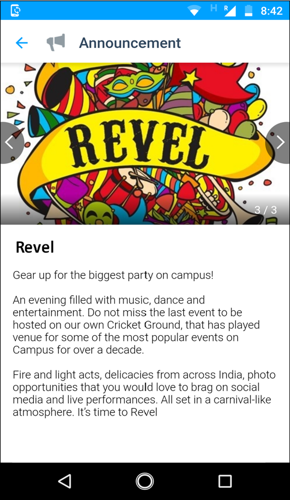
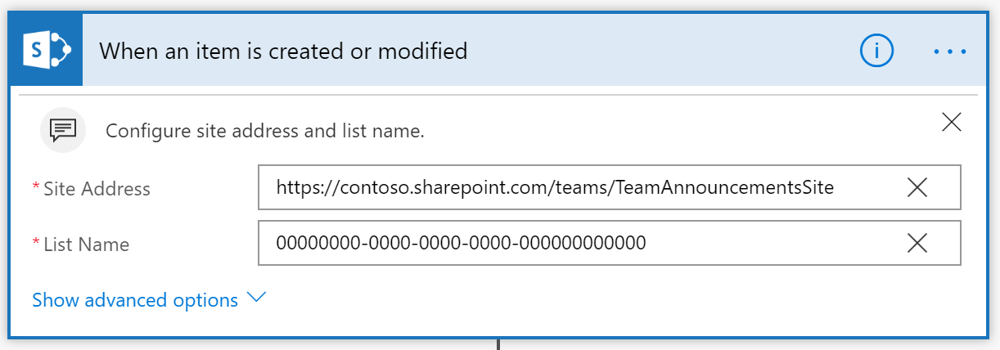

# Afficher les annonces SharePoint dans les groupes Kaizala 
Les organisations utilisent l'application d'annonce SharePoint pour partager des actualités, des États et d'autres informations de taille réduite aux employés. L'application d'annonce SharePoint, qui est fournie avec une liste, est un type spécial de liste qui vous permet de créer des annonces.

À l'aide de cet exemple, les organisations peuvent partager des annonces SharePoint avec la première ligne et les employés mobiles sur Kaizala. Cette carte comporte 3 champs en mode carte de conversation-pièces jointes (dans cet exemple, Photo Story of images), title et Announcement Body (Description). Ce champ est envoyé à un groupe Kaizala en tant que carte d'annonce prédéfinie.

La vue de la carte de conversation est la suivante

En appuyant sur la carte, l'affichage immersif est comme suit.

Ce scénario peut être divisé en deux étapes:
1. Créer une liste d'annonces avec des colonnes-titre, pièces jointes et corps d'annonce (Description) 

    > Remarque: le texte enrichi n'est pas pris en charge par la carte d'annonce prédéfinie. Désactivez le texte enrichi pour une colonne SharePoint dont le corps d'annonce (Description) est créé lors de la création de cette colonne.

    

2. Configurer le flux de sorte que, lorsqu'un nouvel élément est créé ou qu'un élément existant soit modifié dans la liste d'annonces, une carte d'annonce prédéfinie est envoyée à un groupe Kaizala

    

## Étapes d’implémentation

1. [Ajouter une application d'annonce](https://docs.microsoft.com/en-us/sharepoint/administration/add-apps-for-sharepoint-to-a-sharepoint-site) à un site SharePoint (*comme ci-dessous*)
     1. Cliquez sur l'icône Paramètres.
     2.  Cliquez sur Ajouter une application 
     3.  Sélectionnez application d'annonce dans la liste des applications disponibles.
2. Utiliser le [composant WebPart de contenu](https://support.office.com/en-us/article/use-the-highlighted-content-web-part-e34199b0-ff1a-47fb-8f4d-dbcaed329efd) en surbrillance (le*cas échéant, pour la visualisation*)
3. Télécharger le fichier [SharepointAnnouncementOnKaizala-SolutionPackage. zip](https://aka.ms/SharepointAnnouncementOnKaizala-SolutionPackage.zip) (*il s'agit d'un package de flux*)
4. [Importer](https://flow.microsoft.com/en-us/blog/import-export-bap-packages/) SharepointAnnouncementOnKaizala-SolutionPackage. zip sur votre compte Microsoft Flow
   
   > Remarque: Si vous n'avez jamais utilisé SharePoint ou la connexion Kaizala, ajoutez d'abord les [connexions](https://docs.microsoft.com/en-us/flow/add-manage-connections)
   
5. Modifier le flux (*comme ci-dessous*)
    1. Dans le premier bloc du flux
    
         1. Entrez l'adresse du site
         2. Entrez le nom de la liste (*étapes à suivre pour obtenir le nom de la liste, comme indiqué ci-dessous*)
            - Cliquez sur l'onglet contenu du site dans le coin gauche de l'écran.
            - Sélectionnez la liste d'annonces à partir de laquelle vous souhaitez envoyer des annonces à Kaizala
            - Cliquez sur l'icône Paramètres dans le coin supérieur droit de l'écran.
            - Accéder aux paramètres de la liste
            - Copiez l'URL de la liste à partir du navigateur.
            - Décodez l'URL (vous pouvez décoder l'URL [ici](https://www.url-encode-decode.com/) )
        
      
    2. Dans le deuxième bloc du flux
   
        Mapper le champ «valeur» avec le titre de colonne de la liste d'annonces, avec le corps de l'annonce (Description) à partir de contenu dynamique. Dans l'exemple ci-dessous, le titre de la colonne est «corps de l'annonce» 
       
    3. Dans le dernier bloc du flux
    
       Sélectionnez le nom du groupe dans la liste déroulante. Dans cet exemple, il s'agit de «tout le monde @ Fabrikam»
       
6. Enregistrer le flux

L'annonce est envoyée au groupe Kaizala sélectionné, chaque flux de temps étant déclenché.

> Remarque: le fichier texte n'est pas pris en charge en tant que pièce jointe
