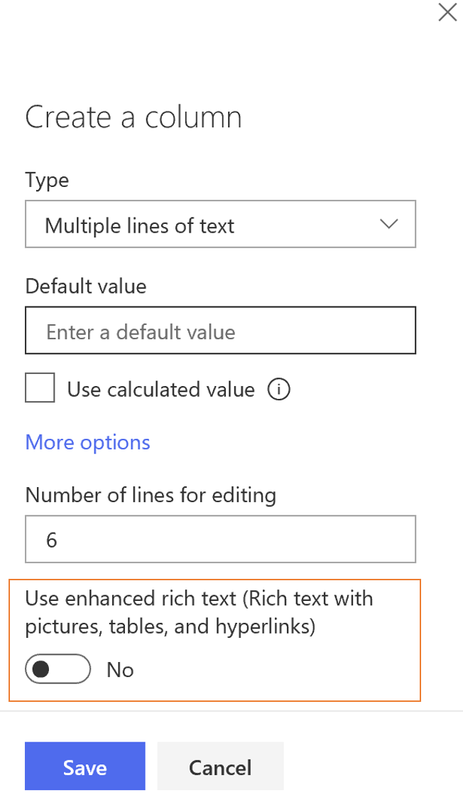

# Afficher les annonces SharePoint dans les groupes de Kaizala 
Organisations utilisent application annonce SharePoint pour partager des news, état et autres bribes d’informations aux employés. Application annonce de SharePoint, qui est fourni avec une liste, est un type particulier de la liste qui vous permet de créer des annonces.

À l’aide de cet exemple, les organisations peuvent partager des annonces SharePoint avec la première ligne et les travailleurs mobiles sur Kaizala. Cette carte a 3 champs de conversation carte afficher-les pièces jointes (dans cet exemple, article Photo d’images), titre et annonce le corps (description). Il est envoyé à un groupe de Kaizala en tant qu’une carte annonce out-of-box.

L’affichage de carte de conversation est en dessous

En cliquant sur la carte, mode immersif est en dessous

Ce scénario peut être divisé en 2 étapes :
1. Créer une liste d’annonces avec colonnes - Title, pièces jointes et annonce body(description) 

    > Remarque : RTF n’est pas pris en charge par la carte annonce out-of-box. Désactiver le texte enrichi dans la colonne sharepoint qui a body(description) annonce lors de la création de cette colonne.

    

2. Configurer le flux tels que lorsqu’un nouvel élément est créé ou un élément existant est modifié dans la liste d’annonces, une carte annonce out-of-box est envoyée à un groupe de Kaizala

    

## Étapes d’implémentation

1. [Application annonce ajouter](https://docs.microsoft.com/en-us/sharepoint/administration/add-apps-for-sharepoint-to-a-sharepoint-site) au site SharePoint (*comme indiqué ci-dessous*)
     1. Cliquez sur l’icône Paramètres
     2.  Cliquez sur Ajouter une application 
     3.  Sélectionnez application annonce dans la liste des applications disponibles
2. Utiliser le [composant WebPart contenu mis en surbrillance](https://support.office.com/en-us/article/use-the-highlighted-content-web-part-e34199b0-ff1a-47fb-8f4d-dbcaed329efd) (*le cas échéant, pour la visualisation*)
3. Téléchargez le [SharepointAnnouncementOnKaizala-SolutionPackage.zip](https://github.com/MicrosoftDocs/kaizala-docs/blob/master/Articles/BusinessSolutions/CorporateCommunications/SharepointAnnouncementsonKaizala/SharepointAnnouncementOnKaizala-SolutionPackage.zip) (*il s’agit d’un package de flux*)
4. [Importation](https://flow.microsoft.com/en-us/blog/import-export-bap-packages/) SharepointAnnouncementOnKaizala-SolutionPackage.zip à votre compte Microsoft Flow
   
   > Remarque : Si vous n’avez jamais utilisé Sharepoint ou Kaizala connexion, première [Ajouter des connexions](https://docs.microsoft.com/en-us/flow/add-manage-connections)
   
5. Modifier le flux (*comme indiqué ci-dessous*)
    1. Dans le premier bloc du flux
    
         1. Entrez l’adresse du site
         2. Entrez le nom de la liste (*comme suit pour obtenir la liste nom est comme suit*)
            - Cliquez sur l’onglet de contenu de site dans le coin gauche de l’écran
            - Sélectionnez la liste d’annonces à partir de laquelle vous voulez envoyer des annonces à Kaizala
            - Cliquez sur l’icône Paramètres dans le coin supérieur droit de l’écran
            - Accéder aux paramètres de liste
            - Copiez l’URL de la liste à partir du navigateur.
            - L’URL de décodage (vous pouvez décoder le URL [ici](https://www.url-encode-decode.com/) )
        
      
    2. Dans le deuxième bloc du flux
   
        Mapper le champ « valeur » avec le titre de la colonne de liste d’annonces, qui a body(description) annonce du contenu dynamique. Dans le sous exemple, le titre de colonne est « Annonce corps » 
       
    3. Dans le dernier bloc du flux
    
       Sélectionnez le nom du groupe dans la liste déroulante. Dans cet exemple, il est « Everyone@Fabrikam »
       
6. Enregistrer le flux

Annonce seront envoyés au groupe Kaizala sélectionné, chaque flux de temps est déclenché.

> Remarque : Fichier texte n’est pas pris en charge en tant que pièce jointe
