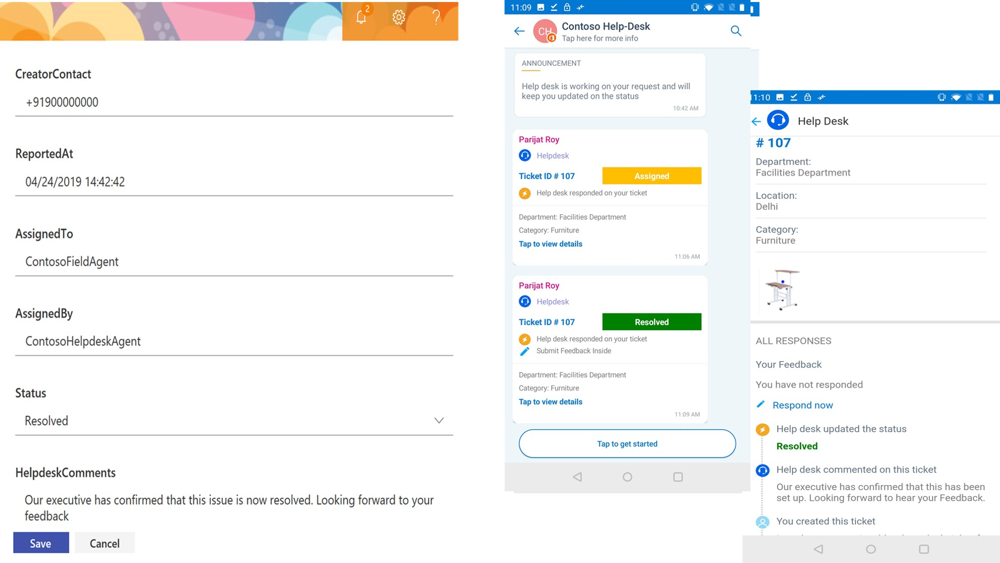

# Support technique pour les employés

 Dans une organisation, l'équipe du support technique examine les requêtes émises par les employés, les affecte à un agent de champ et met à jour l'état de résolution à l'employé. Toutes les requêtes sont connectées sous forme de tickets pour faciliter le suivi et la résolution. Un système de gestion des tickets permet aux agents du support technique de capturer, classer, résoudre et recueillir des commentaires de façon systématique. Cela permet à une organisation d'être efficace dans la résolution des requêtes et a un effet multiplicateur sur les scores de satisfaction des employés.

Cette solution utilise Kaizala en tant que serveur frontal, SharePoint comme serveur principal et de flux pour interagir avec Kaizala et SharePoint. Un utilisateur crée le ticket en envoyant un formulaire dans Kaizala, les détails de ticket envoyés à l'aide de cette carte sont capturés et stockés dans SharePoint à l'aide de Flow. on submission, l'utilisateur obtient une carte mise à jour, soit lorsque-

   1. L'agent du support technique met à jour l'état du ticket dans SharePoint (nouveau, affecté ou résolu) ou

   2. Les agents du support technique ajoutent des commentaires sur le ticket dans SharePoint ou

   3. L'état des mises à jour de l'agent de support technique et ajoute des commentaires dans SharePoint

Si l'utilisateur est satisfait de la résolution proposée, l'utilisateur a la possibilité de fermer le ticket et d'envoyer des commentaires. Si l'utilisateur n'est pas satisfait de la résolution, l'utilisateur peut rouvrir le ticket. Commentaires des utilisateurs-évaluation et commentaires, État: rouvert ou fermé est mis à jour dans SharePoint.

> Remarque: cette carte fonctionne uniquement dans les groupes Hub et spoke

  Affichage par l'utilisateur de la création et de l'envoi d'un ticket:

  

   Affichage de l'État mis à jour sur «affecté» dans SharePoint et la carte correspondante envoyée à l'utilisateur

   

   Affichage de l'État mis à jour sur «résolu» dans SharePoint et la carte correspondante envoyée à l'utilisateur
   
   

   Affichage des commentaires de l'utilisateur

   

## Étapes d'implémentation:
Cette opération est généralement divisée en trois étapes:

1. Télécharger des packages d'actions qui permettent à un utilisateur de (*2 packages d'actions*)

   1. Création et envoi d'un ticket pour le service d'assistance (*CreateTicket-ActionPackage. zip*)

   2. Recevoir des mises à jour d'État & des commentaires du support technique (*StatusUpdateFromHelpdesk-ActionPackage. zip*)

2. Configurer une liste SharePoint qui permet aux agents du support technique de

    1. Stocker les détails du ticket

    2. Affecter, commenter et modifier l'état du ticket

3. Configurer Microsoft Flow pour interagir avec SharePoint et Kaizala (*3 flux*)

    1. Pour collecter les détails des tickets à partir de la carte et les stocker dans SharePoint (*TicketCreationFlow. zip*)
    
    2. Pour envoyer une carte mise à jour à l'utilisateur lorsque l'agent du support technique met à jour l'État, les commentaires ou les deux dans le SharePoint (*TicketStatusUpdatesFlow. zip*)

    3. Pour mettre à jour la liste SharePoint lorsque l'utilisateur choisit de fermer, de rouvrir ou d'ajouter des commentaires de commentaires à partir de la carte (*TicketReopenFlow. zip*)

### Télécharger des packages d'actions
1. Télécharger le fichier [«EmployeeHelpDesk-SolutionPackage. zip»](https://aka.ms/EmployeeHelpdesk-SolutionPackage.zip)(*il contient 2 packages d'action et 3 flux*)

2. Téléchargez la dernière version de Kaizala [«ActionSDK. zip»](https://manage.kaiza.la/MiniApps/DownloadSDK) (*elle contient KASClient. js*)

3. Configurer le «CreateTicket-ActionPackage. zip»

   1. DéCompresser «CreateTicket-ActionPackage. zip» dans un dossier

   2. Modifier les actions «ID» et «nom du fournisseur» dans package. JSON

   3. Ajouter KASClient. js à ce dossier 

   4. Zip tout le contenu de ce dossier (*ce dossier est votre package d'action modifié qui doit être importé dans le portail de gestion Kaizala*)

   5. [Importer](https://docs.microsoft.com/en-us/kaizala/actions/publish#import-kaizala-action) le package d'actions modifié dans le [portail de gestion Kaizala](https://manage.kaiza.la/)

   6. [Publiez](https://docs.microsoft.com/en-us/kaizala/actions/publish) l'action et ajoutez l'action à un groupe auquel vous voulez ajouter la carte.

   7. Sélectionner les rôles d'utilisateur en tant qu'administrateur et membre

4. Configurer «StatusUpdateFromHelpDesk-ActionPackage. zip»

   1.  DéCompresser «StatusUpdateFromHelpDesk-ActionPackage. zip» dans un dossier

   2. Modifier les actions «ID» et «nom du fournisseur» dans package. JSON

   3. Ajouter KASClient. js à ce dossier 

   4. Zip tout le contenu de ce dossier (*ce dossier est votre package d'action modifié qui doit être importé dans le portail de gestion Kaizala*)

   5. [Importer](https://docs.microsoft.com/en-us/kaizala/actions/publish#import-kaizala-action) le package d'actions modifié dans le [portail de gestion Kaizala](https://manage.kaiza.la/)

   6. [Publiez](https://docs.microsoft.com/en-us/kaizala/actions/publish) l'action et ajoutez l'action à un groupe auquel vous voulez ajouter la carte.

   7. Sélectionner un rôle d'utilisateur en tant qu'administrateur

       > Remarque: «CreateTicket-ActionPackage. zip» est la carte utilisée pour déclencher un ticket et doit être mise à la disposition de l'administrateur et des abonnés.» StatusUpdateFromHelpDesk-ActionPackage. zip "afficher les commentaires et les mises à jour de l'état du support technique. Les abonnés n'ont pas besoin d'afficher cette carte dans la palette d'action, donc elle n'est visible que par l'administrateur.

### Configurer une liste SharePoint

1. [Créer](https://support.office.com/en-us/article/create-a-list-in-sharepoint-0d397414-d95f-41eb-addd-5e6eff41b083) une liste dans SharePoint

2. [Ajouter](https://support.office.com/en-us/article/create-a-column-in-a-sharepoint-list-or-library-2b0361ae-1bd3-41a3-8329-269e5f81cfa2) des colonnes et [modifier](https://support.office.com/en-us/article/Edit-list-settings-in-SharePoint-Online-4d35793b-246e-42a3-990c-563a83795b7f) (*comme indiqué ci-dessous dans les mêmes paramètres de colonne ordre et format*) pour cette liste

    |Column|Paramètres recommandés|
    |-------- |---|
    |Service|Une seule ligne de texte|
    |Emplacement|Une seule ligne de texte|
    |Catégorie|Ligne de texte|
    |Description |Plusieurs lignes de texte|
    |Photos|Plusieurs lignes de texte|
    |CreatorName|Une seule ligne de texte|
    |CreatorContact|Une seule ligne de texte|
    |ReportedAt|Une seule ligne de texte|
    |AssignedTo|Une seule ligne de texte|
    |AssignedBy|Une seule ligne de texte|
    |État|Choix avec des options comme nouveau, affecté, résolu, fermé et rouvert (*ces étapes de ticket sont obligatoires*)|
    |HelpdeskComments|Plusieurs lignes de texte|
    |UserFeedback|Plusieurs lignes de texte|
    |ReasonsToReopen|Plusieurs lignes de texte|
    |CreatorKaizalaName|Une seule ligne de texte|
    |CreatorKaizalaContact|Une seule ligne de texte|
    |UserRating|Une seule ligne de texte|
 

4. [Modifier l'affichage de liste](https://support.office.com/en-gb/article/edit-a-list-view-in-sharepoint-online-15916903-e79a-423f-b4e2-02d37e1ff372) sur l'ID de poste à la première place. Il s'agit de l'ID de ticket unique qui s'affichera dans la carte, une fois le ticket attribué.

     >Remarque: [Télécharger](https://github.com/MicrosoftDocs/kaizala-docs/blob/master/Articles/BusinessSolutions/Life%40Work/EmployeeHelpDesk/HelpdeskTemplate.xlsx) le modèle Excel pour les en-têtes de colonne

### Importer et configurer des flux

Cette solution comporte 3 flux,

1. Pour collecter les détails des tickets à partir de la carte et les stocker dans SharePoint

    1. [Importer](https://flow.microsoft.com/en-us/blog/import-export-bap-packages/) le fichier «TicketCreationFlow. zip» sur votre compte Microsoft Flow

          > Remarque: Si vous n'avez jamais utilisé les connexions SharePoint ou Kaizala, ajoutez d'abord les [connexions](https://docs.microsoft.com/en-us/flow/add-manage-connections)    

    2. Modifier les détails dans le flux importé (*voir les étapes ci-dessous*) 

          1. Dans le premier bloc 

               1. Entrez l'ID de groupe ou sélectionnez le nom du groupe auquel vous souhaitez ajouter la carte.

               2. Cliquez sur le champ package d'action pour entrer le code d'action que vous avez indiqué pour «CreateTicket-ActionPackage. zip».

               3. Mapper l'action sur «tout»

                  

          2. Dans le dernier bloc

               1. Entrer l'adresse du site SharePoint

               2. Entrer le nom de la liste
                  
                  

                   > Remarque: toutes les colonnes de la liste SharePoint seront affichées dans le flux de la saisie de l'adresse du site SharePoint & nom de la liste. Vérifiez le mappage des champs de liste SharePoint dans le flux. 

          3.  Enregistrer le flux
           

2. Pour envoyer une carte mise à jour à l'utilisateur lorsque l'agent du support technique met à jour l'État, les commentaires ou les deux dans le SharePoint

    1. [Importer](https://flow.microsoft.com/en-us/blog/import-export-bap-packages/) le fichier «TicketStatusUpdatesFlow. zip» sur votre compte Microsoft Flow

    2. Modifier les détails dans le flux importé (*voir les étapes ci-dessous*) 

          1. Dans le premier bloc

               1.  Entrer l'adresse du site SharePoint

               2. Entrer le nom de la liste

                  

          2. Dans le dernier bloc

               1. Entrez l'ID de groupe ou sélectionnez un nom de groupe à l'endroit où vous souhaitez envoyer les mises à jour d'État.

               2. Cliquez sur action pour sélectionner «package d'actions». 

               3. Cliquez sur package d'action pour entrer l'ID d'action que vous avez indiqué pour «StatusUpdateFromHelpDesk-ActionPackage. zip».

               4. Mapper le corps sur «ActionBody»

                  

        3.  Enregistrer le flux
    
3. Pour mettre à jour la liste SharePoint lorsque l'utilisateur choisit de fermer, de rouvrir ou d'ajouter des commentaires de commentaires à partir de la carte
 
    1. [Importer](https://flow.microsoft.com/en-us/blog/import-export-bap-packages/) le fichier «TicketReopenFlow. zip» sur votre compte Microsoft Flow

    2. Modifier les détails dans le flux importé (*voir les étapes ci-dessous*) 

        1. Dans le premier bloc 

             1. Sélectionnez un nom de groupe ou entrez l'ID de groupe.

             2. Cliquez sur package d'action pour entrer l'ID d'action que vous avez indiqué pour «StatusUpdateFromHelpDesk-ActionPackage. zip».

             3. Mapper l'action sur «tout»

                

        2. Dans le deuxième bloc

             1. Entrez l'adresse du site

             2. Entrez le nom de la liste 

                

        3. Dans le dernier bloc

             1. Entrez l'adresse du site

             2. Entrez le nom de la liste

                

        4.  Enregistrer le flux
