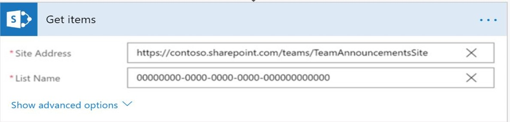

# Support technique pour les employésEmployee Help Desk

 Dans une organisation, l'équipe du support technique examine les requêtes émises par les employés, les affecte à un agent de champ et met à jour l'état de résolution à l'employé.In an Organization, helpdesk team looks into the queries raised by employees, assigns it to a field agent and updates back the resolution status to the employee. Toutes les requêtes sont connectées sous forme de tickets pour faciliter le suivi et la résolution.All the queries are logged in as tickets for easy tracking and resolution. Un système de gestion des tickets permet aux agents du support technique de capturer, classer, résoudre et recueillir des commentaires de façon systématique.A ticketing system enables helpdesk agents to systematically capture, categorize, resolve and collect feedback. Cela permet à une organisation d'être efficace dans la résolution des requêtes et a un effet multiplicateur sur les scores de satisfaction des employés.This enables an organization to be effective in query resolution and has a multiplier effect on employee satisfaction scores.

Cette solution utilise Kaizala en tant que serveur frontal, SharePoint comme serveur principal et de flux pour interagir avec Kaizala et SharePoint.This solution uses Kaizala as the front-end, SharePoint as the backend and Flow as a means to interact with Kaizala and SharePoint. Un utilisateur crée le ticket en envoyant un formulaire dans Kaizala, les détails de ticket envoyés à l'aide de cette carte sont capturés et stockés dans SharePoint à l'aide de Flow. on submission, l'utilisateur obtient une carte mise à jour, soit lorsque-A user creates the ticket by submitting a form in Kaizala, ticket details submitted using this card is captured and stored in the SharePoint using Flow.On submission, User gets an updated card,either when-

   1. L'agent du support technique met à jour l'état du ticket dans SharePoint (nouveau, affecté ou résolu) ouHelp desk agent updates the status of the ticket in SharePoint (New, Assigned or Resolved) or

   2. Les agents du support technique ajoutent des commentaires sur le ticket dans SharePoint ouHelp desk agents adds comments on the ticket in SharePoint or

   3. L'état des mises à jour de l'agent de support technique et ajoute des commentaires dans SharePointBoth, help desk agent updates status and adds comments in SharePoint

Si l'utilisateur est satisfait de la résolution proposée, l'utilisateur a la possibilité de fermer le ticket et d'envoyer des commentaires.If the user is satisfied with the proposed resolution, user has the ability to close the ticket and submit feedback. Si l'utilisateur n'est pas satisfait de la résolution, l'utilisateur peut rouvrir le ticket.If the user is not satisfied with the resolution, user can re-open the ticket. Commentaires des utilisateurs-évaluation et commentaires, État: rouvert ou fermé est mis à jour dans SharePoint.User Feedback - Rating and comments, status- Reopened or closed is updated back in SharePoint.

> Remarque: cette carte fonctionne uniquement dans les groupes Hub et spokeNote: This card works only in Hub and spoke groups

  Affichage par l'utilisateur de la création et de l'envoi d'un ticket:User view of ticket creation and submission:

  

   Affichage de l'État mis à jour sur «affecté» dans SharePoint et la carte correspondante envoyée à l'utilisateurView of status being updated to "Assigned" in sharepoint and the corresponding card that is sent to user

   

   Affichage de l'État mis à jour sur «résolu» dans SharePoint et la carte correspondante envoyée à l'utilisateurView of status being updated to "Resolved" in sharepoint and the corresponding card that is sent to user
   
   

   Affichage des commentaires de l'utilisateurUser Feedback view

   

## Étapes d'implémentation:Implementation Steps:
Cette opération est généralement divisée en trois étapes:This is broadly divided into 3 steps:

1. Télécharger des packages d'actions qui permettent à un utilisateur de (*2 packages d'actions*)Upload action packages that enable a user to (*2 Action Packages*)

   1. Création et envoi d'un ticket pour le service d'assistance (*CreateTicket-ActionPackage. zip*)Create and submit a ticket to help desk (*CreateTicket-ActionPackage.Zip*)

   2. Recevoir des mises à jour d'État & des commentaires du support technique (*StatusUpdateFromHelpdesk-ActionPackage. zip*)Receive status updates & comments from help desk (*StatusUpdateFromHelpdesk-ActionPackage.Zip*)

2. Configurer une liste SharePoint qui permet aux agents du support technique deSet up a SharePoint list that enables helpdesk agents to

    1. Stocker les détails du ticketStore the ticket details

    2. Affecter, commenter et modifier l'état du ticketAssign, comment and change the ticket status

3. Configurer Microsoft Flow pour interagir avec SharePoint et Kaizala (*3 flux*)Configure Microsoft Flow to interact with SharePoint and Kaizala (*3 Flows*)

    1. Pour collecter les détails des tickets à partir de la carte et les stocker dans SharePoint (*TicketCreationFlow. zip*)To collect ticket details from the card and store it in SharePoint(*TicketCreationFlow.Zip*)
    
    2. Pour envoyer une carte mise à jour à l'utilisateur lorsque l'agent du support technique met à jour l'État, les commentaires ou les deux dans le SharePoint (*TicketStatusUpdatesFlow. zip*)To send the user an updated card when help desk agent updates the status, comments or both in the SharePoint(*TicketStatusUpdatesFlow.Zip*)

    3. Pour mettre à jour la liste SharePoint lorsque l'utilisateur choisit de fermer, de rouvrir ou d'ajouter des commentaires de commentaires à partir de la carte (*TicketReopenFlow. zip*)To update the SharePoint list when the user chooses to close, reopen or adds feedback comments from the card(*TicketReopenFlow.Zip*)

### Télécharger des packages d'actionsUpload Action Packages
1. Télécharger le fichier [«EmployeeHelpDesk-SolutionPackage. zip»](https://aka.ms/EmployeeHelpdesk-SolutionPackage.zip)(*il contient 2 packages d'action et 3 flux*)Download the ["EmployeeHelpDesk-SolutionPackage.zip"](https://aka.ms/EmployeeHelpdesk-SolutionPackage.zip)(*This contains 2 Action Packages and 3 Flows*)

2. Téléchargez la dernière version de Kaizala [«ActionSDK. zip»](https://manage.kaiza.la/MiniApps/DownloadSDK) (*elle contient KASClient. js*)Download the latest version of Kaizala ["ActionSDK.Zip"](https://manage.kaiza.la/MiniApps/DownloadSDK) (*This contains KASClient.js*)

3. Configurer le «CreateTicket-ActionPackage. zip»Set up the "CreateTicket-ActionPackage.Zip"

   1. DéCompresser «CreateTicket-ActionPackage. zip» dans un dossierUnzip "CreateTicket-ActionPackage.Zip" to a folder

   2. Modifier les actions «ID» et «nom du fournisseur» dans package. JSONChange the action "id" and "provider name" in package.json

   3. Ajouter KASClient. js à ce dossierAdd KASClient.js to this folder 

   4. Zip tout le contenu de ce dossier (*ce dossier est votre package d'action modifié qui doit être importé dans le portail de gestion Kaizala*)Zip all the contents in this folder (*This folder is your modified action package which should be imported to Kaizala Management Portal*)

   5. [Importer](https://docs.microsoft.com/en-us/kaizala/actions/publish#import-kaizala-action) le package d'actions modifié dans le [portail de gestion Kaizala](https://manage.kaiza.la/)[Import](https://docs.microsoft.com/en-us/kaizala/actions/publish#import-kaizala-action) the edited action package to [Kaizala Management Portal](https://manage.kaiza.la/)

   6. [Publiez](https://docs.microsoft.com/en-us/kaizala/actions/publish) l'action et ajoutez l'action à un groupe auquel vous voulez ajouter la carte.[Publish](https://docs.microsoft.com/en-us/kaizala/actions/publish) the action and add the action to a group where you want to add the card

   7. Sélectionner les rôles d'utilisateur en tant qu'administrateur et membreSelect user roles as admin and member

4. Configurer «StatusUpdateFromHelpDesk-ActionPackage. zip»Set up "StatusUpdateFromHelpDesk-ActionPackage.Zip"

   1.  DéCompresser «StatusUpdateFromHelpDesk-ActionPackage. zip» dans un dossierUnzip "StatusUpdateFromHelpDesk-ActionPackage.Zip" to a folder

   2. Modifier les actions «ID» et «nom du fournisseur» dans package. JSONChange the action "id" and "provider name" in package.json

   3. Ajouter KASClient. js à ce dossierAdd KASClient.js to this folder 

   4. Zip tout le contenu de ce dossier (*ce dossier est votre package d'action modifié qui doit être importé dans le portail de gestion Kaizala*)Zip all the contents in this folder (*This folder is your modified action package which should be imported to Kaizala Management Portal*)

   5. [Importer](https://docs.microsoft.com/en-us/kaizala/actions/publish#import-kaizala-action) le package d'actions modifié dans le [portail de gestion Kaizala](https://manage.kaiza.la/)[Import](https://docs.microsoft.com/en-us/kaizala/actions/publish#import-kaizala-action) the edited action package to [Kaizala Management Portal](https://manage.kaiza.la/)

   6. [Publiez](https://docs.microsoft.com/en-us/kaizala/actions/publish) l'action et ajoutez l'action à un groupe auquel vous voulez ajouter la carte.[Publish](https://docs.microsoft.com/en-us/kaizala/actions/publish) the action and add the action to a group where you want to add the card

   7. Sélectionner un rôle d'utilisateur en tant qu'administrateurSelect user role as admin

       > Remarque: «CreateTicket-ActionPackage. zip» est la carte utilisée pour déclencher un ticket et doit être mise à la disposition de l'administrateur et des abonnés.» StatusUpdateFromHelpDesk-ActionPackage. zip "afficher les commentaires et les mises à jour de l'état du support technique.Note: "CreateTicket-ActionPackage.Zip" is the card that is used to raise a ticket and should be made available to admin and Subscribers."StatusUpdateFromHelpDesk-ActionPackage.Zip" show helpdesk comments and status updates. Les abonnés n'ont pas besoin d'afficher cette carte dans la palette d'action, donc elle n'est visible que par l'administrateur.Subscribers do not have to see this card in action palette, hence this is only made visible to admin.

### Configurer une liste SharePointSet up a SharePoint List

1. [Créer](https://support.office.com/en-us/article/create-a-list-in-sharepoint-0d397414-d95f-41eb-addd-5e6eff41b083) une liste dans SharePoint[Create](https://support.office.com/en-us/article/create-a-list-in-sharepoint-0d397414-d95f-41eb-addd-5e6eff41b083) a new list in SharePoint

2. [Ajouter](https://support.office.com/en-us/article/create-a-column-in-a-sharepoint-list-or-library-2b0361ae-1bd3-41a3-8329-269e5f81cfa2) des colonnes et [modifier](https://support.office.com/en-us/article/Edit-list-settings-in-SharePoint-Online-4d35793b-246e-42a3-990c-563a83795b7f) (*comme indiqué ci-dessous dans les mêmes paramètres de colonne ordre et format*) pour cette liste[Add](https://support.office.com/en-us/article/create-a-column-in-a-sharepoint-list-or-library-2b0361ae-1bd3-41a3-8329-269e5f81cfa2) columns and [Edit](https://support.office.com/en-us/article/Edit-list-settings-in-SharePoint-Online-4d35793b-246e-42a3-990c-563a83795b7f) (*as below in the same order and format*) column settings for this list

    |ColumnColumn|Paramètres recommandésRecommended settings|
    |-------- |---|
    |ServiceDepartment|Une seule ligne de texteSingle line of text|
    |EmplacementLocation|Une seule ligne de texteSingle line of text|
    |CatégorieCategory|Ligne de texteSingle line of text|
    |DescriptionDescription |Plusieurs lignes de texteMultiple lines of text|
    |PhotosPhotos|Plusieurs lignes de texteMultiple lines of text|
    |CreatorNameCreatorName|Une seule ligne de texteSingle line of text|
    |CreatorContactCreatorContact|Une seule ligne de texteSingle line of text|
    |ReportedAtReportedAt|Une seule ligne de texteSingle line of text|
    |AssignedToAssignedTo|Une seule ligne de texteSingle line of text|
    |AssignedByAssignedBy|Une seule ligne de texteSingle line of text|
    |StatutStatus|Choix avec des options comme nouveau, affecté, résolu, fermé et rouvert (*ces étapes de ticket sont obligatoires*)Choice with options as New, Assigned, Resolved, Closed and Reopened (*These ticket stages are mandatory*)|
    |HelpdeskCommentsHelpdeskComments|Plusieurs lignes de texteMultiple lines of text|
    |UserFeedbackUserFeedback|Plusieurs lignes de texteMultiple lines of text|
    |ReasonsToReopenReasonsToReopen|Plusieurs lignes de texteMultiple lines of text|
    |CreatorKaizalaNameCreatorKaizalaName|Une seule ligne de texteSingle line of text|
    |CreatorKaizalaContactCreatorKaizalaContact|Une seule ligne de texteSingle line of text|
    |UserRatingUserRating|Une seule ligne de texteSingle line of text|
 

4. [Modifier l'affichage de liste](https://support.office.com/en-gb/article/edit-a-list-view-in-sharepoint-online-15916903-e79a-423f-b4e2-02d37e1ff372) sur l'ID de poste à la première place. Il s'agit de l'ID de ticket unique qui s'affichera dans la carte, une fois le ticket attribué.[Edit list view](https://support.office.com/en-gb/article/edit-a-list-view-in-sharepoint-online-15916903-e79a-423f-b4e2-02d37e1ff372) to position ID in first place.This is the unique ticket ID that will be displayed in the card, once the ticket is assigned.

     >Remarque: [Télécharger](https://github.com/MicrosoftDocs/kaizala-docs/blob/master/Articles/BusinessSolutions/Life%40Work/EmployeeHelpDesk/HelpdeskTemplate.xlsx) le modèle Excel pour les en-têtes de colonneNote: [Download](https://github.com/MicrosoftDocs/kaizala-docs/blob/master/Articles/BusinessSolutions/Life%40Work/EmployeeHelpDesk/HelpdeskTemplate.xlsx) excel template for column headers

### Importer et configurer des fluxImport and Set up Flows

Cette solution comporte 3 flux,This solution has 3 Flows,

1. Pour collecter les détails des tickets à partir de la carte et les stocker dans SharePointTo collect ticket details from the card and store it in SharePoint

    1. [Importer](https://flow.microsoft.com/en-us/blog/import-export-bap-packages/) le fichier «TicketCreationFlow. zip» sur votre compte Microsoft Flow[Import](https://flow.microsoft.com/en-us/blog/import-export-bap-packages/) the "TicketCreationFlow.Zip" to your Microsoft Flow account

          > Remarque: Si vous n'avez jamais utilisé les connexions SharePoint ou Kaizala, ajoutez d'abord les [connexions](https://docs.microsoft.com/en-us/flow/add-manage-connections)Note- If you have never used Sharepoint or Kaizala connections, first [add connections](https://docs.microsoft.com/en-us/flow/add-manage-connections)    

    2. Modifier les détails dans le flux importé (*voir les étapes ci-dessous*)Edit details in Imported Flow (*See steps below*) 

          1. Dans le premier blocIn the First block 

               1. Entrez l'ID de groupe ou sélectionnez le nom du groupe auquel vous souhaitez ajouter la carte.Enter the Group ID or Select the Group name where you want to add the card

               2. Cliquez sur le champ package d'action pour entrer le code d'action que vous avez indiqué pour «CreateTicket-ActionPackage. zip».Click on Action Package field to enter action id that you have given for "CreateTicket-ActionPackage.zip"

               3. Mapper l'action sur «tout»Map action to "All"

                  

          2. Dans le dernier blocIn the Last block

               1. Entrer l'adresse du site SharePointEnter the SharePoint Site address

               2. Entrer le nom de la listeEnter List Name
                  
                  

                   > Remarque: toutes les colonnes de la liste SharePoint seront affichées dans le flux de la saisie de l'adresse du site SharePoint & nom de la liste.Note: All the columns in the SharePoint list will be displayed in Flow on entering Sharepoint Site address & List Name. Vérifiez le mappage des champs de liste SharePoint dans le flux.Verify the mapping of SharePoint list fields in Flow. 

          3.  Enregistrer le fluxSave the Flow
           

2. Pour envoyer une carte mise à jour à l'utilisateur lorsque l'agent du support technique met à jour l'État, les commentaires ou les deux dans le SharePointTo send the user an updated card when help desk agent updates the status, comments or both in the SharePoint

    1. [Importer](https://flow.microsoft.com/en-us/blog/import-export-bap-packages/) le fichier «TicketStatusUpdatesFlow. zip» sur votre compte Microsoft Flow[Import](https://flow.microsoft.com/en-us/blog/import-export-bap-packages/) the "TicketStatusUpdatesFlow.Zip" to your Microsoft Flow account

    2. Modifier les détails dans le flux importé (*voir les étapes ci-dessous*)Edit details in Imported Flow (*See steps below*) 

          1. Dans le premier blocIn the first block

               1.  Entrer l'adresse du site SharePointEnter the SharePoint Site address

               2. Entrer le nom de la listeEnter List Name

                  

          2. Dans le dernier blocIn the last block

               1. Entrez l'ID de groupe ou sélectionnez un nom de groupe à l'endroit où vous souhaitez envoyer les mises à jour d'État.Enter the group ID or select group name to where you want to send the status updates

               2. Cliquez sur action pour sélectionner «package d'actions».Click on Action to select "Action Package" 

               3. Cliquez sur package d'action pour entrer l'ID d'action que vous avez indiqué pour «StatusUpdateFromHelpDesk-ActionPackage. zip».Click on Action package to enter action id that you have given for "StatusUpdateFromHelpDesk-ActionPackage.Zip"

               4. Mapper le corps sur «ActionBody»Map body to "ActionBody"

                  

        3.  Enregistrer le fluxSave the Flow
    
3. Pour mettre à jour la liste SharePoint lorsque l'utilisateur choisit de fermer, de rouvrir ou d'ajouter des commentaires de commentaires à partir de la carteTo update the SharePoint list when the user chooses to close, reopen or adds feedback comments from the card
 
    1. [Importer](https://flow.microsoft.com/en-us/blog/import-export-bap-packages/) le fichier «TicketReopenFlow. zip» sur votre compte Microsoft Flow[Import](https://flow.microsoft.com/en-us/blog/import-export-bap-packages/) the "TicketReopenFlow.Zip" to your Microsoft Flow account

    2. Modifier les détails dans le flux importé (*voir les étapes ci-dessous*)Edit details in Imported Flow (*See steps below*) 

        1. Dans le premier blocIn the First block 

             1. Sélectionnez un nom de groupe ou entrez l'ID de groupe.Select group name or enter the group ID

             2. Cliquez sur package d'action pour entrer l'ID d'action que vous avez indiqué pour «StatusUpdateFromHelpDesk-ActionPackage. zip».Click on action package to enter action id that you have given for "StatusUpdateFromHelpDesk-ActionPackage.Zip"

             3. Mapper l'action sur «tout»Map action to "All"

                

        2. Dans le deuxième blocIn the second block

             1. Entrez l'adresse du siteEnter the site address

             2. Entrez le nom de la listeEnter the list name 

                

        3. Dans le dernier blocIn the Last block

             1. Entrez l'adresse du siteEnter the site address

             2. Entrez le nom de la listeEnter the list name

                

        4.  Enregistrer le fluxSave the Flow
