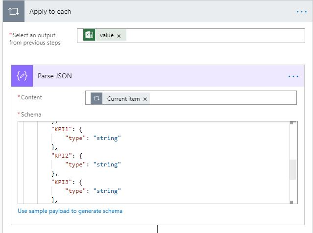

# <a name="drive-performance-using-leaderboard"></a>Performances des disques à l'aide de Leaderboard
Une Leaderboard est une représentation visuelle riche des participants afin de comprendre où ils sont classés par comparaison avec les homologues. En tirant parti de la puissance de joueur ludification, Leaderboards est la meilleure façon de Instill l'esprit de compétitivité entre les équipes et de suivre les performances individuelles/d'équipe par rapport aux objectifs de l'entreprise. Ils fournissent des commentaires instantanés au cours et identifient les modèles dans les indicateurs de performance clés qui pourraient aider les employés à improvise.

Cette solution générique constitue un excellent moyen d'incentivizeer une équipe et de créer une culture ouverte. Elle peut être utilisée par toute organisation de vente ou de service pour effectuer le suivi des performances (individuelle ou d'équipe) et comparer les performances de plusieurs indicateurs de performance clés. 

Excel de votre Onedrive entreprise est consommé par Microsoft Flow et la carte Leaderboard est envoyée au groupe Kaizala dans une périodicité. Cette carte est composée de deux affichages: vue de carte de conversation & mode immersif. 

**Affichage de la carte de conversation**


**Vue immersive**

Cet affichage comporte deux onglets, tout d'abord un mur de notoriété pour les 10 principaux intervenants, le second est «My performance», ce qui est différent pour chaque utilisateur.


Mes performances dispose de 2 sections qui affichent mes statistiques et leurs rangs proches. 


## <a name="implementation-steps"></a>Étapes d’implémentation
Cela peut être divisé en trois étapes:
1. Télécharger le package d'action
2. Format de feuille Excel
3. Configurer le flux Microsoft

### <a name="upload-action-package"></a>Télécharger le package d'action
1. Téléchargez le fichier [«Leaderboard-SolutionPackage. zip](https://aka.ms/Leaderboard-SolutionPackage.zip)»*(il* *contient* les *packages* *«Leaderboard_ActionPackage. zip»* *et* *«Leaderboard_FlowPackage. zip»* )
2. Téléchargez la dernière version de Kaizala [«ActionSDK. zip»](https://manage.kaiza.la/MiniApps/DownloadSDK) (*elle contient KASClient. js*)
3. Modifier «Leaderboard_ActionPackage. zip»
   1. DéCompresser «Leaderboard_ActionPackage. zip» dans un dossier
   2. Modifier les actions «ID» et «nom du fournisseur» dans package. JSON
   3. Ajouter KASClient. js à ce dossier 
   4. Zip tout le contenu de ce dossier (*ce dossier est votre package d'action modifié qui doit être importé dans le portail de gestion Kaizala*)
   5. [Importer](https://docs.microsoft.com/en-us/kaizala/actions/publish#import-kaizala-action) le package d'action modifié vers le [portail de gestion Kaizala](https://manage.kaiza.la/)(*cette carte est envoyée en appelant une API, il n'est donc pas nécessaire d'ajouter la carte à un groupe*).

### <a name="format-excel-sheet"></a>Format de feuille Excel

1. Télécharger le [modèle Excel](https://github.com/MicrosoftDocs/kaizala-docs/blob/master/Articles/BusinessSolutions/Leaderboard/Leaderboard.csv)

2. Remplissez tous les champs obligatoires-nom, PhoneNo et score. À l'exception de ces trois champs obligatoires, les autres sont des indicateurs de performance clés (facultatif) et sont affichés sous l'onglet «My performance».

    

     > Remarque: les indicateurs de performance clés & peuvent être des valeurs numériques ou%. Si la colonne comporte des pourcentages, appliquez le format de [nombre pourcentage](https://support.office.com/en-ie/article/format-numbers-as-percentages-de49167b-d603-4450-bcaa-31fba6c7b6b4) à cette colonne.

     > Remarque: l'onglet mon performance peut contenir un maximum de 6 indicateurs de performance clés


3. [Renommer](https://support.office.com/en-us/article/rename-an-excel-table-fbf49a4f-82a3-43eb-8ba2-44d21233b114) le tableau Excel en tant que «Leaderboardyyyymmdd», par exemple, Leaderboard20190431 pour le jour 2019/04/31 (yy/mm/dd)

4. Enregistrer ce fichier dans un lecteur pour les entreprises

      > Remarque: Flow récupère automatiquement les données Excel de ce jour en fonction du nom de la table et envoie la carte.

### <a name="configure-microsoft-flow"></a>Configurer le flux Microsoft

1. [Importer](https://flow.microsoft.com/en-us/blog/import-export-bap-packages/) le fichier «Leaderboard_FlowPackage. zip» sur votre compte Microsoft Flow

      > Remarque: Si vous n'avez jamais utilisé les connexions SharePoint ou Kaizala, ajoutez d'abord les [connexions](https://docs.microsoft.com/en-us/flow/add-manage-connections)    

2. Modifier les détails dans le flux importé (*voir les étapes ci-dessous*)

    1. Dans le deuxième bloc, entrez le titre de la carte dans le champ valeur, que vous souhaitez afficher dans le leaderboard. Par exemple, «ventes Leaderboard» 

         
    
    2. Dans le troisième bloc, affectez à value la valeur true si le «score» est un pourcentage, s'il n'est pas défini sur false.

         

    3. Dans le septième bloc

       1. Sélectionnez emplacement comme «OneDrive entreprise» dans la liste déroulante.

       2. Sélectionner la bibliothèque de documents en tant que «OneDrive» à partir de la liste déroulante

       3. Sélectionner un fichier Excel en cliquant sur sélecteur de dossiers
     
             > Remarque: le nom de table que vous avez indiqué dans le fichier Excel sera automatiquement sélectionné par le flux. 
       
             


    4. Dans le neuvième bloc, «appliquer à chaque», 

        1. Modifier les étiquettes des indicateurs de performance clés dans l'analyse du bloc JSON pour les indicateurs de performance clés (KPI) 1 en tant que demandes Closed & KPI 2 comme appels convertis.

             


             >Remarque: la carte peut afficher un maximum de 6 indicateurs de performance clés (KPI) 

        2. Modifier les étiquettes d'indicateur de performance clé dans la composition (*comme indiqué ci-dessous*)
        
             

        
    5. Dans le dernier bloc

        1. Entrez l'ID de groupe ou sélectionnez le nom de groupe auquel vous souhaitez envoyer la carte.

        2. Cliquez sur action pour sélectionner «package d'actions» dans la liste déroulante.
        
        3. Cliquez sur package d'action pour sélectionner «entrer une valeur personnalisée» et entrez votre «ID de package d'action» que vous avez donné à Package. JSON.

        4. Enregistrer le flux

           

La carte Leaderboard sera envoyée au groupe spécifié en fonction de l'intervalle et de la fréquence définis dans le flux. 

>Remarque: Si vous souhaitez modifier les étiquettes-«nom», «PhoneNo» et «score» dans la feuille Excel, remplacez-les par les étiquettes souhaitées dans ImmersiveView. js.

```
      
 "/*Fields from excel */

const NAME = "Name";
const PHONENO = "PhoneNo";
const SCORE = "Score";"      

