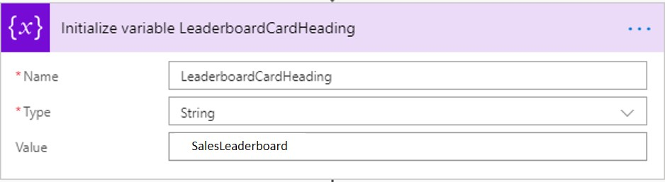

# <a name="drive-performance-using-leaderboard"></a><span data-ttu-id="eb29a-101">Performances des disques à l'aide de Leaderboard</span><span class="sxs-lookup"><span data-stu-id="eb29a-101">Drive Performance using Leaderboard</span></span>
<span data-ttu-id="eb29a-102">Une Leaderboard est une représentation visuelle riche des participants afin de comprendre où ils sont classés par comparaison avec les homologues.</span><span class="sxs-lookup"><span data-stu-id="eb29a-102">A leaderboard is a rich visual representation of participants to provide an understanding of where they rank in comparison to peers.</span></span> <span data-ttu-id="eb29a-103">En tirant parti de la puissance de joueur ludification, Leaderboards est la meilleure façon de Instill l'esprit de compétitivité entre les équipes et de suivre les performances individuelles/d'équipe par rapport aux objectifs de l'entreprise.</span><span class="sxs-lookup"><span data-stu-id="eb29a-103">Leveraging the power of gamification, leaderboards are the best way to instill competitive spirit among teams and also track individual/team performance against business targets.</span></span> <span data-ttu-id="eb29a-104">Ils fournissent des commentaires instantanés au cours et identifient les modèles dans les indicateurs de performance clés qui pourraient aider les employés à improvise.</span><span class="sxs-lookup"><span data-stu-id="eb29a-104">They provide instant feedback to course-correct and identify patterns in KPIs that could help employees improvise.</span></span>

<span data-ttu-id="eb29a-105">Cette solution générique constitue un excellent moyen d'incentivizeer une équipe et de créer une culture ouverte.</span><span class="sxs-lookup"><span data-stu-id="eb29a-105">This generic solution is a great way to incentivize team and create an open culture.</span></span> <span data-ttu-id="eb29a-106">Elle peut être utilisée par toute organisation de vente ou de service pour effectuer le suivi des performances (individuelle ou d'équipe) et comparer les performances de plusieurs indicateurs de performance clés.</span><span class="sxs-lookup"><span data-stu-id="eb29a-106">It can be used by any sales or service organization to track performance- Individual or Team and compare performance across multiple KPIs.</span></span> 

<span data-ttu-id="eb29a-107">Excel de votre Onedrive entreprise est consommé par Microsoft Flow et la carte Leaderboard est envoyée au groupe Kaizala dans une périodicité.</span><span class="sxs-lookup"><span data-stu-id="eb29a-107">Excel from your Onedrive for Business is consumed by Microsoft Flow and Leaderboard card is sent to Kaizala group in a recurrence pattern.</span></span> <span data-ttu-id="eb29a-108">Cette carte est composée de deux affichages: vue de carte de conversation & mode immersif.</span><span class="sxs-lookup"><span data-stu-id="eb29a-108">This card has two views- Chat card view & Immersive view.</span></span> 

<span data-ttu-id="eb29a-109">**Affichage de la carte de conversation**</span><span class="sxs-lookup"><span data-stu-id="eb29a-109">**Chat card view**</span></span>


<span data-ttu-id="eb29a-110">**Vue immersive**</span><span class="sxs-lookup"><span data-stu-id="eb29a-110">**Immersive view**</span></span>

<span data-ttu-id="eb29a-111">Cet affichage comporte deux onglets, tout d'abord un mur de notoriété pour les 10 principaux intervenants, le second est «My performance», ce qui est différent pour chaque utilisateur.</span><span class="sxs-lookup"><span data-stu-id="eb29a-111">This view has two tabs, first being a wall of fame for Top 10 performers, second is "My performance" which is different for each user.</span></span>


<span data-ttu-id="eb29a-112">Mes performances dispose de 2 sections qui affichent mes statistiques et leurs rangs proches.</span><span class="sxs-lookup"><span data-stu-id="eb29a-112">My Performance has 2 sections that display my statistics and nearby ranks.</span></span> 


## <a name="implementation-steps"></a><span data-ttu-id="eb29a-113">Étapes d’implémentation</span><span class="sxs-lookup"><span data-stu-id="eb29a-113">Implementation steps</span></span>
<span data-ttu-id="eb29a-114">Cela peut être divisé en trois étapes:</span><span class="sxs-lookup"><span data-stu-id="eb29a-114">This can be broadly divided into 3 steps:</span></span>
1. <span data-ttu-id="eb29a-115">Télécharger le package d'action</span><span class="sxs-lookup"><span data-stu-id="eb29a-115">Upload Action Package</span></span>
2. <span data-ttu-id="eb29a-116">Format de feuille Excel</span><span class="sxs-lookup"><span data-stu-id="eb29a-116">Format Excel Sheet</span></span>
3. <span data-ttu-id="eb29a-117">Configurer le flux Microsoft</span><span class="sxs-lookup"><span data-stu-id="eb29a-117">Configure Microsoft Flow</span></span>

### <a name="upload-action-package"></a><span data-ttu-id="eb29a-118">Télécharger le package d'action</span><span class="sxs-lookup"><span data-stu-id="eb29a-118">Upload Action package</span></span>
1. <span data-ttu-id="eb29a-119">Téléchargez le fichier [«Leaderboard-SolutionPackage. zip](https://aka.ms/Leaderboard-SolutionPackage.zip)»*(il* *contient* les *packages* *«Leaderboard_ActionPackage. zip»* *et* *«Leaderboard_FlowPackage. zip»* )</span><span class="sxs-lookup"><span data-stu-id="eb29a-119">Download the [“Leaderboard-SolutionPackage.zip"](https://aka.ms/Leaderboard-SolutionPackage.zip)(*This* *contains* *"Leaderboard_ActionPackage.zip"* *and* *"Leaderboard_FlowPackage.zip"* *Package*)</span></span>
2. <span data-ttu-id="eb29a-120">Téléchargez la dernière version de Kaizala [«ActionSDK. zip»](https://manage.kaiza.la/MiniApps/DownloadSDK) (*elle contient KASClient. js*)</span><span class="sxs-lookup"><span data-stu-id="eb29a-120">Download the latest version of Kaizala ["ActionSDK.Zip"](https://manage.kaiza.la/MiniApps/DownloadSDK) (*This contains KASClient.js*)</span></span>
3. <span data-ttu-id="eb29a-121">Modifier «Leaderboard_ActionPackage. zip»</span><span class="sxs-lookup"><span data-stu-id="eb29a-121">Edit "Leaderboard_ActionPackage.zip"</span></span>
   1. <span data-ttu-id="eb29a-122">DéCompresser «Leaderboard_ActionPackage. zip» dans un dossier</span><span class="sxs-lookup"><span data-stu-id="eb29a-122">Unzip "Leaderboard_ActionPackage.zip" to a folder</span></span>
   2. <span data-ttu-id="eb29a-123">Modifier les actions «ID» et «nom du fournisseur» dans package. JSON</span><span class="sxs-lookup"><span data-stu-id="eb29a-123">Change the action "id" and "provider name" in package.json</span></span>
   3. <span data-ttu-id="eb29a-124">Ajouter KASClient. js à ce dossier</span><span class="sxs-lookup"><span data-stu-id="eb29a-124">Add KASClient.js to this folder</span></span> 
   4. <span data-ttu-id="eb29a-125">Zip tout le contenu de ce dossier (*ce dossier est votre package d'action modifié qui doit être importé dans le portail de gestion Kaizala*)</span><span class="sxs-lookup"><span data-stu-id="eb29a-125">Zip all the contents in this folder (*This folder is your modified action package which should be imported to Kaizala Management Portal*)</span></span>
   5. <span data-ttu-id="eb29a-126">[Importer](https://docs.microsoft.com/en-us/kaizala/actions/publish#import-kaizala-action) le package d'action modifié vers le [portail de gestion Kaizala](https://manage.kaiza.la/)(*cette carte est envoyée en appelant une API, il n'est donc pas nécessaire d'ajouter la carte à un groupe*).</span><span class="sxs-lookup"><span data-stu-id="eb29a-126">[Import](https://docs.microsoft.com/en-us/kaizala/actions/publish#import-kaizala-action) the edited action package to [Kaizala Management Portal](https://manage.kaiza.la/)(*This card is sent by calling an API, so no need to add the card to a group*)</span></span>

### <a name="format-excel-sheet"></a><span data-ttu-id="eb29a-127">Format de feuille Excel</span><span class="sxs-lookup"><span data-stu-id="eb29a-127">Format Excel Sheet</span></span>

1. <span data-ttu-id="eb29a-128">Télécharger le [modèle Excel](https://github.com/MicrosoftDocs/kaizala-docs/blob/master/Articles/BusinessSolutions/Life%40Work/Leaderboard/Leaderboard.csv)</span><span class="sxs-lookup"><span data-stu-id="eb29a-128">Download the [Excel template](https://github.com/MicrosoftDocs/kaizala-docs/blob/master/Articles/BusinessSolutions/Life%40Work/Leaderboard/Leaderboard.csv)</span></span>

2. <span data-ttu-id="eb29a-129">Remplissez tous les champs obligatoires-nom, PhoneNo et score.</span><span class="sxs-lookup"><span data-stu-id="eb29a-129">Fill all mandatory fields -Name, PhoneNo, and Score.</span></span> <span data-ttu-id="eb29a-130">À l'exception de ces trois champs obligatoires, les autres sont des indicateurs de performance clés (facultatif) et sont affichés sous l'onglet «My performance».</span><span class="sxs-lookup"><span data-stu-id="eb29a-130">Apart from these three mandatory fields, the rest are KPIs (optional) and are displayed in "My Performance" tab.</span></span>

    

     > <span data-ttu-id="eb29a-131">Remarque: les indicateurs de performance clés & peuvent être des valeurs numériques ou%.</span><span class="sxs-lookup"><span data-stu-id="eb29a-131">Note: Score & KPIs can be numeric or % values.</span></span> <span data-ttu-id="eb29a-132">Si la colonne comporte des pourcentages, appliquez le format de [nombre pourcentage](https://support.office.com/en-ie/article/format-numbers-as-percentages-de49167b-d603-4450-bcaa-31fba6c7b6b4) à cette colonne.</span><span class="sxs-lookup"><span data-stu-id="eb29a-132">If the column has percentages, apply [percent number](https://support.office.com/en-ie/article/format-numbers-as-percentages-de49167b-d603-4450-bcaa-31fba6c7b6b4) format to that column</span></span>

     > <span data-ttu-id="eb29a-133">Remarque: l'onglet mon performance peut contenir un maximum de 6 indicateurs de performance clés</span><span class="sxs-lookup"><span data-stu-id="eb29a-133">Note: My Performance tab can have a maximum of 6 KPIs</span></span>


3. <span data-ttu-id="eb29a-134">[Renommer](https://support.office.com/en-us/article/rename-an-excel-table-fbf49a4f-82a3-43eb-8ba2-44d21233b114) le tableau Excel en tant que «Leaderboardyyyymmdd», par exemple, Leaderboard20190431 pour le jour 2019/04/31 (yy/mm/dd)</span><span class="sxs-lookup"><span data-stu-id="eb29a-134">[Rename](https://support.office.com/en-us/article/rename-an-excel-table-fbf49a4f-82a3-43eb-8ba2-44d21233b114) excel table as "Leaderboardyyyymmdd" E.g, Leaderboard20190431 for the day 2019/04/31(yy/mm/dd)</span></span>

4. <span data-ttu-id="eb29a-135">Enregistrer ce fichier dans un lecteur pour les entreprises</span><span class="sxs-lookup"><span data-stu-id="eb29a-135">Save this file in One Drive for Business</span></span>

      > <span data-ttu-id="eb29a-136">Remarque: Flow récupère automatiquement les données Excel de ce jour en fonction du nom de la table et envoie la carte.</span><span class="sxs-lookup"><span data-stu-id="eb29a-136">Note: Flow automatically picks up the excel data of that day based on the table name and sends the card.</span></span>

### <a name="configure-microsoft-flow"></a><span data-ttu-id="eb29a-137">Configurer le flux Microsoft</span><span class="sxs-lookup"><span data-stu-id="eb29a-137">Configure Microsoft Flow</span></span>

1. <span data-ttu-id="eb29a-138">[Importer](https://flow.microsoft.com/en-us/blog/import-export-bap-packages/) le fichier «Leaderboard_FlowPackage. zip» sur votre compte Microsoft Flow</span><span class="sxs-lookup"><span data-stu-id="eb29a-138">[Import](https://flow.microsoft.com/en-us/blog/import-export-bap-packages/) the "Leaderboard_FlowPackage.zip" to your Microsoft Flow account</span></span>

      > <span data-ttu-id="eb29a-139">Remarque: Si vous n'avez jamais utilisé les connexions SharePoint ou Kaizala, ajoutez d'abord les [connexions](https://docs.microsoft.com/en-us/flow/add-manage-connections)</span><span class="sxs-lookup"><span data-stu-id="eb29a-139">Note- If you have never used Sharepoint or Kaizala connections, first [add connections](https://docs.microsoft.com/en-us/flow/add-manage-connections)</span></span>    

2. <span data-ttu-id="eb29a-140">Modifier les détails dans le flux importé (*voir les étapes ci-dessous*)</span><span class="sxs-lookup"><span data-stu-id="eb29a-140">Edit details in Imported Flow (*See steps below*)</span></span>

    1. <span data-ttu-id="eb29a-141">Dans le deuxième bloc, entrez le titre de la carte dans le champ valeur, que vous souhaitez afficher dans le leaderboard.</span><span class="sxs-lookup"><span data-stu-id="eb29a-141">In the second block, enter the card title in the value field, that you want to show in the leaderboard.</span></span> <span data-ttu-id="eb29a-142">Par exemple, «ventes Leaderboard»</span><span class="sxs-lookup"><span data-stu-id="eb29a-142">For E.g, "Sales Leaderboard"</span></span> 

         
    
    2. <span data-ttu-id="eb29a-143">Dans le troisième bloc, affectez à value la valeur true si le «score» est un pourcentage, s'il n'est pas défini sur false.</span><span class="sxs-lookup"><span data-stu-id="eb29a-143">In the third block, set value as  true if the "score" is a percentage, if not set it to false</span></span>

         

    3. <span data-ttu-id="eb29a-144">Dans le septième bloc</span><span class="sxs-lookup"><span data-stu-id="eb29a-144">In the seventh block</span></span>

       1. <span data-ttu-id="eb29a-145">Sélectionnez emplacement comme «OneDrive entreprise» dans la liste déroulante.</span><span class="sxs-lookup"><span data-stu-id="eb29a-145">Select Location as "OneDrive for Business" from the dropdown</span></span>

       2. <span data-ttu-id="eb29a-146">Sélectionner la bibliothèque de documents en tant que «OneDrive» à partir de la liste déroulante</span><span class="sxs-lookup"><span data-stu-id="eb29a-146">Select Document library as "OneDrive" from the dropdown</span></span>

       3. <span data-ttu-id="eb29a-147">Sélectionner un fichier Excel en cliquant sur sélecteur de dossiers</span><span class="sxs-lookup"><span data-stu-id="eb29a-147">Select Excel file on clicking folder picker</span></span>
     
             > <span data-ttu-id="eb29a-148">Remarque: le nom de table que vous avez indiqué dans le fichier Excel sera automatiquement sélectionné par le flux.</span><span class="sxs-lookup"><span data-stu-id="eb29a-148">Note: Table name that you have given in excel file will be automatically picked up by the flow.</span></span> 
       
             


    4. <span data-ttu-id="eb29a-149">Dans le neuvième bloc, «appliquer à chaque»,</span><span class="sxs-lookup"><span data-stu-id="eb29a-149">In the ninth block, "Apply to each",</span></span> 

        1. <span data-ttu-id="eb29a-150">Modifier les étiquettes des indicateurs de performance clés dans l'analyse du bloc JSON pour les indicateurs de performance clés (KPI) 1 en tant que demandes Closed & KPI 2 comme appels convertis.</span><span class="sxs-lookup"><span data-stu-id="eb29a-150">Edit KPI labels in Parse JSON block for E.g, KPI 1 as Deals closed & KPI 2 as Calls converted.</span></span>

             


             ><span data-ttu-id="eb29a-151">Remarque: la carte peut afficher un maximum de 6 indicateurs de performance clés (KPI)</span><span class="sxs-lookup"><span data-stu-id="eb29a-151">Note: Card can display a maximum of 6 KPI's</span></span> 

        2. <span data-ttu-id="eb29a-152">Modifier les étiquettes d'indicateur de performance clé dans la composition (*comme indiqué ci-dessous*)</span><span class="sxs-lookup"><span data-stu-id="eb29a-152">Edit KPI labels in Compose (*as shown below*)</span></span>
        
             

        
    5. <span data-ttu-id="eb29a-153">Dans le dernier bloc</span><span class="sxs-lookup"><span data-stu-id="eb29a-153">In the last block</span></span>

        1. <span data-ttu-id="eb29a-154">Entrez l'ID de groupe ou sélectionnez le nom de groupe auquel vous souhaitez envoyer la carte.</span><span class="sxs-lookup"><span data-stu-id="eb29a-154">Enter the group ID or select group name where you want to send the card</span></span>

        2. <span data-ttu-id="eb29a-155">Cliquez sur action pour sélectionner «package d'actions» dans la liste déroulante.</span><span class="sxs-lookup"><span data-stu-id="eb29a-155">Click on Action to select "Action package" from drop down</span></span>
        
        3. <span data-ttu-id="eb29a-156">Cliquez sur package d'action pour sélectionner «entrer une valeur personnalisée» et entrez votre «ID de package d'action» que vous avez donné à Package. JSON.</span><span class="sxs-lookup"><span data-stu-id="eb29a-156">Click on Action package to select "enter a custom value" and enter your "action package id" that you have given package.json</span></span>

        4. <span data-ttu-id="eb29a-157">Enregistrer le flux</span><span class="sxs-lookup"><span data-stu-id="eb29a-157">Save the Flow</span></span>

           

<span data-ttu-id="eb29a-158">La carte Leaderboard sera envoyée au groupe spécifié en fonction de l'intervalle et de la fréquence définis dans le flux.</span><span class="sxs-lookup"><span data-stu-id="eb29a-158">Leaderboard card will be sent to the specified group as per the interval and frequency set in the Flow.</span></span> 

><span data-ttu-id="eb29a-159">Remarque: Si vous souhaitez modifier les étiquettes-«nom», «PhoneNo» et «score» dans la feuille Excel, remplacez-les par les étiquettes souhaitées dans ImmersiveView. js.</span><span class="sxs-lookup"><span data-stu-id="eb29a-159">Note: If you wish to change the labels- "Name", "PhoneNo" and "Score" in excel sheet, change it to desired labels in ImmersiveView.js</span></span>

```
      
 "/*Fields from excel */

const NAME = "Name";
const PHONENO = "PhoneNo";
const SCORE = "Score";"      

