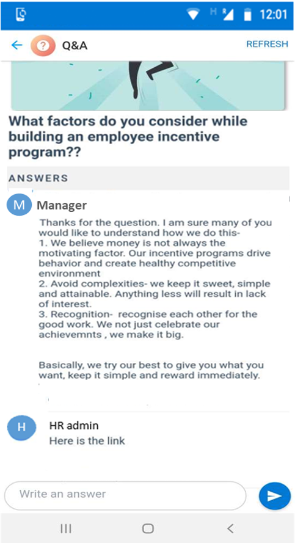

# Obtenir des réponses structurées à vos questions auprès de vos collègues

L’élévation de l’implication des employés est essentielle pour la réussite de toute organisation, qu’il s’agisse d’un petit démarrage ou d’une grande entreprise qui fonctionne sur plusieurs emplacements. Il peut être difficile pour les dirigeants et les responsables de savoir comment les employés se conforment aux stratégies de la société, aux projets, aux tâches et aux tâches affectées.

Avec l’augmentation de la main-d’œuvre mobile qui mènent de telles sessions QnA avec des responsables, en déplacement, il peut s’avérer encore plus difficile. En recourant à la session QnA sur une conversation mobile, les réponses aux questions peuvent interrompre le flux et l’utilisateur final peut manquer d’informations.

Avec la carte QnA, les utilisateurs peuvent poser des questions à des responsables et à la suite de la communauté afficher toutes les réponses dans un format structuré.

Il s’agit d’une carte simple avec un affichage de création, qui permet à l’utilisateur de soumettre une question, une vue de la carte graphique permettant aux utilisateurs de voir le dernier commentaire et un affichage de synthèse permettant aux utilisateurs d’afficher et de participer à la discussion.

Affichage création:

Affichage de la carte de conversation:

Affichage de Résumé:

## Étapes d’implémentation:
1. Télécharger le fichier [«QnA-SolutionPackage. zip»](https://aka.ms/QnA-SolutionPackage) (*il contient le package d’actions*)
2. Téléchargez la dernière version de Kaizala [«ActionSDK. zip»](https://manage.kaiza.la/MiniApps/DownloadSDK) (*elle contient KASClient. js*)
3. Modifier le fichier «QnA-SolutionPackage. zip» (*comme ci-dessous*)
   1. Décompresser «QnA-SolutionPackage. zip» dans un dossier
   2. Modifier les actions «ID» et «providerName» dans package. JSON
   3. Ajouter KASClient. js à ce dossier (*Renommer KASClient (1). js en KASClient. js si nécessaire*)
   4. Zip tout le contenu de ce dossier (*ce dossier est votre package d’action modifié qui doit être importé dans le portail de gestion kaizala*)    
       
      > Remarque: sélectionnez tous les fichiers dans votre répertoire de travail et créez un fichier zip pour votre package. Assurez-vous que tous les fichiers sont présents dans le répertoire racine du package. Cela doit inclure KASClient. js, package. JSON avec les nouvelles actions «ID» et «providerName».
       
4. [Importer](https://docs.microsoft.com/en-us/kaizala/actions/publish#import-kaizala-action) le package d’actions modifié dans le [portail de gestion kaizala](https://manage.kaiza.la/)
5. [Publiez](https://docs.microsoft.com/en-us/kaizala/actions/publish) l’action et ajoutez l’action à un groupe auquel vous voulez ajouter la carte.
6. Sélectionner les rôles d’utilisateur en tant qu’administrateur et membre pour publier la carte dans le groupe plat

> Remarque: cette carte fonctionne uniquement dans un groupe plat. Tous les membres du groupe et les administrateurs peuvent créer et envoyer cette carte dans un groupe plat.
