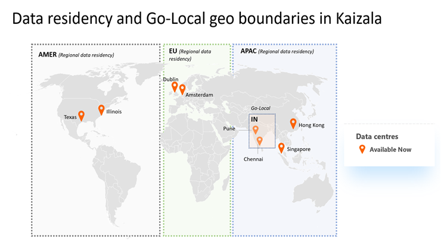

# Prise en charge des données et de l’accès local dans Microsoft KaizalaData residency and go-local support in Microsoft Kaizala

Actuellement, Microsoft Kaizala offre une prise en charge des données régionales par les centres de données en Europe (UE), Asie-Pacifique (APAC), aux États-Unis (É.U.) et en Inde (en).Currently, Microsoft Kaizala provides regional data residency support through the datacenters in Europe (EU), Asia Pacific (APAC), United States (US), and India (IN). Cela signifie que les clients Kaizala auront des données liées aux [groupes et conversations](https://support.office.com/article/organization-chats-and-groups-in-kaizala-c8a7855c-d232-4914-811c-f6708734dcc3) de l’organisation, telles que les messages, les pièces jointes et les actions Kaizala stockées dans le centre de données de leur région de facturation.This means Kaizala customers will have data related to [organization chats and groups](https://support.office.com/article/organization-chats-and-groups-in-kaizala-c8a7855c-d232-4914-811c-f6708734dcc3) such as messages, attachments, and Kaizala Actions stored in the datacenter of their billing region.

En plus de prendre en charge les objectifs de la résidence des données dans la région, les centres de données de service Kaizala facilitent également le basculement et la récupération d’urgence via les centres de données.In addition to supporting the goals of within-region data residency, Kaizala service datacenters will also facilitate failover and disaster recovery through the datacenters.

## Encombrement global des centres de données avec prise en charge de la résidence des donnéesGlobal datacenter footprint with data residency support

Actuellement, Kaizala possède huit centres de centres (principaux et de sauvegarde) dans trois régions et un pays:Currently, Kaizala has eight datacenters (primary and backup) in three regions and one country:

- APAC (Asie-Pacifique à l’exception de l’Inde)-centres de centre de Singapour et Hong KongAPAC (Serves Asia Pacific except India) - Datacenters in Singapore and Hong Kong
- EMEA (UE, MEA)-centres de centre de Dublin et AmsterdamEMEA (EU, MEA) - Datacenters in Dublin and Amsterdam
- AMER (Nord et Sud-Unis)-centres de redirection dans le Texas et l’IllinoisAMER (North and South Americas) - Datacenters in Texas and Illinois
- Inde (Go-local)-centres de Chennai et PuneIndia (Go-Local) - Datacenters in Chennai and Pune

En plus de fournir des services de calcul et de stockage, Kaizala fournit également une prise en charge des données de résidence, un basculement robuste et une prise en charge de la récupération d’urgence aux clients d’entreprise.In addition to providing compute and storage, Kaizala also provides data residency support, robust failover, and disaster recovery support to enterprise customers. De plus, ces unités d’étendue contribuent à améliorer les performances de connectivité et de messagerie pour les clients d’entreprise et les clients généraux.Also, these scale units help ensure improved connectivity and messaging performance to both enterprise and general customers. 

## Comment les données sont-elles stockées dans KaizalaHow is data stored in Kaizala

Kaizala stocke les données différemment en fonction des types de données des messages.Kaizala stores data differently based on data types of the messages.

- **Conversations, j’aime et commentaires** : tous les messages, les aiment et les données de commentaire appartenant à un groupe d’organisation ou des conversations de l’organisation 1:1 sont stockés dans un service de conversation Office 365 et Azure Powered qui est régionalement lié aux clients, en fonction de leur pays de facturation.**Chats, likes, and comments** - All messages, likes, and comment data belonging to organization group or org 1:1 chats are stored in a secure Office 365 and Azure powered chat service that is regionally bounded for tenants, based on their billing country.
- **Pièces jointes** : toutes les pièces jointes sont localisées en même temps que les messages de conversation dans la même limite de données.**Attachments** - All attachments are co-located along with chat messages in the same data boundary.
- **Fiches d’action Kaizala** -toutes les données de la carte d’action Kaizala, qui incluent les données de métadonnées, de package d’action et de rapport de réponse, sont colocalisées avec le service de conversation dans la même limite de données.**Kaizala Action cards** - All Kaizala Action card data, which includes metadata, action package, and response report data, are co-located with chat service in the same data boundary.
- L' **appel** étant transitoire, les données d’appel Kaizala ne sont pas stockées dans les centres de données.**Calling** - Being transient, Kaizala calling data is not stored in datacenters. Toutefois, les journaux d’appels suivent la même résidence des données que les conversations.However, call logs follow the same data residency as chats.

### ExempleExample

Contoso a son pays de facturation Office 365 dans l’UE.Contoso has its Office 365 billing country in EU. Contoso s’est inscrit sur Kaizala en avril 2019 et toutes ses données de base, y compris les conversations, les pièces jointes et les cartes d’action seront stockées au repos exclusivement dans les unités de l’Union européenne (Dublin et Amsterdam).Contoso has signed up on Kaizala in April 2019 and all of its core data including chats, attachments and action cards will be stored at rest exclusively in EU scale units (Dublin and Amsterdam).

## Qu’est-ce que le stockage à venir?What is in store in future

- **Page d’intégration à l’emplacement des données** : pour les entreprises, l’emplacement des données pour les différentes charges de travail d’Office 365 est visible sous le portail d’administration d’Office 365 sous profil Home\Organizational.**Onboarding on to data location page** - For enterprises, the data location for different workloads of Office 365 is visible under Office 365 admin portal under Home\Organizational Profile. La possibilité d’intégrer Kaizala à la page d’emplacement des données sur le portail d’administration est à paraître.The ability to onboard Kaizala to the data location page on admin portal is forthcoming. Regardez cette section pour les mises à jour.Watch this section for updates.
- **Nouveaux centres** de développement: l’équipe Kaizala examine continuellement l’expansion en fonction de la meilleure expérience utilisateur pour les utilisateurs.**New datacenters** - The Kaizala team is continuously looking at expansion based on providing the best user experience to users. Si vous avez un cas client, publiez vos questions dans notre [communauté TechNet](https://techcommunity.microsoft.com/t5/Microsoft-Kaizala/ct-p/MicrosoftKaizala).If you have a business case, then post your questions in our [Technet community](https://techcommunity.microsoft.com/t5/Microsoft-Kaizala/ct-p/MicrosoftKaizala).

## FAQFAQs

### Qu’est-ce que cela signifie pour les clients d’entreprise existants?What does it mean for existing enterprise customers?

Les clients existants en Inde ont déjà leur résidence de données en Inde.Existing customers in India already have their data residency within India. Toutefois, les données de tous les clients existants non-Inde continueront à rester dans l’emplacement du groupe (en fonction du code pays du créateur).Data for all non-India existing tenants however will continue to stay in the group location (based on creator’s country code). Toutefois, après le 2019 avril, tous les nouveaux groupes d’organisation et les nouveaux messages de groupes d’organisation ou de conversations existants commencent à suivre la résidence des données en fonction de la région de facturation du client.However after April 2019, all the newer organization groups and messages of existing organization groups or chats will start following data residency based on the tenant’s billing region.

### Qu’est-ce que cela signifie pour les nouveaux clients d’entreprise?What does it mean for new enterprise customers?

La résidence des données s’applique automatiquement à tous les clients qui s’inscrivent sur Kaizala après le 2019 avril.Data residency will be automatically applicable for all the customers who sign up on Kaizala after April 2019. De plus, la résidence des données sur les cartes d’action doit être applicable aux dernières versions des applications Android ou iOS.Additionally, data residency on action cards should be applicable on the latest Android or iOS app versions.
 
### J’ai plus de questions.I do have more questions. Qui dois-je atteindre?Who do I reach out to?

En cas de questions supplémentaires, contactez votre équipe de compte ou notre [communauté TechNet](https://techcommunity.microsoft.com/t5/Microsoft-Kaizala/ct-p/MicrosoftKaizala).In case of more questions, contact your account team or our [Technet community](https://techcommunity.microsoft.com/t5/Microsoft-Kaizala/ct-p/MicrosoftKaizala). En outre, vous pouvez écrire dans [Kaizalafeedback@microsoft.com](mailto:kaizalafeedback@microsoft.com).Additionally, you can write to [Kaizalafeedback@microsoft.com](mailto:kaizalafeedback@microsoft.com).

