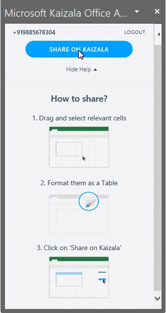

## Complément Office Kaizala: extraction de données dans Excel
 Le complément Excel Kaizala vous permet d'obtenir rapidement des données à partir de points de terminaison Kaizala sans quitter Excel en un seul clic. Tout ce dont vous avez besoin est un tableau Excel dans une feuille de calcul et un compte Kaizala. Vous pouvez désormais partager le tableau Excel sur Kaizala, qui enverra une enquête avec chaque colonne en tant que question. Les personnes du groupe peuvent répondre à l'enquête qu'elles ont reçues sur leur téléphone. Lorsque vous actualisez la table à partir d'Excel, vous obtenez les réponses sous forme de lignes dans votre tableau.
### Installation du complément
[1]:https://store.office.com/addinstemplateinstallpage.aspx?rs=en-IN&assetid=WA104381121
Vous trouverez des instructions détaillées sur l'installation du [http://aka.ms/KaizalaExcelAddin] [ 1]plug-in dans. Si cela ne fonctionne pas, vous pouvez utiliser temporairement ce lien direct.
 Une fois que vous avez installé le complément, le ruban s'affiche sous l'onglet Compléments.
 
### Procédure pas à pas
Permet de commencer avec une nouvelle feuille de calcul Excel et de créer une table. Ajoutez du texte dans 3 cellules dont le nom est, le nombre de prospects et le nombre de prospects, puis créez un tableau en tant qu'en-têtes.

 

 À présent, à partir de l'onglet COMPLÉMENTs, sélectionnez Microsoft Kaizala. Cela ouvrirait une barre latérale avec la page Kaizala. Indiquez votre numéro de téléphone portable et votre mot de passe à usage unique dans la page pour vous authentifier. Vous ne devez effectuer cette opération qu'une seule fois.
  En gardant la table sélectionnée, cliquez sur le bouton partager sur la page Kaizala. Donner un titre à votre enquête sélectionnez le groupe à partir duquel vous souhaitez capturer les données. 

 

  Cela entraînerait l'envoi d'une enquête sur le groupe qui ressemble à ceci:

 

 Par exemple, une réponse à l'enquête sur le téléphone dont le nom est Gladson, le nombre de leads est 10 et le nombre de prospects est de 7.

 

 À présent, cliquez sur l'icône d'actualisation de la page Kaizala dans Excel pour actualiser les données dans le tableau. Voilà, vous avez les données!

 

 Si vous avez encore besoin d'autres informations par le biais de ce [lien](https://www.youtube.com/watch?v=cyvfEw5zGv8&t=0s&index=6&list=PLJquJ26ry3X6wZ5FCXOjMD-uhUGxB_tMd )
