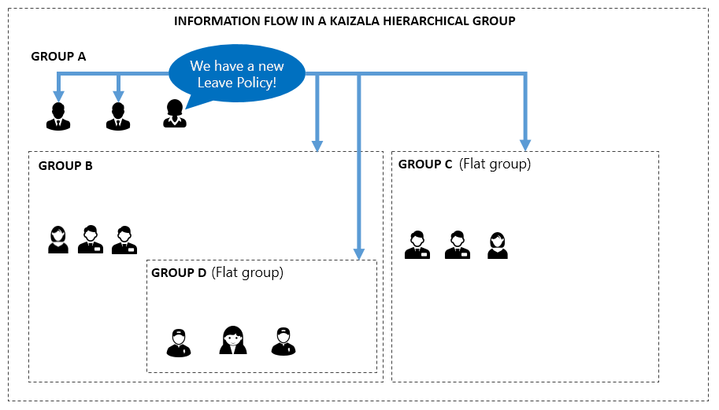

# Mise en route avec Microsoft Kaizala
## Guide de référence rapide 
  Bienvenue, nous sommes heureux que vous êtes ici ! Ce guide de référence rapide vous aidera à obtenir votre organisation démarrée sur Kaizala.    
  
  Guide de l’utilisateur Kaizala est disponible [ici](https://support.office.com/en-us/article/About-the-Kaizala-mobile-app-122fdf32-9f15-465d-a905-6fae72d38b42) et le guide pour le portail de gestion Kaizala qui vous permet de gérer les groupes Kaizala, en bloc de mise en service et obtenir des rapports de toutes les activités Kaizala est disponible [ici](https://support.office.com/en-us/article/About-Kaizala-Management-Portal-2046ddba-06fb-49c9-b6d6-a4777e8a556f?ui=en-US&rs=en-US&ad=US).  
  
[1]: https://support.office.com/en-us/article/About-the-Kaizala-mobile-app-122fdf32-9f15-465d-a905-6fae72d38b42
[2]: https://support.office.com/en-us/article/About-Kaizala-Management-Portal-2046ddba-06fb-49c9-b6d6-a4777e8a556f?ui=en-US&rs=en-US&ad=US
[3]: https://play.google.com/store/apps/details?id=com.microsoft.mobile.polymer&hl=en
[4]: https://itunes.apple.com/in/app/microsoft-kaizala/id1112208399?mt=8
[5]: http://manage.kaiza.la/
[6]: https://support.office.com/en-us/article/Kaizala-Groups-858bead0-f99b-4215-83c6-b8812bbe3edd
[7]: https://github.com/MicrosoftDocs/kaizala-docs

## 1. installation et Guide de démarrage rapide 
  * Téléchargez Kaizala à partir de [Google Play magasin](https://play.google.com/store/apps/details?id=com.microsoft.mobile.polymer&hl=en) pour Android ou [App Store](https://itunes.apple.com/in/app/microsoft-kaizala/id1112208399?mt=8) pour iOS maintenant
  * Activer avec votre numéro de téléphone et commencer immédiatement
  * Cliquez sur le signe « + » pour créer un groupe et ajouter des membres à partir de votre liste de contacts ou ajouter directement les numéros de téléphone
  * Donnez un nom au groupe et vous sont toutes configurées
  * Essayez d’envoyer une Action Kaizala en cliquant sur le coin supérieur droit pour afficher la palette de Kaizala Actions
  * Essayez d’envoyer un sondage rapide ou une annonce pour voir Kaizala à le œuvre. 
  Si vous ne disposez pas tout le monde dans votre réseau de Kaizala, vous pouvez quand même les ajouter au groupe et puis cliquez sur le nom de groupe pour envoyer une invitation à tous les membres qui ne figurent pas dans Kaizala.
  
## 2. identifier les scénarios de

  Il est recommandé d’avoir quelques exemples d’utilisation pour Kaizala à l’esprit pour votre organisation avant de commencer le déploiement. Voici quelques vidéos montrant les cas d’utilisation Kaizala, créés avec inspiration à partir des clients à l’aide de Kaizala.  

  

 **Voici quelques exemples d’utilisation plus exemple indiqués pour la référence à la mise en route avec votre planification.**
 
| Scénario   |      Quelques exemples d’utilisation      |  Illustration de l’exemple|
|----------|:-------------:|------:|
|**Conserver vos employés informés et commencé**| Utilisez la fiche d’annonce dans Kaizala pour : <ul><li>Envoyer une annonce Bienvenue à tous les employés</li><li>Informer tous les employés sur une nouvelle stratégie. ; </li><ul><li>Employés peuvent fournir leurs entrées ou poser des questions à l’aide de la section des commentaires de l’annonce.</li><li> Ils peuvent » comme « l’annonce</li></ul><li>Mettre à jour l’ensemble de l’équipe ventes sur le lancement du produit le plus récent et les nouvelles cibles</li><ul><li>Les employés peuvent poser des questions permettant de clarifier dans la section des commentaires.</li></ul><li>Annoncer un congé soudain ou une nouvelle organisation dans l’équipe. Les employés utilisent sûr « J’aime ».</li></ul> |  |
| **Collecte de données de champ et de gestion du travail efficace pour votre équipe** | <ul><li>Utilisez Kaizala enquêtes et sondages pour collecter des données des employés sur le terrain rapidement et d’autres Actions permet de gérer le travail. </li><li> Importer des données des responsables client alors que le champ est l’équipe<ul><li>Équipe de vente peut entrer les informations de client déplacements</li><li>Responsables du client peuvent obtenir automatiquement en backend CRM à l’aide de Kaizala APIs</li><li>Ce rapport est disponible sur le portail de gestion Kaizala, en temps réel.</li></ul><li>Obtenir un rapport d’état quotidien à partir d’emplacements distants, ainsi que des photos et l’emplacement du site distant</li><li>Affecter des tâches à l’équipe dans Kaizala et vérifiez l’état et tendance dans le portail de gestion Kaizala</li><li>Inviter des personnes pour les réunions à l’aide de Kaizala.</li></ul>||
|**Connectez-vous avec vos clients et de la chaîne de valeur ; Recueillir les commentaires instantanément**|<ul><li>Utilisez les groupes publics Kaizala pour créer un canal privé de communication avec votre lakhs du client ou des citoyens : <ol><li>Envoyez-leur marketing contenu sur la nouvelle barre de lancement</li><li>Leur envoyer des enquêtes pour obtenir des informations sur le lancement d’un nouveau</li><li>Créer des cartes Kaizala personnalisés pour pouvoir ouvrir une demande de support</li></ol><li>Afficher le rapport de tout cela sur le portail de gestion Kaizala</li><li>Utilisez gérées groupe public ajouter uniquement les membres prédéfinies à un groupe public comme tous les groupes parents écoles ou tous les distributeurs ou vous travaillez avec des fournisseurs</li></ul>||
|**Développer vos applications métiers sur Kaizala en tant qu’Actions personnalisées Kaizala, disponibles dans l’application**|Vous pouvez créer des applications personnalisées pour votre organisation comme laisser l’application ou la présence de suivi à l’aide de l’infrastructure d’extensibilité Kaizala. Ces applications seront afficheront dans la palette de l’Action Kaizala.||  

## 3 définir des groupes de Kaizala pour votre organisation  

Une fois que vous avez identifié les cas d’utilisation pour Kaizala dans votre société, vous devez créer les groupes de droite dans Kaizala afin que les cas d’utilisation peut être atteinte efficacement.   
Kaizala fournit 3 types de groupes qui peuvent être utilisées dans l’isolation ou conjointement pour prendre en charge la communication et collaboration différents besoins de votre organisation – dans ses employés, ainsi que les employés ou de la chaîne de valeur.    
###### Voici les types de groupes, leurs propriétés et des scénarios couramment utilisées où chacun du type de groupe est utilisée par les clients existants : 
| Type de groupe   |      Propriétés     |  Scénarios couramment utilisées|
|----------|:-------------:|------:|
|**Plat**|<ul><li>Standard de groupes dans laquelle vous pouvez ajouter des milliers d’utilisateurs de messagerie </li><li>  Vous pouvez ajouter des utilisateurs à l’aide des numéros de téléphone ; l’enregistrement en tant que contact n’est pas nécessaire. </li><li>    Vous pouvez créer et affecter des Actions de Kaizala (par exemple, travail, enquête, sondage, etc.) à n’importe quel participant du groupe.</li><li>  Numéros de téléphone des membres du groupe sont visibles uniquement par l’administrateur ; sauf si le membre est déjà dans vos contacts. </li></ul>| <ol><li>Groupes de l’équipe de petite taille</li><li>Groupe de l’équipe de projet</li><li>Groupe de l’équipe de direction</li><li> Votre groupe d’amis/famille de travail| 
  |**Hiérarchique**|<ul><li>    Les groupes peuvent avoir des membres directs, ainsi que des sous-groupes en tant que membres </li><li>    Message envoyé à n’importe quel niveau accède à tous les membres de ce groupe et tous ses groupes enfants. Par conséquent, les membres de groupe parent ne peuvent pas envoyer de messages texte ; ils peuvent uniquement envoyer une carte annonce dans la mesure où ces messages sont envoyés à tous ses groupes enfants. </li><li>    N’importe quel membre du groupe peut créer et affecter des Actions de Kaizala (par exemple, travail, enquête, sondage, etc.) à tout le monde dans le même groupe ou en dessous. </li><li>    Groupes enfants ne peuvent pas envoyer de message au parent ou les groupes de l’homologue. </li><li>  Les groupes bas (noeud) des groupes hiérarchiques sont régulières groupes plats. </li></ul>  |<ol><li>    Vous pouvez créer des groupes géographiques mappage secteurs et état niveau hiérarchique des unités.</li><li> Vous pouvez créer business groupes dirigé par le groupe parent pour PDG/tout org. par exemple RH, Finance, les opérations, etc. sous groupe de l’organisation. Chacun de ces peut avoir des groupes régionaux comme ventes Amérique du Sud ventes, etc.. </li><li>    Groupes universitaire avec chaque mappage de groupe/département de l’objet à un groupe de niveau parent universitaire. </li><li> Groupe de la Communauté apartment avec chaque construction/tour représentant un groupe enfant.</li></ol>| 
|**Public**|<ul><li>    Admin peut se connecter à n’importe quel nombre de membres et envoyer et rechercher des informations. </li><li>   Ces membres ne peuvent pas voir ou interagir les uns avec les autres</li><li>    Ces membres peuvent communiquer avec d’administration uniquement par le biais de cartes de personnalisées définies par l’administrateur comme commenter, partagez votre configuration requise </li><li>  Les membres peuvent s’abonner à un groupe public à l’aide d’un lien.|<ol><li>  Les agences gouvernementales peuvent créer un groupe public pour se connecter avec les citoyens. </li><li>   Les entreprises peuvent créer un groupe public pour se connecter avec les clients. Les entreprises peuvent également créer un groupe public géré pour se connecter avec leurs fournisseurs, des fournisseurs, détaillants, etc.. ; Dans ce cas, seuls les membres prédéfinies peuvent rejoindre le groupe.</li>|
  
### 3.1 créer des groupes et ajouter des utilisateurs 

  Une fois que vous avez identifié les types de groupes et la structure de votre organisation, vous pouvez créer des groupes directement à l’aide de l’application, ou vous pouvez utiliser le portail de gestion Kaizala pour créer des groupes et ajouter des utilisateurs en bloc à l’aide d’Excel.   
  Vous pouvez créer un groupe en utilisant le signe '+' et ajouter des membres à ce groupe. Si vous souhaitez ajouter des groupes enfants, vous pouvez procéder que dans l’écran même où vous vous trouvez Ajout de membres – sélectionnez groupes au lieu de Contacts et tous les groupes existants sur votre téléphone ne s’affichera. Vous devez créer des groupes individuel enfant tout d’abord et ajoutez-les au groupe parent.   
  
  ** Ici sont des instructions sur la création de ces groupes à l’aide du portail rapides : ** 
 <ol>
<li>Connexion avec vos informations d’identification Office 365 ou Kaizala Pro [Kaizala Management Portal] [5]</li>
<li>    Cliquez sur fichier CSV télécharger sous Ajouter des utilisateurs en bloc</li>
<li>    Télécharger des modèles Excel et d’ajouter des numéros de téléphone portable et des informations sur la hiérarchie, le cas échéant</li>  
<li>    Rechercher et ajouter les deux fichiers et cliquez sur Envoyer</li>
<li>    Une fois que vous consultez les informations sur l’écran, cliquez sur Télécharger</li>
<li>    Si vous souhaitez créer des groupes publics, cliquez sur le groupe Public à partir du menu de gauche et accédez via le flux de création</li>
  </ol>
    Pour obtenir des instructions détaillées sur la création de groupes et ajout de membres à celui-ci, consultez [ici.] [6]
  
## 4 démarrer à l’aide de Kaizala
> Kaizala peut être installé à partir de [Google Play magasin](https://play.google.com/store/apps/details?id=com.microsoft.mobile.polymer&hl=en) pour Android ou [App Store](https://itunes.apple.com/in/app/microsoft-kaizala/id1112208399?mt=8) pour les iPhone.

### 4.1 obtenir Kaizala installé par vos utilisateurs d’organisation

Commande d’installation de l’application dans votre société est essentiel à la réussite de ce projet. Voici quelques méthodes utilisées par les autres clients :
* Cliquez sur le nom de groupe dans l’application Kaizala et cliquez sur inviter tout pour envoyer un message texte à inviter tous les membres.
* Envoyer un message électronique à des personnes partageant des propriétés de valeur et un lien pour télécharger.
* Envoyer des messages aux groupes WhatsApp d’organisation avec le lien de téléchargement.   
* Envoyer aux personnes ayant le lien de téléchargement en bloc SMS. 
* Concevoir des affiches Kaizala et les placer à des emplacements où tout le monde peut voir.
* Incentivize personnes pour installer Kaizala avec prix anticipée ou quiz ou meilleures enquête de soumission d’image, etc.

### 4.2 rechercher des utilisateurs qui ont installé Kaizala / données l’activation de l’utilisateur

    From the Kaizala Management Portal, you can download a CSV file that shows the status of Kaizala for each user.
<ol>
<li>Connexion avec vos informations d’identification Office 365 ou Kaizala Pro [Kaizala Management Portal] [5]</li>  
<li>Cliquez sur l’onglet groupes sur la gauche, cliquez sur le nom du groupe</li>
<li>Vous pouvez afficher les membres enregistré ou non enregistré (n’avez pas installé Kaizala). Vous pouvez également utiliser l’exportation d’utilisateurs > nouvelle demande de démarrer > Télécharger permet d’obtenir ces informations dans un fichier CSV</li> </ol>

### 4,3 rechercher si les utilisateurs utilisent Kaizala / Kaizala des données d’utilisation

    You can monitor whether users are using Kaizala using the Kaizala Management Portal.
<ol>
<li>Connexion sur le [Portail de gestion Kaizala](http://manage.kaiza.la/) avec vos informations d’identification Office 365 ou Kaizala Pro</li>  
<li>Cliquez sur l’onglet groupes sur la gauche, cliquez sur le nom du groupe</li>
<li>Vous pouvez cliquez sur rapports dans le volet gauche, cliquez sur l’utilisation de télémétrie pour surveiller l’utilisation de Kaizala de vos groupes</li> </ol>

### 4.4 envoyer votre premier message

|*Publier une annonce Bienvenue*   Vous pouvez envoyer un message de Bienvenue à tous les utilisateurs dans votre organisation à main sur Kaizala. Envoie un message à partir du groupe supérieur comme l’annonce. Ajouter une image ou audio pour le rendre plus intéressantes. Incept personnes pour écrire des commentaires ou telles que l’annonce pour obtenir l’engagement démarré.| ||
|-----------|:-------------:|------:|
|*Publier un sondage*   Envoyer un sondage rapide à démarrer avec vos utilisateurs.  Ouvrez le groupe à partir de laquelle vous souhaitez envoyer ce. Si vous souhaitez envoyer à tous les employés, envoyer à partir de groupe du haut. Seulement, cliquez sur l’icône Action dans le coin supérieur droit et cliquez sur sondage rapide. Effectuer un sondage quelque chose qui est cher à plusieurs. Si vous pouvez prendre une décision ou effectuer une action en fonction de qui – amélioration ! Bouche se propagera et personnes téléchargent plus volontairement. |||
###### Une fois que vous avez une masse critique de votre organisation à l’aide de Kaizala, vous pouvez évaluer création/migration de vos applications personnalisées/LoB sur Kaizala ou intégrant des données Kaizala à votre base de données existante ou d’un flux de travail à l’aide de la [plate-forme de développement Kaizala.](https://github.com/MicrosoftDocs/kaizala-docs)

## Nous contacter

<ol>
<li>Envoyer un message électronique à KaizalaFeedback@microsoft.com pour toute question ou suggestion</li>  
<li>Ou, rejoignez le groupe public équipe Kaizala sur Kaizala pour obtenir les dernières mises à jour sur Kaizala et fournir vos commentaires/suggestions</li> 
</ol>
        [Kaizala > découvrir > s’abonner à « Équipe Kaizala » > partager des commentaires]. 

