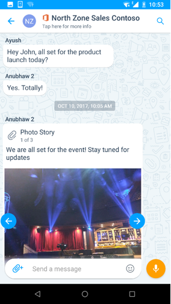
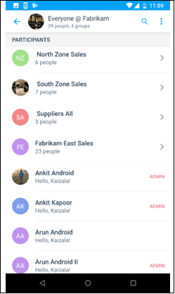
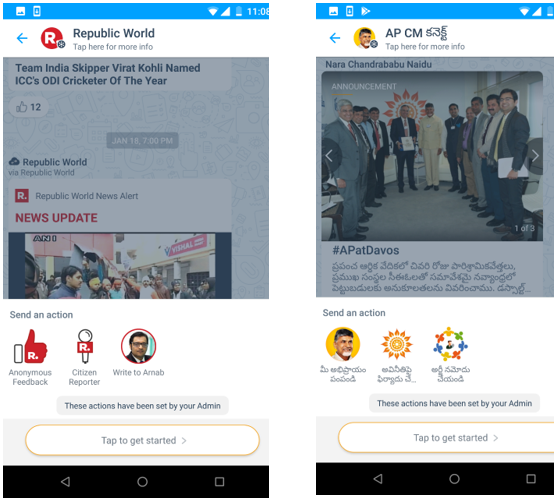

# Groupes de KaizalaGroups in Kaizala
Dans Kaizala, vous pouvez ajouter ou inviter des personnes à rejoindre le groupe, même si elles ne sont pas encore sur Kaizala.In Kaizala, you can add or invite people to join the group even if they are not yet on Kaizala. Dès qu’ils installent Kaizala, ils verront qu’ils sont déjà ajoutés au groupe.As soon as they install Kaizala, they will see that they are already added to the group. 

Kaizala comprend trois types de groupes pour répondre à différents types d’impératifs organisationnels :Kaizala has three types of groups to cater to different types of organizational requirements:
- Groupes platsFlat Groups
- Groupes hiérarchiquesHierarchical Groups
- Groupes publicsPublic Groups

## **Groupes plats****Flat Groups**

Plat groupes généralement adaptée aux petites équipes, équipe de projet, équipe de direction et groupes de travail/famille d’équipe.Flat groups usually suits to small team, project team, leadership team, and Work/family team groups. 

Certaines propriétés principales du groupe plat comprend :Some main properties of Flat group includes:

- Norme de groupes dans laquelle vous pouvez ajouter des milliers d’utilisateurs de messagerie.Standard messaging groups where you can add thousands of users.
- Vous pouvez ajouter des utilisateurs à l’aide de numéros de téléphone, premier enregistrement d’un contact n’est pas obligatoire.You can add users using phone numbers, saving a contact first is not mandatory.
- Vous pouvez créer et affecter des Actions de Kaizala comme (travail, enquête, sondage, etc.) à n’importe quel participant du groupe.You can create and assign Kaizala Actions like (Job, Survey, Poll, etc.) to any participant of the group. 
- Numéros de téléphone des membres du groupe sont visibles uniquement par l’administrateur ; sauf si le membre est déjà dans les contactsPhone numbers of group members are only visible to admin; unless member is already in the contacts  
 &nbsp;&nbsp;&nbsp;&nbsp;&nbsp;&nbsp;&nbsp; 

## **Groupes hiérarchiques****Hierarchical Groups**

La plupart des organisations dans le monde réel ne sont pas plat mais hiérarchique et par conséquent Kaizala offre un moyen pour mapper votre hiérarchie d’organisation et la plateforme de conversation.Most organizations in real world are not flat but hierarchical, and hence Kaizala provides a way to map your organizational hierarchy to chat platform.

Contrairement à un groupe plat où toutes les informations partagées sont visibles par tout le monde dans le groupe, dans le groupe hiérarchique, les informations s’enchaîne à partir du haut vers le bas.Unlike a flat group where all the information shared is visible to everyone in the group, in hierarchical group, information flows from the top to the bottom. Il existe une relation parent-enfant entre les groupes.There exists a parent-child relationship between the groups. 

Par exemple, lorsque vous ajoutez un groupe de ventes au groupe du siège social (un groupe dans les images), le groupe de ventes (groupe B dans les images) devient le groupe secondaire du groupe du siège social.For example, when you add Sales group to Head Office group (group A in images), Sales Group (group B in images) becomes the sub-group of Head Office group. Membres du groupe de ventes démarrera voir un siège social dans leur liste de conversation Kaizala Client.Members of Sales group will start seeing a Head Office in their Kaizala Client chat list. Dans office chef de groupe, ils peuvent uniquement afficher/répondre à Actions envoyées dans le siège social.In group Head office, they can only view/respond to Actions sent in Head Office. Ils ne serait pas en mesure d’envoyer des messages de ce groupe.They would not be able to send messages in this group.

De même, lorsque les ventes du Nord (groupe D dans les images) est ajouté au groupe de ventes, consultez le tableau ci-dessous pour comprendre la relation.Similarly, when North Sales (group D in images) is added to Sales Group, refer the table below to understand the relationship.

|Groupe d’envoi de messageMessage Sending Group|Groupe Recieving de messageMessage Recieving Group|
|--------|--------|
|Messages envoyés dans le siège socialMessages sent in Head Office|Membres du groupe de ventes et le groupe de ventes Amérique reçoit le message dans un groupe nommé siège social dans la liste de conversationMembers of Sales Group and North Sales Group receives the message in group named Head Office in the chat list|
|Messages envoyés au groupe de ventesMessages sent in Sales Group|Les membres du groupe de ventes Amérique reçoit le message dans le groupe de ventes dans la liste de conversationMembers of North Sales Group receives the message in Sales group in the chat list|
|Messages envoyés au groupe de ventes du NordMessages sent in North Sales Group |Groupe de ventes Amérique uniquement reçoit le messageOnly North Sales group receives the message|

  

Groupes hiérarchiques sont essentiellement utilisés pour partager des informations avec votre organisation ou de collecter des données à partir de votre organisation.Hierarchical groups are mainly used to share information with your entire organization or collect data from your organization. 

Prendre en compte les exemples suivants.Consider the following examples.

- Dans une organisation du secteur public répartis dans un état, vous pouvez créer des groupes géographiques mappage secteurs, mandals/groupes constitutifs et organisation d’état au niveau des unités.In a public-sector organization spread deep in a state, you can create geographical groups mapping to districts, mandals/constituencies, and state level organization units.
-   Dans une organisation d’entreprise, vous pouvez créer des groupes professionnels dirigés par le groupe parent pour le directeur général ou RH, Finance, fournit des informations sur les opérations.In a business organization, you can create business groups headed by the parent group for CEO or HR, Finance, Operations Heads. Chacun de ces groupes peut avoir des groupes enfants régionaux, tels que nord Sales Department, Sud Sales department et ainsi de suite.Each of these groups can have regional child groups such as, like North Sales Department, South Sales department, and so on.
-   Dans établissements d’enseignement, vous pouvez créer des groupes avec les groupes de services en tant qu’enfant groupes, ayant par lot pour l’étudiant de chaque année en tant que groupes enfants.In education institutions, you can create groups with departmental groups as child groups, having each year’s student batch as child groups.
-   Dans une Communauté Apartment, vous pouvez créer des groupes avec chaque construction/tour représentant un groupe enfant.In a Apartment community, you can create groups with each building/tower representing a child group.

Certaines propriétés principales de ce type de groupe sont les suivantes :Some main properties of this type of group include: 
- Groupes peuvent avoir des membres directs, ainsi que des sous-groupes en tant que membres.Groups can have direct members as well as subgroups as members.
- Message envoyé à n’importe quel niveau accède à tous les membres de ce groupe et tous ses groupes enfants.Message sent at any level goes to all members of that group and down to all its child groups. Par conséquent, la conversation est désactivée dans les groupes parents, mais toutes les Actions Kaizala sont activées.Hence, chat is disabled in parents groups but all Kaizala Actions are enabled. Ainsi, les membres des groupes parent peuvent envoyer des annonces ou enquêtes qui seront envoyés à l’ensemble de l’organisation.So, members of parent groups can send Announcements or Surveys which will be sent to entire organization.
- N’importe quel membre du groupe permettre créer et affecter des Actions Kaizala comme (travail, enquête, sondage, etc.) pour tout le monde dans le même groupe ou en dessous.Any group member can create and assign Kaizala Actions like (Job, Survey, Poll, etc.) to anyone in the same group or below it.
- Groupes enfants ne peuvent pas envoyer le message à un groupe parent ou des groupes de l’homologue, mais ils peuvent présenter leurs vues à j’aime et des commentaires sur chaque Action Kaizala envoyés.Child groups cannot send the message to a parent group or peer groups but they can present their views through Likes and Comments on each Kaizala Action sent to them.
- Les groupes bas (noeud) des groupes hiérarchiques sont régulières groupes plats.Bottom groups (leaf nodes) of the hierarchical groups are regular flat groups.
  

## **Groupes publics****Public Groups** 

Un groupe Public dans Kaizala est un groupe unique où les membres du groupe peuvent interagir avec l’administrateur du groupe sur une base individuelle, mais les interactions ne sont pas visibles par les autres membres du groupe.A Public Group in Kaizala is a unique group where members of the group can interact with the admin of the group on a one-to-one basis, but the interactions cannot be seen by other group members. 

Groupes publics sont généralement préférés dans les scénarios suivants :Public groups are usually preferred in the following scenarios:

- Les agences gouvernementales autorisez à se connecter avec les citoyens.Government agencies who want to connect with citizens.
- Les entreprises peuvent se connecter avec les clients.Enterprises can connect with customers.
- Les entreprises peuvent également créer groupe public géré pour se connecter avec leurs fournisseurs, fournisseurs, détaillants et ainsi de suite.Enterprises can also create managed public group to connect with their vendors, suppliers, retailers, and so on.

Dans des groupes publics, seuls les membres prédéfinies peuvent rejoindre le groupe.In Public Groups, only pre-defined members can join the group.

Certaines propriétés principales de ce type de groupe sont les suivantes :Some main properties of this kind of group include: 

- Admin peut se connecter à n’importe quel nombre de membres et envoyer et rechercher des informations.Admin can connect with any number of members and send and seek information.
- Les membres ne peuvent pas voir ou interagir les uns avec les autres.The members cannot see each other or interact with each other.
- Les membres peuvent communiquer avec uniquement par le biais d’administration définies par l’administrateur de cartes de visite personnalisées comme commentaires, partagez votre demande.The members can communicate with admin only through admin defined custom cards like giving Feedback, Share your requirement, etc.
- Les membres peuvent s’abonner à un groupe public à l’aide d’un lien.Members can subscribe to a public group using a link.
    

