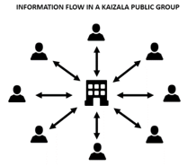

# Groupes dans KaizalaGroups in Kaizala
Dans Kaizala, vous pouvez ajouter ou inviter des personnes à rejoindre le groupe même si elles ne sont pas encore sur Kaizala.In Kaizala, you can add or invite people to join the group even if they are not yet on Kaizala. Dès qu'ils installent Kaizala, ils verront qu'ils sont déjà ajoutés au groupe.As soon as they install Kaizala, they will see that they are already added to the group. 

Kaizala dispose de trois types de groupes pour répondre aux différents types d'exigences organisationnelles:Kaizala has three types of groups to cater to different types of organizational requirements:
- Groupes à deux dimensionsFlat Groups
- Groupes hiérarchiquesHierarchical Groups
- Groupes publicsPublic Groups

## **Groupes à deux dimensions****Flat Groups**

Les groupes à plat sont généralement adaptés aux équipes de petite équipe, d'équipe de projet, de direction et d'équipe professionnelle/familiale.Flat groups usually suits to small team, project team, leadership team, and Work/family team groups. 

Voici quelques-unes des principales propriétés du groupe plat:Some main properties of Flat group includes:

- Groupes de messagerie standard où vous pouvez ajouter des milliers d'utilisateurs.Standard messaging groups where you can add thousands of users.
- Vous pouvez ajouter des utilisateurs en utilisant des numéros de téléphone, l'enregistrement d'abord d'un contact n'est pas obligatoire.You can add users using phone numbers, saving a contact first is not mandatory.
- Vous pouvez créer et affecter des actions Kaizala comme (Job, Survey, Poll, etc.) à n'importe quel participant du groupe.You can create and assign Kaizala Actions like (Job, Survey, Poll, etc.) to any participant of the group. 
- Les numéros de téléphone des membres du groupe ne sont visibles que par l'administrateur; sauf si le membre est déjà dans les contactsPhone numbers of group members are only visible to admin; unless member is already in the contacts  
 &nbsp;&nbsp;&nbsp;&nbsp;&nbsp;&nbsp;&nbsp; 

## **Groupes hiérarchiques****Hierarchical Groups**

La plupart des organisations en réalité ne sont pas plates mais hiérarchiques, et donc Kaizala offre un moyen de mapper votre hiérarchie d'organisation à la plateforme de conversation.Most organizations in real world are not flat but hierarchical, and hence Kaizala provides a way to map your organizational hierarchy to chat platform.

Contrairement à un groupe plat dans lequel toutes les informations partagées sont visibles par tous les membres du groupe, dans le groupe hiérarchique, les informations circulent en partant du haut vers le bas.Unlike a flat group where all the information shared is visible to everyone in the group, in hierarchical group, information flows from the top to the bottom. Il existe une relation parent-enfant entre les groupes.There exists a parent-child relationship between the groups. 

Par exemple, lorsque vous ajoutez un groupe de ventes au groupe de siège social (groupe A dans les images), le groupe ventes (groupe B dans images) devient le sous-groupe du groupe de siège social.For example, when you add Sales group to Head Office group (group A in images), Sales Group (group B in images) becomes the sub-group of Head Office group. Les membres du groupe ventes commencent à voir un siège social dans leur liste de conversations client Kaizala.Members of Sales group will start seeing a Head Office in their Kaizala Client chat list. Dans le siège social du groupe, les utilisateurs peuvent uniquement afficher/répondre aux actions envoyées au siège social.In group Head office, they can only view/respond to Actions sent in Head Office. Ils ne seraient pas en mesure d'envoyer des messages dans ce groupe.They would not be able to send messages in this group.

De même, lorsque le service des ventes au nord (dans les images du groupe D) est ajouté au groupe de ventes, reportez-vous au tableau ci-dessous pour comprendre la relation.Similarly, when North Sales (group D in images) is added to Sales Group, refer the table below to understand the relationship.

|Groupe d'envoi de messagesMessage Sending Group|Groupe de réception de messageMessage Receiving Group|
|--------|--------|
|Messages envoyés au siège socialMessages sent in Head Office|Les membres du groupe ventes et du groupe ventes nord reçoivent le message dans le groupe nommé siège social de la liste des conversations.Members of Sales Group and North Sales Group receives the message in group named Head Office in the chat list|
|Messages envoyés dans le groupe de ventesMessages sent in Sales Group|Les membres du groupe de ventes nord reçoivent le message «groupe de ventes» dans la liste des conversations.Members of North Sales Group receives the message in Sales group in the chat list|
|Messages envoyés dans le groupe de ventes nordMessages sent in North Sales Group |Seul le groupe de ventes nord reçoit le messageOnly North Sales group receives the message|

  

Les groupes hiérarchiques sont principalement utilisés pour partager des informations avec l'ensemble de votre organisation ou collecter les données de votre organisation.Hierarchical groups are mainly used to share information with your entire organization or collect data from your organization. 

Examinez les exemples suivants.Consider the following examples.

- Dans une organisation de secteur public dispersée dans un État, vous pouvez créer des groupes géographiques mappés avec des districts, des Mandals/groupes et des unités d'organisation au niveau de l'État.In a public-sector organization spread deep in a state, you can create geographical groups mapping to districts, mandals/constituencies, and state level organization units.
-   Dans une organisation d'entreprise, vous pouvez créer des groupes d'entreprise dirigés par le groupe parent pour les PDG ou les RH, les services financiers, les chefs d'exploitation.In a business organization, you can create business groups headed by the parent group for CEO or HR, Finance, Operations Heads. Chacun de ces groupes peut avoir des groupes enfants locaux, tels que le département ventes au nord, le service des ventes au sud, etc.Each of these groups can have regional child groups such as, like North Sales Department, South Sales department, and so on.
-   Dans les établissements scolaires, vous pouvez créer des groupes avec des groupes de services en tant que groupes enfants, chaque lot d'étudiant de chaque année en tant que groupes enfants.In education institutions, you can create groups with departmental groups as child groups, having each year’s student batch as child groups.
-   Dans une communauté cloisonnée, vous pouvez créer des groupes avec chaque bâtiment/tour représentant un groupe enfant.In a Apartment community, you can create groups with each building/tower representing a child group.

Voici quelques-unes des principales propriétés de ce type de groupe:Some main properties of this type of group include: 
- Les groupes peuvent avoir des membres directs ainsi que des sous-groupes en tant que membres.Groups can have direct members as well as subgroups as members.
- Les messages envoyés à tous les niveaux sont redirigés vers tous les membres de ce groupe et vers tous les groupes enfants.Message sent at any level goes to all members of that group and down to all its child groups. Par conséquent, la conversation est désactivée dans les groupes parents, mais toutes les actions Kaizala sont activées.Hence, chat is disabled in parents groups but all Kaizala Actions are enabled. Par conséquent, les membres des groupes parents peuvent envoyer des annonces ou des enquêtes qui seront envoyées à l'ensemble de l'organisation.So, members of parent groups can send Announcements or Surveys which will be sent to entire organization.
- N'importe quel membre du groupe peut créer et affecter des actions Kaizala comme (travail, enquête, sondage, etc.) à tous les membres du même groupe ou en dessous.Any group member can create and assign Kaizala Actions like (Job, Survey, Poll, etc.) to anyone in the same group or below it.
- Les groupes enfants ne peuvent pas envoyer le message à un groupe parent ou à des groupes d'homologues, mais ils peuvent présenter leurs vues par leurs équivalents et leurs commentaires sur chaque action Kaizala qui leur est envoyée.Child groups cannot send the message to a parent group or peer groups but they can present their views through Likes and Comments on each Kaizala Action sent to them.
- Les groupes de bas (nœuds feuille) des groupes hiérarchiques sont des groupes plats standard.Bottom groups (leaf nodes) of the hierarchical groups are regular flat groups.
  

## **Groupes publics****Public Groups** 

Un groupe public dans Kaizala est un groupe unique dans lequel les membres du groupe peuvent interagir avec l'administrateur du groupe sur une base un-à-un, mais les interactions ne peuvent pas être vues par les autres membres du groupe.A Public Group in Kaizala is a unique group where members of the group can interact with the admin of the group on a one-to-one basis, but the interactions cannot be seen by other group members. 

Les groupes publics sont généralement préférés dans les scénarios suivants:Public groups are usually preferred in the following scenarios:

- Les agences gouvernementales qui souhaitent se connecter avec les citoyens.Government agencies who want to connect with citizens.
- Les entreprises peuvent se connecter à des clients.Enterprises can connect with customers.
- Les entreprises peuvent également créer un groupe public géré pour se connecter à leurs fournisseurs, fournisseurs, détaillants, etc.Enterprises can also create managed public group to connect with their vendors, suppliers, retailers, and so on.

Dans les groupes publics, seuls les membres prédéfinis peuvent rejoindre le groupe.In Public Groups, only pre-defined members can join the group.

Voici quelques-unes des principales propriétés de ce type de groupe:Some main properties of this kind of group include: 

- L'administrateur peut se connecter avec n'importe quel nombre de membres et envoyer et Rechercher des informations.Admin can connect with any number of members and send and seek information.
- Les membres ne peuvent pas s'afficher mutuellement ni interagir les uns avec les autres.The members cannot see each other or interact with each other.
- Les membres peuvent communiquer avec l'administrateur uniquement par le biais de cartes personnalisées définies par l'administrateur, telles que l'apport de commentaires, le partage de votre besoin, etc.The members can communicate with admin only through admin defined custom cards like giving Feedback, Share your requirement, etc.
- Les membres peuvent s'abonner à un groupe public à l'aide d'un lien.Members can subscribe to a public group using a link.
    

