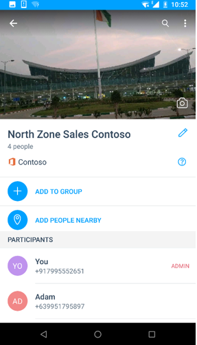
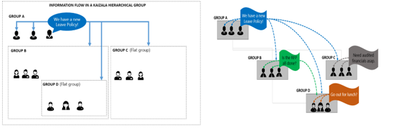

# Groupes de Kaizala
Dans Kaizala, vous pouvez ajouter ou inviter des personnes à rejoindre le groupe, même si elles ne sont pas encore sur Kaizala. Dès qu’ils installent Kaizala, ils verront qu’ils sont déjà ajoutés au groupe. 

Kaizala comprend trois types de groupes pour répondre à différents types d’impératifs organisationnels :
- Groupes plats
- Groupes hiérarchiques
- Groupes publics

## **Groupes plats**

Plat groupes généralement adaptée aux petites équipes, équipe de projet, équipe de direction et groupes de travail/famille d’équipe. 

Certaines propriétés principales du groupe plat comprend :

- Norme de groupes dans laquelle vous pouvez ajouter des milliers d’utilisateurs de messagerie.
- Vous pouvez ajouter des utilisateurs à l’aide de numéros de téléphone, premier enregistrement d’un contact n’est pas obligatoire.
- Vous pouvez créer et affecter des Actions de Kaizala comme (travail, enquête, sondage, etc.) à n’importe quel participant du groupe. 
- Numéros de téléphone des membres du groupe sont visibles uniquement par l’administrateur ; sauf si le membre est déjà dans les contacts  
 &nbsp;&nbsp;&nbsp;&nbsp;&nbsp;&nbsp;&nbsp; 

## **Groupes hiérarchiques**

La plupart des organisations dans le monde réel ne sont pas plat mais hiérarchique et par conséquent Kaizala offre un moyen pour mapper votre hiérarchie d’organisation et la plateforme de conversation.

Contrairement à un groupe plat où toutes les informations partagées sont visibles par tout le monde dans le groupe, dans le groupe hiérarchique, les informations s’enchaîne à partir du haut vers le bas. Il existe une relation parent-enfant entre les groupes. 

Par exemple, lorsque vous ajoutez un groupe de ventes au groupe du siège social (un groupe dans les images), le groupe de ventes (groupe B dans les images) devient le groupe secondaire du groupe du siège social. Membres du groupe de ventes démarrera voir un siège social dans leur liste de conversation Kaizala Client. Dans office chef de groupe, ils peuvent uniquement afficher/répondre à Actions envoyées dans le siège social. Ils ne serait pas en mesure d’envoyer des messages de ce groupe.

De même, lorsque les ventes du Nord (groupe D dans les images) est ajouté au groupe de ventes, consultez le tableau ci-dessous pour comprendre la relation.

|Groupe d’envoi de message|Groupe Recieving de message|
|--------|--------|
|Messages envoyés dans le siège social|Membres du groupe de ventes et le groupe de ventes Amérique reçoit le message dans un groupe nommé siège social dans la liste de conversation|
|Messages envoyés au groupe de ventes|Les membres du groupe de ventes Amérique reçoit le message dans le groupe de ventes dans la liste de conversation|
|Messages envoyés au groupe de ventes du Nord |Groupe de ventes Amérique uniquement reçoit le message|

  

Groupes hiérarchiques sont essentiellement utilisés pour partager des informations avec votre organisation ou de collecter des données à partir de votre organisation. 

Prendre en compte les exemples suivants.

- Dans une organisation du secteur public répartis dans un état, vous pouvez créer des groupes géographiques mappage secteurs, mandals/groupes constitutifs et organisation d’état au niveau des unités.
-   Dans une organisation d’entreprise, vous pouvez créer des groupes professionnels dirigés par le groupe parent pour le directeur général ou RH, Finance, fournit des informations sur les opérations. Chacun de ces groupes peut avoir des groupes enfants régionaux, tels que nord Sales Department, Sud Sales department et ainsi de suite.
-   Dans établissements d’enseignement, vous pouvez créer des groupes avec les groupes de services en tant qu’enfant groupes, ayant par lot pour l’étudiant de chaque année en tant que groupes enfants.
-   Dans une Communauté Apartment, vous pouvez créer des groupes avec chaque construction/tour représentant un groupe enfant.

Certaines propriétés principales de ce type de groupe sont les suivantes : 
- Groupes peuvent avoir des membres directs, ainsi que des sous-groupes en tant que membres.
- Message envoyé à n’importe quel niveau accède à tous les membres de ce groupe et tous ses groupes enfants. Par conséquent, la conversation est désactivée dans les groupes parents, mais toutes les Actions Kaizala sont activées. Ainsi, les membres des groupes parent peuvent envoyer des annonces ou enquêtes qui seront envoyés à l’ensemble de l’organisation.
- N’importe quel membre du groupe permettre créer et affecter des Actions Kaizala comme (travail, enquête, sondage, etc.) pour tout le monde dans le même groupe ou en dessous.
- Groupes enfants ne peuvent pas envoyer le message à un groupe parent ou des groupes de l’homologue, mais ils peuvent présenter leurs vues à j’aime et des commentaires sur chaque Action Kaizala envoyés.
- Les groupes bas (noeud) des groupes hiérarchiques sont régulières groupes plats.
  

## **Groupes publics** 

Un groupe Public dans Kaizala est un groupe unique où les membres du groupe peuvent interagir avec l’administrateur du groupe sur une base individuelle, mais les interactions ne sont pas visibles par les autres membres du groupe. 

Groupes publics sont généralement préférés dans les scénarios suivants :

- Les agences gouvernementales autorisez à se connecter avec les citoyens.
- Les entreprises peuvent se connecter avec les clients.
- Les entreprises peuvent également créer groupe public géré pour se connecter avec leurs fournisseurs, fournisseurs, détaillants et ainsi de suite.

Dans des groupes publics, seuls les membres prédéfinies peuvent rejoindre le groupe.

Certaines propriétés principales de ce type de groupe sont les suivantes : 

- Admin peut se connecter à n’importe quel nombre de membres et envoyer et rechercher des informations.
- Les membres ne peuvent pas voir ou interagir les uns avec les autres.
- Les membres peuvent communiquer avec uniquement par le biais d’administration définies par l’administrateur de cartes de visite personnalisées comme commentaires, partagez votre demande.
- Les membres peuvent s’abonner à un groupe public à l’aide d’un lien.
    

