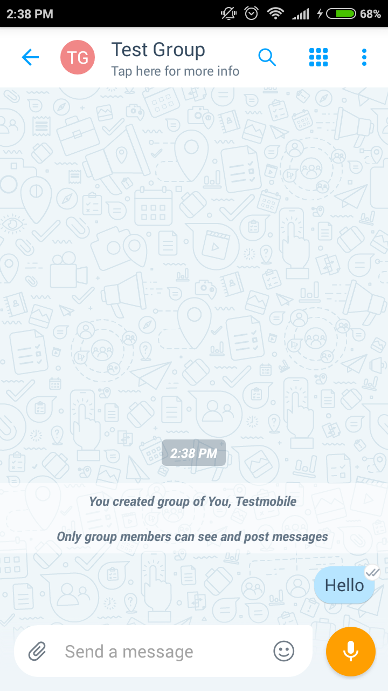

[3]: https://play.google.com/store/apps/details?id=com.microsoft.mobile.polymer&hl=en
[4]: https://itunes.apple.com/in/app/microsoft-kaizala/id1112208399?mt=8

# Installation et démarrage rapideInstallation and quick start 
###### Téléchargez Kaizala à partir de [Google lire banque] [ 3] pour Android ou [App Store] [ 4] pour iOS maintenant.Download Kaizala from [Google Play Store][3] for Android or [App Store][4] for iOS now.

### Activer avec votre numéro de téléphone et commencer immédiatementActivate with your phone number and get started right away 

1. Cliquez sur le signe « + » pour créer un groupe et ajouter des membres à partir de votre liste de contacts ou ajouter directement les numéros de téléphone.Click on the ‘+’ sign to create a group and add members from your contacts list or directly add the phone numbers. Donnez un nom au groupe et vous sont toutes définies.Give the group a name and you are all set. 

 
2.  Pour inviter des personnes non sur Kaizala à ce groupe, simplement partager le » pour le groupe de liens ».To invite the people not on Kaizala to this group, just share the "Link to the Group".

3.  Dans le groupe, par exemple « Hello ».Say "Hello" in the group.

4. Envoyer une Action Kaizala en cliquant sur le coin supérieur droit pour afficher la palette de Kaizala Actions.Send a Kaizala Action by clicking on the top right corner to bring up the Kaizala Actions palette. Essayez d’envoyer un sondage rapide ou une annonce pour voir Kaizala à le œuvre.Try sending a Quick Poll or an Announcement to see Kaizala in Action.

 

