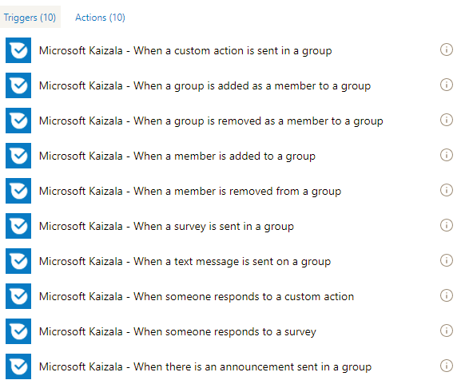
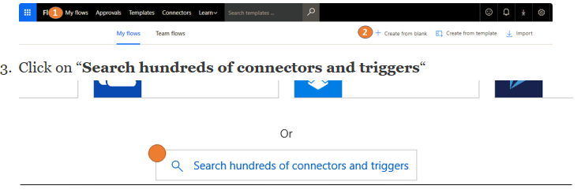
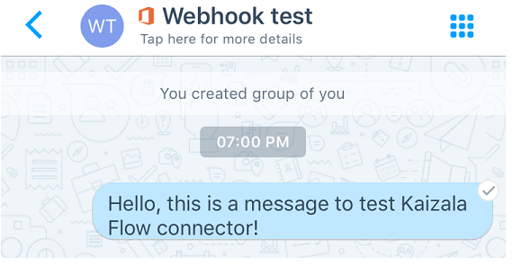
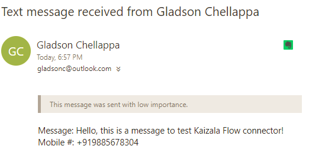

# Automatisation du processus d'entreprise à l'aide du connecteur de flux Kaizala
## Présentation de Microsoft Flow
Microsoft Flow est un service qui vous permet de créer des flux de travail automatisés entre vos applications et vos services favoris pour synchroniser des fichiers, recevoir des notifications, collecter des données et bien plus encore. [courtoisie: [Flow](https://docs.microsoft.com/en-us/flow/getting-started)]. En d'autres termes, vous pouvez créer un organigramme qui exécuterait la logique en arrière-plan, c'est simple!
  Le flux extrait des services en tant que connecteurs servant de proxy/wrapper pour le service sous-jacent. Flow communique avec le (s) connecteur (s) et vous permet de transmettre la sortie d'un connecteur à un autre.  Cela vous permet de créer un flux qui s'intègre avec plusieurs services. Un connecteur peut avoir des déclencheurs et des actions. Les déclencheurs sont l'événement qui déclenchent un flux. Chaque flux commence par un déclencheur. Exemple de déclencheur: lors de la réception d'un message électronique. Les actions sont les fonctionnalités exposées par les services. Exemple d'action: envoyer un courrier électronique. Lorsque vous ajoutez un connecteur sur le flux, si le connecteur nécessite un compte sous-jacent pour accéder au service/fonctionnalité, vous devez l'authentifier/le configurer avant de pouvoir utiliser le connecteur. Ces informations sont enregistrées en tant que connexion.
  Si votre service n'est pas encore disponible en flux, vous pouvez créer un connecteur de flux personnalisé pour votre service!
## Connecteur de flux Kaizala
Kaizala est disponible sous forme de connecteur sur Microsoft Flow. Cela vous permet d'incorporer Kaizala dans votre flux de travail d'entreprise. Et, étant donné que le flux prend en charge 200 connecteurs +, ce qui présente une opportunité de créer des solutions Kaizala.
  Vous trouverez ci-dessous des captures d'écran illustrant la liste des déclencheurs et des actions actuellement disponibles dans le connecteur de flux Kaizala.
### Actions

### Déclenche

 
  Kaizala dispose de 2 modèles de flux publiés que vous pouvez utiliser comme point de départ:
  1. [Ajouter un élément de liste SharePoint pour chaque réponse d'enquête Kaizala](https://us.flow.microsoft.com/en-us/galleries/public/templates/a71f0ac3e35a40728b3e9ee27bf9dbcd/add-a-sharepoint-list-item-for-every-kaizala-survey-response/)
  2. [Envoyer une annonce sur Kaizala lorsque vous recevez un message électronique Outlook](https://us.flow.microsoft.com/en-us/galleries/public/templates/cb85f664dfb0421dbd937dd64618f791/send-an-announcement-on-kaizala-when-you-get-an-outlook-email/)
## Exemple de scénario
Pour illustrer le connecteur de flux Kaizala, faites-nous part d'un scénario: «envoyez un message électronique au message texte reçu sur le groupe Kaizala».
### Étapes :
  1. Accédez à [https://flow.microsoft.com](https://flow.microsoft.com/en-us/) et connectez-vous avec vos informations d'identification
  2. cliquez sur «mes flux», puis cliquez sur «créer à partir d'un espace»
  4. Donnez un nom à votre flux
  5. dans la zone de recherche du connecteur, recherchez Kaizala
  6. Sélectionnez le connecteur de flux Kaizala à partir du résultat de la recherche.
   7. à partir des déclencheurs disponibles, sélectionnez «lors de l'envoi d'un message texte sur un groupe» (vous devrez vous authentifier auprès de Kaizala à ce stade avec votre numéro de téléphone mobile et le mot de passe à usage unique que vous recevrez).
   8. Ajoutez maintenant une action pour envoyer le courrier électronique (j'ai choisi Outlook.com – envoyer une action de courrier électronique – vous devrez vous authentifier auprès de votre compte de messagerie)
  9. Entrez une adresse de messagerie dans le champ à
 10. cliquez sur le champ objet, vous remarquerez qu'une fenêtre contextuelle s'affiche sur la droite qui vous donne une série de valeurs extraites du déclencheur ci-dessus.
 
  11. laissez le nom de l'expéditeur dans l'objet et le message, numéro de téléphone mobile dans le corps du message. Le flux se présente comme suit:
 

  12. cliquez sur créer un flux
   Poursuivez et testez le flux en envoyant un message texte sur le groupe que vous avez configuré.
### Exemple de capture d'écran du message envoyé au groupe:

### Capture d'écran d'exemple du courrier électronique reçu:

