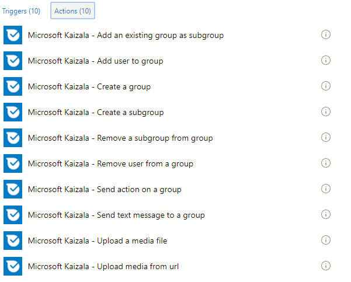
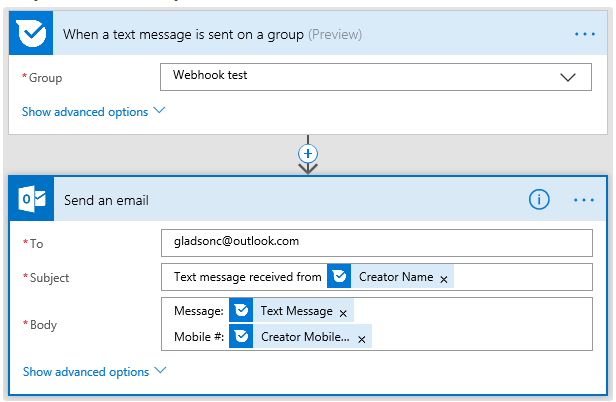

# Automatisation des processus d’entreprise à l’aide du connecteur de flux Kaizala
## Introduction aux flux de Microsoft
Microsoft Flow est un service qui vous permet de créer des flux de travail automatisés entre vos applications et vos services favoris pour synchroniser des fichiers, recevoir des notifications, collecter des données et bien plus encore. [courtoisie : [flux](https://docs.microsoft.com/en-us/flow/getting-started)]. Dans une certaine façon, vous pouvez uniquement créer un organigramme qui s’exécute en arrière-plan – simple la logique de !
  Flux brièvement les services en tant que les connecteurs qui permettent d’en tant que proxy / wrapper autour du service sous-jacent. Flux communique avec le connecteur et vous permet de passer la sortie à partir d’un connecteur à une autre.  Ainsi, vous permet de créer un flux intégrant plusieurs services. Un connecteur peut avoir des déclencheurs et des actions. Les déclencheurs sont l’événement qui déclenche un flux. Chaque flux commence par un déclencheur. Exemple de déclencheur : lors de la réception d’un message électronique. Les actions sont les fonctionnalités qui expose les services. Exemple d’une action : envoyer un message électronique. Lorsque vous ajoutez un connecteur sur le flux, si le connecteur nécessite un compte sous-jacent pour accéder au service / fonctionnalités – vous devrez authentifier / configurer le compte avant de pouvoir utiliser le connecteur. Cette information est enregistrée en tant que connexion.
  Si votre service n’est pas disponible sur le flux, vous pouvez créer un connecteur personnalisé de flux pour votre service !
## Connecteur de flux Kaizala
Kaizala est disponible en tant que connecteur sur Microsoft Flow. Cela vous permet d’incorporer Kaizala dans votre flux de travail d’entreprise. Et prenant en charge les flux de 200 connecteurs – qui présente la possibilité de créer des solutions Kaizala avec eux.
  Ci-dessous sont captures d’écran montrant la liste des déclencheurs actuellement disponibles et les actions dans le connecteur Kaizala flux.
### Actions

### Déclencheurs

 
  Kaizala comprend des modèles de flux 2 publiés que vous pouvez utiliser comme point de départ :
  1. [Ajouter un élément de liste SharePoint pour chaque réponse d’enquête Kaizala](https://us.flow.microsoft.com/en-us/galleries/public/templates/a71f0ac3e35a40728b3e9ee27bf9dbcd/add-a-sharepoint-list-item-for-every-kaizala-survey-response/)
  2. [Envoyer une annonce sur Kaizala lorsque vous recevez un message électronique Outlook](https://us.flow.microsoft.com/en-us/galleries/public/templates/cb85f664dfb0421dbd937dd64618f791/send-an-announcement-on-kaizala-when-you-get-an-outlook-email/)
## Exemple de scénario
Pour illustrer le connecteur Kaizala flux, nous vous pensez d’un scénario : « Le message reçu sur le groupe Kaizala de messagerie ».
### Étapes :
  1. Accédez à [https://flow.microsoft.com](https://flow.microsoft.com/en-us/) et la connexion avec vos informations d’identification
  2. Cliquez sur « Mon flux » et cliquez ensuite sur « Créer vide »
  4. donner un nom pour votre flux
  5. dans la zone de recherche du connecteur de recherche pour Kaizala
  6. Sélectionnez le connecteur Kaizala flux dans le résultat de recherche
   7. dans les déclencheurs disponibles, sélectionnez « Lorsqu’un message texte envoyé sur un groupe » (vous devrez s’authentifient auprès de Kaizala à ce stade avec votre numéro de téléphone mobile et un unique que vous recevrez)
   8. maintenant ajouter une action pour envoyer un message électronique (j’ai choisies Outlook.com – envoyer une action de courrier électronique – vous devrez pour authentifier votre compte de messagerie)
  9. Entrez une adresse de messagerie dans le champ à
 10. Cliquez sur le champ objet – vous constaterez un menu contextuel à droite qui vous offre un certain nombre de valeurs lues à partir du déclencheur ci-dessus
 
  11. nous ont le nom de l’expéditeur de l’objet et le message, le numéro de téléphone mobile dans le corps du message électronique. Puis flux ressemble à ceci :
 

  12. Cliquez sur flux de création
   Continuez et test du flux en envoyant un message de texte dans le groupe que vous avez configurée.
### Exemple capture d’écran du message envoyé sur le groupe :

### Capture d’écran de l’exemple de courrier électronique reçu :

