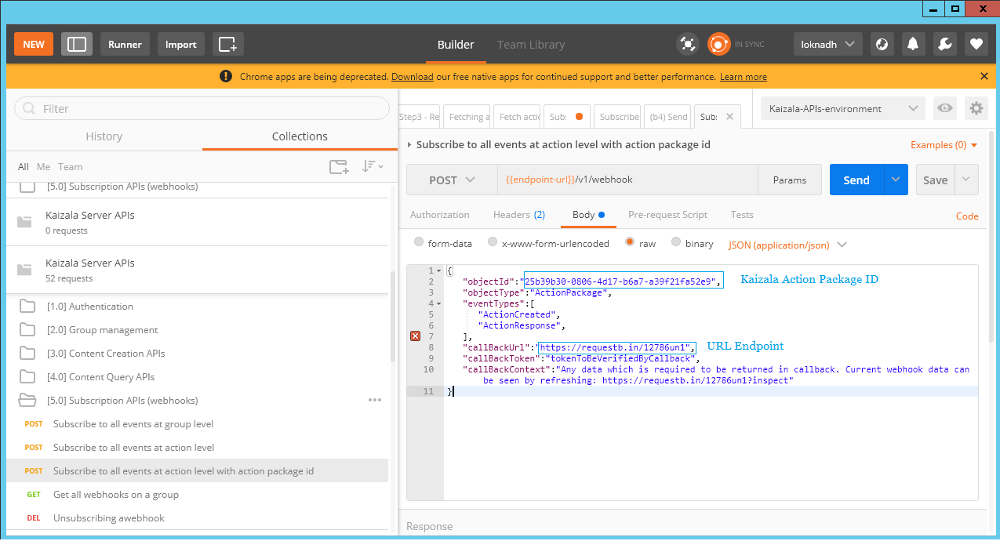

## Intégration de données Kaizala à vos tableaux de bord existantIntegrating Kaizala Data to your existing dashboards

Créer un rapport personnalisé ou connectez vos données Kaizala vos tableaux de bord existant à l’aide de Kaizala APIs.Create custom report or plug your Kaizala data to your existing dashboards using Kaizala APIs. 
 En tant qu’une organisation tierce partie - vous souhaitez connecter des données Kaizala à votre tableau de bord existant, puis vous pouvez le faire à l’aide des manières suivantes :As a third party organization - You want to plug Kaizala data to your existing dashboard, then you can do it using the following ways:
 1. obtenir des données de Kaizala par le biais de Power BI-Content Pack et créer un rapport personnalisé sur PowerBI1. Get Kaizala data through Power BI-Content Pack and create a Custom report on PowerBI
 2 accéder aux données de Kaizala par le biais de connecteurs et passe au tableau de bord existant dans le format qu’il comprend.2.Access Kaizala data through connectors and pass on to  existing dashboard in the format that it understands. Vous pouvez accéder à l’aide de Kaizala Connecters de données :You can access data using Kaizala Connecters:  
 a[API](https://docs.microsoft.com/en-us/kaizala/connectors/api) - Kaizala connecteurs permettent 3ème partie aux développeurs Kaizala intégrer leurs processus d’entreprise en fournissant des appels d’API en fonction de la capacité à exécuter un ensemble d’actions curated dans Kaizala à l’aide de REST.a.[APIs](https://docs.microsoft.com/en-us/kaizala/connectors/api)  - Kaizala Connectors enable 3rd party developers to integrate Kaizala into their business processes by providing the ability to perform a curated set of actions in Kaizala using REST based API calls. L’étendue de l’API est pour les systèmes externes pour le point de terminaison d’appel et effectuer des actions sur la demande.The scope of the API is for external systems to call the end-point and perform actions on-demand. Autrement dit, il s’agit d’un modèle de collecte – où les points de terminaison individuels doivent être appelée pour effectuer des actions spécifiques à l’aide de l’API Kaizala.That is, this will be a PULL model – where individual endpoints need to be called to perform specific actions using Kaizala API's. 
 b.[webhooks](https://docs.microsoft.com/en-us/kaizala/connectors/webhooks) - PUSH du modèle où plateforme Kaizala peut déclencher des actions peuvent être configurés à l’aide de webhooks.b.[webhooks](https://docs.microsoft.com/en-us/kaizala/connectors/webhooks) - The PUSH model where Kaizala platform can trigger actions can be configured using webhooks.  
  Connecteurs Kaizala activer 3e développeurs tiers d’intégrer Kaizala leurs processus d’entreprise en fournissant des appels d’API en fonction de la capacité à exécuter un ensemble d’actions curated dans Kaizala à l’aide de REST.Kaizala Connectors enable 3rd party developers to integrate Kaizala into their business processes by providing the ability to perform a curated set of actions in Kaizala using REST based API calls. L’étendue de l’API est pour les systèmes externes pour le point de terminaison d’appel et effectuer des actions sur la demande.The scope of the API is for external systems to call the end-point and perform actions on-demand. Autrement dit, il s’agit d’un modèle de collecte – où les points de terminaison individuels doivent être appelée pour effectuer des actions spécifiques à l’aide Kaizala [API](https://docs.microsoft.com/en-us/kaizala/connectors/api).That is, this will be a PULL model – where individual endpoints need to be called to perform specific actions using Kaizala [APIs](https://docs.microsoft.com/en-us/kaizala/connectors/api). Le modèle PUSH où plateforme Kaizala peut déclencher des actions permettre être configuré à l’aide de [webhooks](https://docs.microsoft.com/en-us/kaizala/connectors/webhooks).The PUSH model where Kaizala platform can trigger actions can be configured using [webhooks](https://docs.microsoft.com/en-us/kaizala/connectors/webhooks). 

### Intégration à l’aide de Webhooks :Integration Using Webhooks: 
 Il s’agit d’un mécanisme de diffusion en fonction.This is a PUSH based mechanism. Une fois que Webhook est enregistré sur une action particulière, chaque fois que l’utilisateur envoie les données sur cette action sur Application Kaizala - Kaizala Server envoie une notification d’événement (message HTTP POST) avec la charge utile de réponse (au Format JSON) au point de terminaison URL configuré.Once Webhook is registered on particular action, Whenever user submits data on that action on Kaizala Application - Kaizala Server will send a event notification (HTTP POST message) with response payload (JSON Format) to the configured URL endpoint. Une fois les données sont informées sur le point de terminaison clients, logique pour l’analyse de la charge utile de réponse doit déclencher et insérer des données dans les tableaux respectifs dans le stockage (base de données ou sharepoint...) et visualisations peuvent être construites par l’interrogation de données à partir du stockage.Once data is notified on customers endpoint, Logic for parsing the response payload should trigger and Insert data in to the respective tables in the storage (Database or sharepoint,..) and Visualizations can be built by querying data from the storage. Tirer parti est que toute organisation peuvent y accéder Kaizala données les tableaux de bord personnalisés sans interrompre leur flux de travail existant.Advantage of this is any Organization can get Kaizala data in to their Custom dashboards without disrupting their existing work flows. 
### Permet d’atteindre la procédure ci-dessus et le voir en détail :Lets drill down in to the above process and see it in detail: 
#### Explique comment inscrire un webhook sur le point de terminaison ?How to register a webhook on endpoint? 
  Une fois que vous configurez un point de terminaison URL sur laquelle vous souhaitez notifier les événements Kaizala, vous pouvez vous abonner à une notification sur le groupe ou d’une action particulière.Once you configure a URL endpoint on which you wanted to notify the Kaizala events, You can subscribe for a notification on the group or a particular  action. Vous pouvez utiliser les clients 3ème partie API Rest comme Postman / Client reste avancé, etc. pour vous inscrire pour un webhook.You can use the 3rd party Rest API clients like  Postman/ Advanced Rest Client, etc. to subscribe for a webhook. Signature de l’inscription d’un webhook sur une Action particulière est donné ci-dessous :Signature of registering a webhook on particular Action is given below: 
 Accédez à [Kaizala API Documentation !](https://docs.microsoft.com/en-us/kaizala/connectors/api)Go to [Kaizala API Documentation!](https://docs.microsoft.com/en-us/kaizala/connectors/api) sur laand click on the 
 Effectuez la procédure pour obtenir le AccessToken et inscrire un wekbhook.Go through the steps to get the AccessToken and register a wekbhook. 
 
 Comme vous avez maintenant inscrit un webhook, Kaizala server conserver sera avertissant les événements sur l’URL enregistré chaque fois qu’événement se produit.As you have now registered a webhook, Kaizala server will keep notifying the events on the registered URL every time event occurs. Réponse à un événement qui se trouve dans le ci-dessous au format JSON :Event response is in the below JSON format: 
 
  Exemple de réponse événement au format JSON :Sample Event Response in JSON:
  {   
  « objectId":"com.microsoft.kaizala.OrderFormDemo »,"objectId":"com.microsoft.kaizala.OrderFormDemo",
  « objectType » : « ActionPackage »,"objectType":"ActionPackage",
  « eventType » : « ActionResponse »,"eventType":"ActionResponse",
  « eventId » : « 75609730-f5d2-4f07-XXXX-ccca96dd9e76 »,"eventId":"75609730-f5d2-4f07-XXXX-ccca96dd9e76",
 « données » : {   
"data":{   
  « actionId » : « eb40446b-3dc7-4e8e-XXXX-44ccc5ae760c »,"actionId":"eb40446b-3dc7-4e8e-XXXX-44ccc5ae760c",
  « actionPackageId":"com.microsoft.kaizala.OrderFormDemo »,"actionPackageId":"com.microsoft.kaizala.OrderFormDemo",
  « packageId":"com.microsoft.kaizala.OrderFormDemo »,"packageId":"com.microsoft.kaizala.OrderFormDemo",
  « groupId » : « af461a3c-49cf-47cf-XXXX-83b5d348318d »,"groupId":"af461a3c-49cf-47cf-XXXX-83b5d348318d",
  « responseId » : « 75609730-f5d2-4f07-XXXX-ccca96dd9e76 »,"responseId":"75609730-f5d2-4f07-XXXX-ccca96dd9e76",
  « isUpdateResponse » : false"isUpdateResponse":false,
  « répondeur » : « +911234567890 »,"responder":"+911234567890",
  « responderName » : « FooName »,"responderName":"FooName",
  « responderProfilePic » : « «,"responderProfilePic":"",
  é « anonyme » : false"isAnonymous":false,
  « responseDetails » : {   
"responseDetails":{   
  « responseWithQuestions » : [   
"responseWithQuestions":[   
  {   
 « title » : « Prise détaillant »,"title":"Retailer Outlet",
 « type » : « SingleOption »,"type":"SingleOption",
  « options » : [   
"options":[   
 {   
  « title » : « ABC Traders »"title":"ABC Traders"
 },
  {   
 « title » : « Distributeurs BCD »"title":"BCD Distributors"
 },
 {   
 « title » : « Gros EFG »"title":"EFG wholesale"
 }
 ],
  « réponse » : [   
"answer":[   
 « ABC Traders »"ABC Traders"
 ]
  },
  {   
  « title » : « Riz 1KG »"title":"Rice 1KG",
  « type » : « Numérique »"type":"Numeric",
 « options » : [   
"options":[   
  ],
  « répondre à » :1.0"answer":1.0
 },
  {   
 « title » : « 5KG de riz »"title":"Rice 5KG",
  « type » : « Numérique »"type":"Numeric",
 « options » : [   
"options":[   
 ],
  « répondre à » :2.0"answer":2.0
  },
  {   
  « title » : « Mixte jus 250ml »,"title":"Mixed Fruit Juice 250ml",
  « type » : « Numérique »"type":"Numeric",
  « options » : [   
"options":[   
  ],
  « répondre à » :4.0"answer":4.0
  },
  {   
  « title » : « Emplacement »,"title":"Location",
  « type » : « Emplacement »,"type":"Location",
 « options » : ["options":[   
 
  ],
  « réponse » : {   
"answer":{   
  :99.1234567 « lt »,"lt":99.1234567,
 :88.1234567 « lg »,"lg":88.1234567,
  « n » : « FooAddress »"n":"FooAddress"
 }
 }
  ]
  }
  },
  « context » : « toutes les données qui doit être renvoyé dans le rappel."context":"Any data which is required to be returned in callback.Données webhook en cours peuvent être affichées par l’actualisation :[: https://requestb.in/12786un1?inspect!](https://requestb.in/12786un1?inspect) Current webhook data can be seen by refreshing:[: https://requestb.in/12786un1?inspect!](https://requestb.in/12786un1?inspect)
  « fromUser » : « +911234567890 »,"fromUser":"+911234567890",
  « fromUserName » : « FooName »,"fromUserName":"FooName",
 « fromUserProfilePic » : « »"fromUserProfilePic":""
  }
  **Sur l’inscrit Point de terminaison** - comportant une logique métier pour analyser la réponse à un événement et insérer des données dans les tables de stockage respectif.**On the Registered End Point** - Have business logic to parse the event response and insert data in to the respective storage tables. Comme données sont désormais disponibles à votre fin, interroger les données du stockage et afficher des visualisations sur vos tableaux de bord existant.As data is now available at your end, Query data from storage and show visualizations on your existing dashboards. Avec cette approche - vous pouvez créer les visualisations de données Kaizala dans les tableaux de bord existant.With this approach - You can create the visualizations of Kaizala data on existing dashboards. Dans cette approche vous obtiendra les données averties en temps réel à l’aide du point de fin Webhook.In this approach you will be getting the data notified in Realtime using the Webhook end point.  
#### Comment extraire des données à l’aide de l’API Kaizala ?How to PULL data using Kaizala API's? 
Si vous souhaitez extraire des données à partir de Kaizala dans des intervalles réguliers et mettre à jour les données dans le tableau de bord - vous pouvez appeler Kaizala API d’à l’aide de connecteurs et extrait les données pour le Package Action requise, mettre à jour des données pour le stockage et actualiser le tableau de bord.If you want to Pull data from Kaizala in regular Intervals and update data in the dashboard- then You can call Kaizala API's using Connectors and Pull data for the required Action Package, update data in to the Storage and refresh Dashboard. 
  
**Pour interroger les réponses d’un Package Action**- vous pouvez voir la signature des API et la réponse en accédant à la collection Postman mentionnée ci-dessus et accédez à l’API de requête de contenu--> réponses d’action extraction d’un groupe et la remplacer par votre groupe, action Détails du package**For Querying the responses of an Action Package**- You can see the API signature and the response by Going to the Postman collection mentioned above and go to Content Query API's--> Fetch action responses in a group and replace with your group, action package details  

