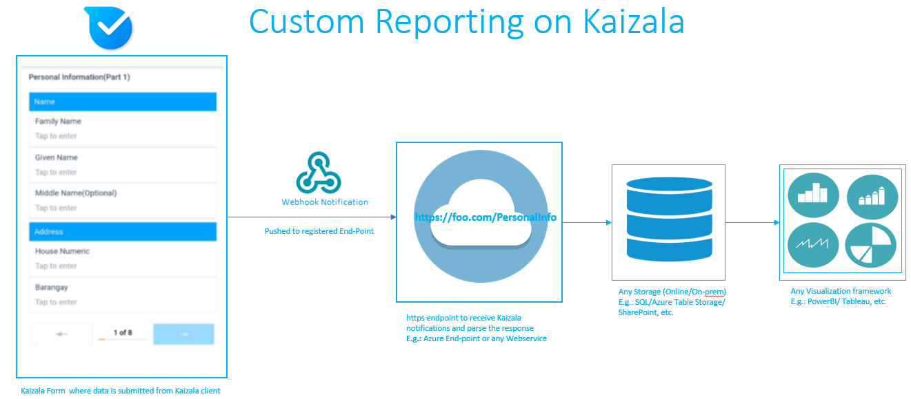

## Intégration de données Kaizala à vos tableaux de bord existantsIntegrating Kaizala Data to your existing dashboards

Créer un rapport personnalisé ou connecter vos données Kaizala à vos tableaux de bord existants à l'aide des API Kaizala.Create custom report or plug your Kaizala data to your existing dashboards using Kaizala APIs. 
 En tant qu'organisation tierce, vous souhaitez connecter des données Kaizala à votre tableau de bord existant, puis vous pouvez le faire en procédant comme suit:As a third party organization - You want to plug Kaizala data to your existing dashboard, then you can do it using the following ways:
 1. obtenir des données Kaizala via Power BI-Content Pack et créer un rapport personnalisé sur PowerBI1. Get Kaizala data through Power BI-Content Pack and create a Custom report on PowerBI
 2. accéder aux données Kaizala via des connecteurs et passer à un tableau de bord existant au format qu'il comprend.2.Access Kaizala data through connectors and pass on to  existing dashboard in the format that it understands. Vous pouvez accéder aux données à l'aide de connexions Kaizala:You can access data using Kaizala Connecters:  
 les connecteurs.[APIs](https://docs.microsoft.com/en-us/kaizala/connectors/api) -Kaizala permettent aux développeurs tiers d'intégrer Kaizala à leurs processus métier en offrant la possibilité d'effectuer un ensemble d'actions organisée dans Kaizala à l'aide d'appels d'API basés sur REST.a.[APIs](https://docs.microsoft.com/en-us/kaizala/connectors/api)  - Kaizala Connectors enable 3rd party developers to integrate Kaizala into their business processes by providing the ability to perform a curated set of actions in Kaizala using REST based API calls. L'étendue de l'API est destinée aux systèmes externes pour appeler le point de terminaison et effectuer des actions à la demande.The scope of the API is for external systems to call the end-point and perform actions on-demand. Autrement dit, il s'agit d'un modèle d'extraction, où les points de terminaison individuels doivent être appelés pour effectuer des actions spécifiques à l'aide de l'API Kaizala.That is, this will be a PULL model – where individual endpoints need to be called to perform specific actions using Kaizala API's. 
 b. webhooks: le modèle poussé dans lequel la plateforme Kaizala peut déclencher des actions peut être configuré à l'aide des webhooks.b.[webhooks](https://docs.microsoft.com/en-us/kaizala/connectors/webhooks) - The PUSH model where Kaizala platform can trigger actions can be configured using webhooks.  
  Les connecteurs Kaizala permettent aux développeurs tiers d'intégrer Kaizala à leurs processus métier en leur permettant d'effectuer un ensemble d'actions organisée dans Kaizala à l'aide d'appels d'API basés sur REST.Kaizala Connectors enable 3rd party developers to integrate Kaizala into their business processes by providing the ability to perform a curated set of actions in Kaizala using REST based API calls. L'étendue de l'API est destinée aux systèmes externes pour appeler le point de terminaison et effectuer des actions à la demande.The scope of the API is for external systems to call the end-point and perform actions on-demand. Autrement dit, il s'agit d'un modèle d'extraction, où les points de terminaison individuels doivent être appelés pour effectuer des actions spécifiques à l'aide des [API](https://docs.microsoft.com/en-us/kaizala/connectors/api)Kaizala.That is, this will be a PULL model – where individual endpoints need to be called to perform specific actions using Kaizala [APIs](https://docs.microsoft.com/en-us/kaizala/connectors/api). Le modèle poussé dans lequel la plateforme Kaizala peut déclencher des actions peut être configuré à l'aide des webhooks.The PUSH model where Kaizala platform can trigger actions can be configured using [webhooks](https://docs.microsoft.com/en-us/kaizala/connectors/webhooks). 

### Intégration à l'aide des webhooks:Integration Using Webhooks: 
 Il s'agit d'un mécanisme de type poussé.This is a PUSH based mechanism. Une fois que le webhook est inscrit sur une action particulière, chaque fois que l'utilisateur envoie des données sur cette action sur le serveur Kaizala de l'application Kaizala envoie une notification d'événement (message HTTP POST) avec un temps de réponse (format JSON) au point de terminaison de l'URL configuré.Once Webhook is registered on particular action, Whenever user submits data on that action on Kaizala Application - Kaizala Server will send a event notification (HTTP POST message) with response payload (JSON Format) to the configured URL endpoint. Une fois que les données sont notifiées sur le point de terminaison des clients, la logique d'analyse de la charge utile de réponse doit déclencher et insérer des données dans les tables respectives du stockage (base de données ou SharePoint,..) et les visualisations peuvent être créées en interrogeant les données à partir du stockage.Once data is notified on customers endpoint, Logic for parsing the response payload should trigger and Insert data in to the respective tables in the storage (Database or sharepoint,..) and Visualizations can be built by querying data from the storage. L'avantage est que toute organisation peut obtenir des données Kaizala dans leurs tableaux de bord personnalisés sans interrompre les flux de travail existants.Advantage of this is any Organization can get Kaizala data in to their Custom dashboards without disrupting their existing work flows. 
### Permet d'accéder au processus ci-dessus et de le voir en détail:Lets drill down in to the above process and see it in detail: 
#### Comment enregistrer un webhook sur un point de terminaison?How to register a webhook on endpoint? 
  Une fois que vous avez configuré un point de terminaison d'URL sur lequel vous souhaitez avertir les événements Kaizala, vous pouvez vous abonner pour une notification sur le groupe ou une action particulière.Once you configure a URL endpoint on which you wanted to notify the Kaizala events, You can subscribe for a notification on the group or a particular  action. Vous pouvez utiliser les clients de l'API REST tiers, tels que le client REST ou le client Rest avancé, etc., pour s'abonner à un webhook.You can use the 3rd party Rest API clients like  Postman/ Advanced Rest Client, etc. to subscribe for a webhook. La signature de l'inscription d'un webhook sur une action particulière est indiquée ci-dessous:Signature of registering a webhook on particular Action is given below: 
 Accédez à [la documentation de l'API Kaizala!](https://docs.microsoft.com/en-us/kaizala/connectors/api)Go to [Kaizala API Documentation!](https://docs.microsoft.com/en-us/kaizala/connectors/api) et cliquez sur leand click on the 
 Suivez les étapes pour obtenir le AccessToken et enregistrer un wekbhook.Go through the steps to get the AccessToken and register a wekbhook. 
 
 Étant donné que vous avez enregistré un webhook, le serveur Kaizala continuera à avertir les événements sur l'URL inscrite chaque fois que l'événement se produit.As you have now registered a webhook, Kaizala server will keep notifying the events on the registered URL every time event occurs. La réponse d'événement se trouve au format JSON ci-dessous:Event response is in the below JSON format: 
 
  Exemple de réponse d'événement dans JSON:Sample Event Response in JSON:
  {   
  "objectId": "com. Microsoft. kaizala. OrderFormDemo","objectId":"com.microsoft.kaizala.OrderFormDemo",
  "objectType": "ActionPackage","objectType":"ActionPackage",
  "eventType": "ActionResponse","eventType":"ActionResponse",
  "eventId": "75609730-f5d2-4f07-XXXX-ccca96dd9e76","eventId":"75609730-f5d2-4f07-XXXX-ccca96dd9e76",
 «données»: {   
"data":{   
  "actionId": "eb40446b-3dc7-4e8e-XXXX-44ccc5ae760c","actionId":"eb40446b-3dc7-4e8e-XXXX-44ccc5ae760c",
  «actionPackageId»: «com. Microsoft. kaizala. OrderFormDemo»,"actionPackageId":"com.microsoft.kaizala.OrderFormDemo",
  «packageId»: «com. Microsoft. kaizala. OrderFormDemo»,"packageId":"com.microsoft.kaizala.OrderFormDemo",
  "groupId": "af461a3c-49cf-47cf-XXXX-83b5d348318d","groupId":"af461a3c-49cf-47cf-XXXX-83b5d348318d",
  "responseId": "75609730-f5d2-4f07-XXXX-ccca96dd9e76","responseId":"75609730-f5d2-4f07-XXXX-ccca96dd9e76",
  «isUpdateResponse»: false,"isUpdateResponse":false,
  «répondeur»: «+ 911234567890»,"responder":"+911234567890",
  «responderName»: «FooName»,"responderName":"FooName",
  «responderProfilePic»: «»,"responderProfilePic":"",
  «isAnonymous»: false,"isAnonymous":false,
  «responseDetails»: {   
"responseDetails":{   
  «responseWithQuestions»: [   
"responseWithQuestions":[   
  {   
 «titre»: «sortie détaillant»,"title":"Retailer Outlet",
 «type»: «SingleOption»,"type":"SingleOption",
  «Options»: [   
"options":[   
 {   
  «titre»: «ABC Traders»"title":"ABC Traders"
 },
  {   
 «titre»: «distributeurs BCD»"title":"BCD Distributors"
 },
 {   
 «title»: «EFG grossiste»"title":"EFG wholesale"
 }
 ],
  «réponse»: [   
"answer":[   
 «ABC Traders»"ABC Traders"
 ]
  },
  {   
  "title": "riz 1KG","title":"Rice 1KG",
  "type": "Numeric","type":"Numeric",
 «Options»: [   
"options":[   
  ],
  «réponse»: 1.0"answer":1.0
 },
  {   
 "title": "riz 5KG","title":"Rice 5KG",
  "type": "Numeric","type":"Numeric",
 «Options»: [   
"options":[   
 ],
  «réponse»: 2.0"answer":2.0
  },
  {   
  "titre": "mélange de jus de fruits 250ml","title":"Mixed Fruit Juice 250ml",
  "type": "Numeric","type":"Numeric",
  «Options»: [   
"options":[   
  ],
  «réponse»: 4.0"answer":4.0
  },
  {   
  "title": "location","title":"Location",
  "type": "location","type":"Location",
 «Options»: ["options":[   
 
  ],
  «réponse»: {   
"answer":{   
  "lt": 99.1234567,"lt":99.1234567,
 «LG»: 88.1234567,"lg":88.1234567,
  «n»: «FooAddress»"n":"FooAddress"
 }
 }
  ]
  }
  },
  «Context»: «toutes les données qui doivent être renvoyées dans le rappel."context":"Any data which is required to be returned in callback.Les données de webhook actuelles peuvent être vues en actualisant:[: https://requestb.in/12786un1?inspect!](https://requestb.in/12786un1?inspect) Current webhook data can be seen by refreshing:[: https://requestb.in/12786un1?inspect!](https://requestb.in/12786un1?inspect)
  "fromUser": "+ 911234567890","fromUser":"+911234567890",
  «fromUserName»: «FooName»,"fromUserName":"FooName",
 "fromUserProfilePic": """fromUserProfilePic":""
  }
  **Sur le point de terminaison enregistré** , la logique métier doit analyser la réponse de l'événement et insérer des données dans les tables de stockage respectives.**On the Registered End Point** - Have business logic to parse the event response and insert data in to the respective storage tables. À l'issue de la mise à disposition des données, interrogez les données à partir du stockage et affichez les visualisations sur vos tableaux de bord existants.As data is now available at your end, Query data from storage and show visualizations on your existing dashboards. Cette approche vous permet de créer des visualisations de données Kaizala sur des tableaux de bord existants.With this approach - You can create the visualizations of Kaizala data on existing dashboards. Dans cette approche, vous allez obtenir les données notifiées en temps réel à l'aide du point de terminaison de webhook.In this approach you will be getting the data notified in Realtime using the Webhook end point.  
#### Comment extraire des données à l'aide de l'API Kaizala?How to PULL data using Kaizala API's? 
Si vous souhaitez extraire des données de Kaizala à intervalles réguliers et mettre à jour des données dans le tableau de bord, vous pouvez alors appeler des API Kaizala à l'aide de connecteurs et extraire des données pour le package d'actions requis, mettre à jour les données dans le tableau de bord de stockage et d'actualisation.If you want to Pull data from Kaizala in regular Intervals and update data in the dashboard- then You can call Kaizala API's using Connectors and Pull data for the required Action Package, update data in to the Storage and refresh Dashboard. 
  
**Pour interroger les réponses d'un package d'action**: vous pouvez voir la signature de l'API et la réponse en accédant à la collection post-citée ci-dessus et accéder à l'API de requête de contenu--> FETCH action Response in a Group et remplacer par votre groupe, action Détails du package**For Querying the responses of an Action Package**- You can see the API signature and the response by Going to the Postman collection mentioned above and go to Content Query API's--> Fetch action responses in a group and replace with your group, action package details  

