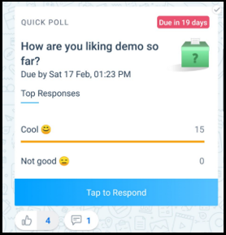
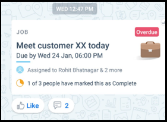
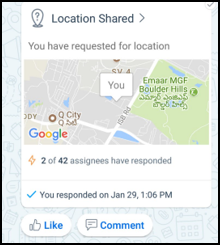
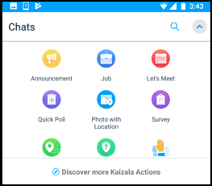

# Cartes d’Action KaizalaKaizala Action Cards

Kaizala vous offre un large éventail de cartes de visite action ou minies applications qui simplifient la gestion de travail quotidien et efficace.Kaizala offers you wide range of action cards or mini apps that make your daily work management easy and efficient. Vous pouvez utiliser les cartes Out-of-box(OOB) Action ou créer votre propre Kaizala des Actions personnalisées.You can use the Out-of-box(OOB) Action cards or create your own customized Kaizala Actions.

Certaines cartes Action prêtes à l’emploi disponibles sont les suivantes :Some of the OOB Action cards available are as follows:
- AnnouncementsAnnouncements
- Enquêtes et sondages rapidesQuick Polls & Surveys
- Tâches /Job/Tasks
- Invitation de réunionMeeting Invite
- Carte de présenceAttendance Card
- Carte de formationTraning Card
- Fiche magasinLocation Card
- Découvrir plus d’ActionsDiscover More Actions 

## AnnouncementsAnnouncements

Kaizala vous permet de partager des informations avec votre organisation en une fois au moyen de la carte d’annonce.Kaizala enables you to share information with your entire organization in one go by means of Announcement card. Vous pouvez ajouter des images, des messages audio ou vidéos ainsi que des documents dans les annonces Kaizala.You can add pictures, audio or video messages as well as documents in Kaizala Announcements.

Récepteurs d’annonces puissent s’impliquer sur cette annonces par le biais de fonction j’aime et de commentaires.Receivers of the announcements can engage on this announcements through Likes and Comments feature.

![Annonces] (Images/Actions1.png "Annonces")

## Enquêtes et sondages rapidesQuick Polls & Surveys

Kaizala fournit une Action prédéfinie de sondages et d’enquêtes à recueillir rapidement les données du champ.Kaizala provides predefined Action for Polls and Surveys to quickly collect data from field. Agrégation de données est disponible à cet endroit, sans avoir à compiler rien.Data aggregation is available right there, without having to compile anything.
Sondages prend en charge la question unique, enquêtes prend en charge plusieurs questions et les types de questions à choix multiples, le type de date, numérique, etc. de texte.While Polls support single question, Surveys support multiple questions and question types like Multi-choice, date type, numeric, Text etc.

![Enquêtes et sondages rapides] (Images/Actions2.png "Enquêtes et sondages rapides")

## Tâches /Job/Tasks 
Kaizala permet d’affecter des tâches ou des tâches à une ou plusieurs personnes.Kaizala enables you to assign jobs or tasks to one or more individuals. Lorsque vos utilisateurs terminé les tâches, vous recevez une notification.When your users complete the tasks, you get a notification. En outre, vous pouvez suivre l’état de toutes les tâches affectées sous **Actions en attente** dans le profil.Also, you can track status of all your assigned tasks under **Pending Actions** in Profile.

![Tâche ou des tâches] (Images/Actions3.png "Tâche ou des tâches")

 ## Carte de présenceAttendance Card

Carte de présence vous permet de collecter les coordonnées de l’emplacement, avec ou sans la photo des membres de votre groupe.Attendance card enables you to collect location coordinates, with or without photo from members of your group. Cela garantit qu'une personne est présente à l’emplacement spécifique à un moment donné.This ensures a person is present at specific location at a specific time. Vous pouvez afficher le rapport pour la même Kaizala portail de gestion.You can view the report for the same in Kaizala management portal.

![Carte de présence] (Images/ActionsAttendance.PNG "Carte de présence")
  
## Carte de formationTraining Card
Kaizala permet d’envoyer le contenu de formation ainsi que des questions/questionnaires de formation à votre équipe.Kaizala enables you to send Training Content along with Training questions/quizzes to your team. Rapport de celui-ci est disponible sur Kaizala management Portal.Report for the same is available on Kaizala management Portal. Vous pouvez configurer des formations sur Kaizala rapidement si le contenu de la formation et les questions sont prêtes.You can setup Training on Kaizala quickly if training content and questions are ready.

![Formation sur la carte] (Images/ActionsTraining.PNG "Formation sur la carte")

## Fiche magasinLocation Card

Kaizala fournit des cartes de visite emplacement en fonction de différents qui sont comme suit :Kaizala provides various location based cards that are as follows:

1. Effectuer le suivi sur emplacement actuel de mappage unique de votre groupe entier.To track on single map current location of your entire group.
2. Pour effectuer le suivi des coordonnées de l’emplacement live d’un ou plusieurs membres.To track live location coordinates of one or more members.
3. Pour effectuer le suivi des photos avec l’emplacement d’une personne pour vous assurer de présence à un emplacement.To track photo with location of a person to ensure presence at a location.

![Fiche magasin] (Images/ActionsLocation.PNG "Fiche magasin")

## Découvrir plus d’ActionsDiscover More Actions

Vous pouvez trouver beaucoup plus d’actions Kaizala sous découvrir.You can find many more Kaizala actions under Discover. Si vous souhaitez créer votre propre des actions personnalisées dans Kaizala, vous pouvez également le faire.If you would like to create your own customized actions in Kaizala, you can do that as well. 

![Découvrir plus d’Actions] (Images/ActionsDiscoverMore.PNG "Découvrir plus d’Actions")

Reportez-vous à [cette](../developer-platform.md) section pour plus d’informations sur la personnalisation et de créer vos propres cartes d’Action.Refer to [this](../developer-platform.md) section for details on customizing and creating your own Action cards.
