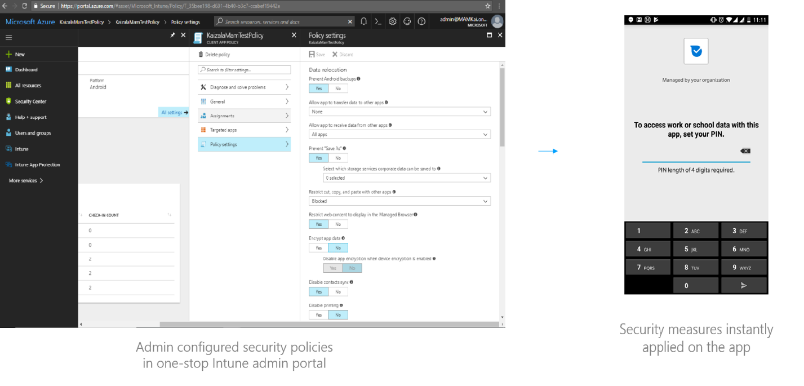

# Sécurité pour les utilisateurs finaux
## Protection des données client

Tous les stockages de données sur Android, iOS et les clients Windows sont effectués sur des stockages internes qui fournissent le bac à sable de l'application, qui isole les données de votre application et l'exécution du code des autres applications. Les autorisations accordées par l'utilisateur pour limiter l'accès aux fonctionnalités système et aux données utilisateur sont uniquement utilisées. Kaizala suit toutes les normes de plateforme pour restreindre l'accès aux ressources des clients en fonction des autorisations accordées. Aucun stockage externe autorisant l'accès en lecture et en écriture dans le monde, est utilisé. MODE_WORLD_READABLE ou MODE_WORLD_WRITEABLE ne sont pas activés. 

## Authentification et autorisation

L'application mobile Microsoft Kaizala authentifie les utilisateurs sur les appareils en utilisant un numéro de téléphone et un mot de passe unique pour faciliter l'inscription et l'intégration.  

Pour des raisons de sécurité, Kaizala applique également plusieurs stratégies de sécurité pour restreindre un numéro de téléphone à un seul périphérique à la fois et le nombre de demandes de OTP par jour.  

L'accès à toutes les données client, telles que les messages, les documents, les médias, etc., est limité aux utilisateurs finaux concernés, aux membres du groupe et aux administrateurs de l'organisation. 

L'authentification multifacteur pour les utilisateurs de l'application Kaizala peut être activée via les stratégies de groupe. Un administrateur de groupe ou de client peut appliquer une connexion de compte Office 365 (AAD) supplémentaire pour pouvoir ouvrir un groupe Kaizala. Cela signifie qu'un utilisateur doit se connecter à un compte lié AAD dans l'application mobile Kaizala, en plus du numéro de téléphone & OTP. Tant que l'utilisateur se connecte avec un compte AAD lié, les messages du groupe ne peuvent pas être vus par l'utilisateur pour le groupe configuré. 

Le portail de gestion Kaizala utilise l'authentification des services Azure Active Directory pour sécuriser l'accès et la gestion des données organisationnelles. Ce service est utilisé par des millions de clients dans le monde entier pour l'hébergement de leurs données métiers en toute sécurité dans Office 365. 

Dans Kaizala, le contrôle total de la gestion des groupes et des appartenances est limité uniquement aux administrateurs d'organisation de groupe et respectifs. 

## Stratégies de groupe Kaizala

Kaizala permet aux administrateurs de groupes et de clients de contrôler le flux de données et le comportement au sein d'un ou de tous les groupes de l'organisation. Vous trouverez ci-dessous les différentes stratégies de groupe pouvant être configurées par les administrateurs de groupes et de clients afin d'améliorer la sécurité des données: 

  
- Restreindre le transfert des messages, des pièces jointes et des actions Kaizala à partir du groupe actif ou de ses groupes organisationnels 
- Limiter la copie de contenu pour les messages, les pièces jointes et les actions Kaizala 
- Restreindre le partage du contenu pour les messages, les pièces jointes et les actions Kaizala 
- Activer l'authentification multifacteur pour les membres via AAD de telle sorte que l'utilisateur doit se connecter avec son compte AAD de l'Organisation pour afficher les messages à l'intérieur du groupe. 
- Activez Microsoft Intune pour les stratégies avancées (par exemple, PIN) après la durée d'inactivité. À moins que l'utilisateur ait activé Intune, il se peut que l'utilisateur ne puisse pas ouvrir le groupe. 

## Gestion des applications mobiles avec Microsoft Intune

Pour la gestion avancée des applications, l'application mobile Kaizala peut être conteneur à l'aide de Microsoft Intune. Microsoft Kaizala est intégré en mode natif avec le kit de développement logiciel (SDK Intune) et fournit une prise en charge des stratégies spécifiques d'Intune avancées décrites ci-dessous:
    - Exiger l'accès au code confidentiel sur l'application mobile pour une sécurité améliorée du client 
    - Bloquer l’exécution des applications gérées sur les appareils jailbroken ou rootés 
    - Restreindre les opérations couper, copier, coller avec d'autres applications gérées • restreindre l'application pour transférer des données vers ou à partir d'autres applications gérées 
    - Bloquer la capture d'écran ou le partage d'écran 
    - Appliquer la version minimale du système d'exploitation Android 
    - Afficher le contenu web uniquement dans Managed Browser
    - Intervalle hors connexion avant la réinitialisation des données 

Les stratégies Intune peuvent être gérées facilement de manière centralisée via le portail Intune, comme indiqué ci-dessous:  

