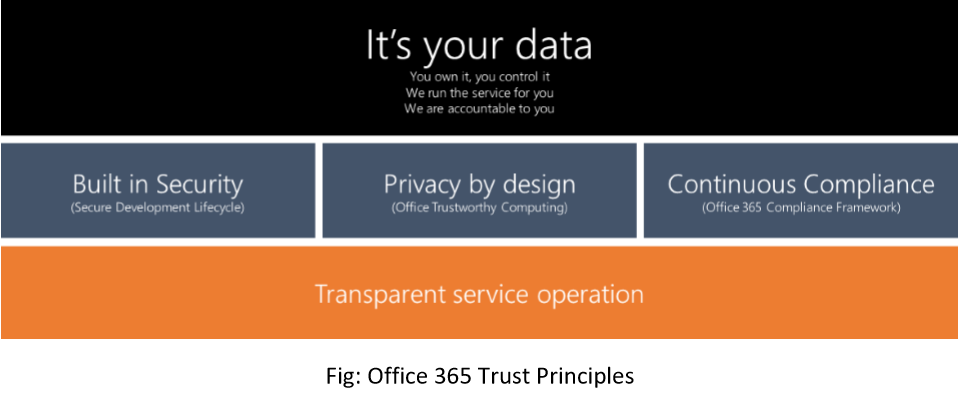

# Sécurité & conformité-vue d'ensembleSecurity & Compliance - Overview

La sécurité et la conformité sont l'un des piliers principaux de Microsoft Kaizala, développé en fonction des principes d'approbation Office 365 décrits ci-dessous:Security and compliance is one of the core pillars for Microsoft Kaizala, which is developed based on the Office 365 trust principles described below –

  * Kaizala fournit la propriété complète des données aux clients pour ses groupes d'organisation.Kaizala provides full ownership of data to customers for its organization groups. 
  * Kaizala suit les pratiques de cycle de vie de développement de la sécurité standard (SDL) pour toutes les phases du développement de produits, y compris la conception, le développement, le déploiement et les opérations.Kaizala follows standard security development lifecycle (SDL) practices for all phases of the product development including design, development, deployment and operations. Les meilleures pratiques telles que l'accès au moindre privilège, etc., sont appliquées.The best practices such as defence-in-depth, least privilege access, etc. are applied.
  * Kaizala respecte les pratiques d'Office Trustworthy Computing (OTwC) pour gérer l'organisation et les données individuellesKaizala adheres to Office Trustworthy computing (OTwC) practices to handle the organization and individual data 
  * Kaizala suit l'infrastructure de conformité Office 365 pour le stockage, la rétention et la transmission des données.Kaizala follows Office 365 compliance framework for data handling standards for storage, retention and transmission.
  * Kaizala est hébergé sur une infrastructure de centre de données Office 365/Azure de niveau international, qui sont exécutées avec l'opération de service transparenteKaizala is hosted on world-class Office 365/ Azure data centre infrastructure, which are run with the transparent service operation
  
Cette section traite de l'approche en matière de sécurité, de confidentialité et de conformité pour Microsoft Kaizala, qui met non seulement en évidence l'engagement de Microsoft vis-à-vis de ces derniers, mais permet également aux décideurs techniques et d'entreprise de mieux comprendre comment Microsoft gère les données client avec une grande prudence.This section dives into the approach for security, privacy and compliances practices for Microsoft Kaizala, which not only highlights Microsoft’s commitment towards these but also helps technical and business decision makers to better understand how Microsoft handles customer data with utmost care.

* [Sécurité pour les clients finauxSecurity for end Customers](SecurityFeaturesforendcustomers.md)
* [SécuritéSecurity](Security.md)
* [ConfidentialitéPrivacy](Privacy.md)
* [ConformitéCompliance](Compliance.md)

