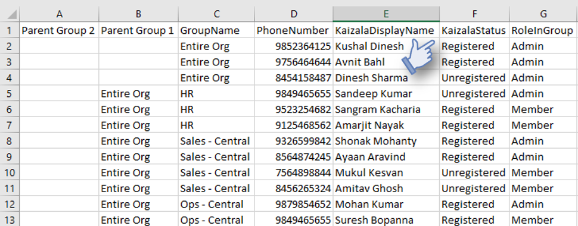

[3]: https://play.google.com/store/apps/details?id=com.microsoft.mobile.polymer&hl=en
[4]: https://itunes.apple.com/in/app/microsoft-kaizala/id1112208399?mt=8
[5]: http://manage.kaiza.la/
[7]: https://github.com/MicrosoftDocs/kaizala-docs
# Commencer à utiliser Kaizala
###### Kaizala peut être installé à partir de [Google Play Store] [ 3] pour Android ou [App Store] [ 4] pour les iPhone.
##  Obtenir Kaizala installé par les utilisateurs de votre organisation
###### L'installation de l'application de pilotage dans votre organisation est très importante pour la réussite de ce projet. Voici quelques méthodes utilisées par d'autres clients:
###### &nbsp;&nbsp;&nbsp;&nbsp;&nbsp;&nbsp;• Cliquez sur nom du groupe dans l'application Kaizala, puis cliquez sur inviter tout pour envoyer un message texte pour inviter tous les membres.
###### &nbsp;&nbsp;&nbsp;&nbsp;&nbsp;&nbsp;• Envoyez un message électronique à des personnes qui partagent la valeur prop et un lien à télécharger.
###### &nbsp;&nbsp;&nbsp;&nbsp;&nbsp;&nbsp;• Envoyez les messages aux groupes WhatsApp de l'organisation avec le lien de téléchargement.   
###### &nbsp;&nbsp;&nbsp;&nbsp;&nbsp;&nbsp;• Envoyez des courriers indésirables en bloc à des personnes disposant du lien de téléchargement. 
###### &nbsp;&nbsp;&nbsp;&nbsp;&nbsp;&nbsp;• Concevez des affiches Kaizala et placez-les à des endroits où tout le monde peut le voir.
###### &nbsp;&nbsp;&nbsp;&nbsp;&nbsp;&nbsp;• Incentivize personnes à installer Kaizala avec les lauréats du vainqueur ou avec des quiz ou une enquête d'envoi d'images, etc.
##  Rechercher les utilisateurs qui ont installé les données d'activation d'Kaizala/utilisateur
###### À partir du portail de gestion de Kaizala, vous pouvez télécharger un fichier CSV qui indique l'état de Kaizala pour chaque utilisateur.
###### &nbsp;&nbsp;&nbsp;&nbsp;&nbsp;&nbsp;0,1.   connectez-vous sur le [portail] [ 5] de gestion Kaizala avec vos informations d'identification Office 365 ou Kaizala Pro.  
###### &nbsp;&nbsp;&nbsp;&nbsp;&nbsp;&nbsp;n°2.   Cliquez sur l'onglet __groupes__ à gauche et cliquez sur le nom de votre groupe.  
###### &nbsp;&nbsp;&nbsp;&nbsp;&nbsp;&nbsp;3.   Vous pouvez voir les membres inscrits ou non inscrits (n'ont pas installé Kaizala). Vous pouvez également utiliser l'option exporter des utilisateurs > lancer une nouvelle demande > Télécharger pour obtenir ces détails dans un fichier CSV.   

##  Vérifier si les utilisateurs utilisent les données d'utilisation Kaizala/Kaizala
###### Vous pouvez surveiller si les utilisateurs utilisent Kaizala à l'aide du portail de gestion Kaizala.
###### &nbsp;&nbsp;&nbsp;&nbsp;&nbsp;&nbsp;0,1.   connectez-vous sur le [portail] [ 5] de gestion Kaizala avec vos informations d'identification Office 365 ou Kaizala Pro.  
###### &nbsp;&nbsp;&nbsp;&nbsp;&nbsp;&nbsp;n°2.   Cliquez sur l'onglet **groupes** à gauche et cliquez sur le nom de votre groupe.  
###### &nbsp;&nbsp;&nbsp;&nbsp;&nbsp;&nbsp;3.   Vous pouvez cliquer sur rapports dans le volet de gauche et cliquer sur télémétrie de l'utilisation pour surveiller l'utilisation de Kaizala dans vos groupes.   

##  Envoyer votre premier message

|Publier une annonce d'accueil  

Vous pouvez envoyer un message de bienvenue à tous les utilisateurs de votre organisation pour les démarrer sur Kaizala.

Envoyez ce message à partir du groupe du haut en tant qu'annonce. Ajoutez une image ou un son pour en faciliter l'implication.

Les personnes inceptes écrivent des commentaires ou aiment l'annonce pour démarrer l'engagement. |||
|-------|-------|-------|
|**_Publier un sondage_** 

 Envoyez un sondage rapide pour commencer à communiquer avec vos utilisateurs. 
Ouvrez le groupe à partir duquel vous souhaitez envoyer cet envoi. Si vous souhaitez envoyer à tous les employés, envoyer à partir du groupe du haut.
Il vous suffit de cliquer sur l'icône d'action en haut à droite et de cliquer sur sondage rapide. Effectuer un sondage sur un événement qui est cher. Si vous pouvez prendre une décision ou entreprendre une action en fonction de ce qui est encore plus efficace! Les mots de la bouche se répandent et les personnes se téléchargeront plus facilement. |||
###### Une fois que vous avez une masse critique de votre organisation à l'aide de Kaizala, vous pouvez évaluer la création/la migration de vos applications personnalisées/métier sur Kaizala ou l'intégration de données Kaizala à votre base de données ou vos flux de travail existants à l'aide de la [plateforme de développement Kaizala.][7]
